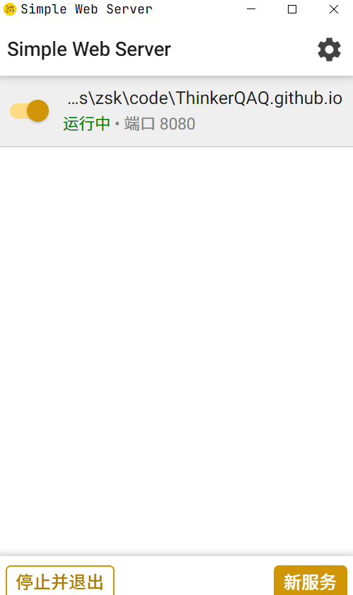

## 1. Introduction

[ThinkerQAQ](https://thinkerqaq.github.io/)

本地运行：

1. 安装http server

[Simple Web Server](https://simplewebserver.org/)

2. 运行http server

3. 打开浏览器访问[http://127.0.0.1:8080](http://127.0.0.1:8080/#)

## 2. Ref

- [Viki \- A simple Wiki page in Markdown from notebook of VNote](https://vnotex.github.io/viki/zh_cn/#!index.md)
- [GitHub \- vnotex/viki: A simple Wiki page in Markdown from notebook of VNote\.](https://github.com/vnotex/viki)