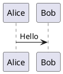

# ThinkerQAQ Blog

## 1. 这个仓库是做什么的

这是 [ThinkerQAQ](https://thinkerqaq.github.io/) 的个人博客网站源码。网站用于发布技术文章、系列文章、学习笔记和项目记录；仓库中的 Markdown 内容经过构建后，会生成可部署到 GitHub Pages 的静态网站。

## 2. 如何使用

### 2.1 准备环境

- [Git](https://git-scm.com/)
- [Node.js](https://nodejs.org/) 22.12 或更高版本

如果需要首次生成新的 PlantUML 图表，还需要 Java 17 或更高版本。

### 2.2 Clone 仓库

```powershell
git clone https://github.com/ThinkerQAQ/ThinkerQAQ.github.io.git
cd ThinkerQAQ.github.io
```

### 2.3 使用 Windows 脚本

在 Windows 资源管理器中双击 [`start-local.cmd`](start-local.cmd)，脚本会自动安装缺少的依赖、构建网站，并在默认浏览器中打开本地预览。

也可以在终端中使用下面的子命令，不需要记忆 `npm run ...`：

| 命令 | 用途 |
| --- | --- |
| `.\start-local.cmd` | 构建包含草稿的本地网站并打开浏览器 |
| `.\start-local.cmd preview` | 与直接双击脚本相同 |
| `.\start-local.cmd build` | 构建用于正式发布的网站 |
| `.\start-local.cmd check` | 执行类型、正式构建和链接检查 |
| `.\start-local.cmd diagrams` | 生成 PlantUML 和 draw.io 图表 |
| `.\start-local.cmd stop` | 停止本地预览 |
| `.\start-local.cmd help` | 查看脚本帮助 |

## 3. 写作与发布

### 3.1 写一篇文章

在 `src/content/articles/` 中新建 Markdown 文件。文件名会成为网址的一部分，例如 `src/content/articles/my-first-post.md` 对应 `/articles/my-first-post/`。

```markdown
---
title: "文章标题"
description: "用一句话介绍文章内容。"
publishedAt: "2026-09-07T20:00:00+08:00"
language: zh
tags:
  - Astro
  - 博客
status: draft
featured: false
---

从这里开始写正文。
```

先使用 `status: draft` 写作和本地预览；确认内容可以公开后改为 `status: published`。正式构建和线上网站不会包含草稿。

### 3.2 写一篇笔记

在 `src/content/notes/` 中新建 Markdown 文件。可以用子目录整理分类，例如 `src/content/notes/javascript/event-loop.md`。

```markdown
---
title: "Event Loop 笔记"
description: "整理 JavaScript 事件循环的核心概念。"
sourcePath: "src/content/notes/javascript/event-loop.md"
category: javascript
categoryLabel: JavaScript
tags:
  - JavaScript
updatedAt: 2026-09-07
language: zh
featured: false
indexable: true
---

从这里开始写正文。
```

笔记目前没有 `draft` 状态：只要 Push 到 `master` 就会参与线上构建。尚未完成的笔记不要提交，或者暂时保留在本地。

### 3.3 把文章或笔记加入系列

系列文件放在 `src/content/series/`。例如要创建 `concurrency-programming` 系列，新建 `src/content/series/concurrency-programming.md`：

```markdown
---
title: "并发编程"
description: "从基础概念到常用并发工具。"
status: active
updatedAt: 2026-09-07
featured: false
relatedArticles:
  - concurrency-series-00
  - concurrency-series-01
relatedNotes:
  - java/happens-before
---

这里填写系列介绍。
```

`relatedArticles` 和 `relatedNotes` 填写内容文件相对于各自目录的路径，并去掉 `.md` 后缀；列表顺序就是系列页面的阅读顺序。

文章还需要在自己的 Frontmatter 中加入系列 ID，这样文章页才会显示“所属系列”入口：

```yaml
series: concurrency-programming
```

把草稿文章写入 `relatedArticles` 后，本地预览可以正常显示；Push 前必须把文章改为 `published`，否则正式构建会因为系列引用了未发布文章而失败。

### 3.4 把文章关联到项目

项目页放在 `src/content/projects/`。例如新建 `src/content/projects/my-project.md`：

```markdown
---
title: "项目名称"
description: "项目解决了什么问题。"
status: building
startedAt: 2026-09-01
updatedAt: 2026-09-07
tags:
  - Astro
featured: false
repository: "https://github.com/ThinkerQAQ/example"
---

项目介绍。

## 相关文章

- [文章标题](/articles/my-first-post/)
```

项目目前没有类似系列的 `relatedArticles` 字段。要关联文章，请在项目正文中添加文章链接；如需双向入口，也可以在文章正文中添加 `[查看项目](/projects/my-project/)`。

项目状态可以是 `exploring`、`building`、`maintained` 或 `completed`。

### 3.5 本地预览并发布

1. 运行 `.\start-local.cmd preview`，等待浏览器打开本地网站。
2. 检查文章内容、目录、图表、系列顺序和站内链接。
3. 准备发布的文章将 `status` 改为 `published`。
4. 运行 `.\start-local.cmd build`，确认正式版本可以成功构建。
5. 提交并 Push 到 `master`：

```powershell
git add .
git commit -m "add: 文章标题"
git push origin master
```

Push 后 GitHub Actions 会自动构建，并将 `dist/` 发布到 GitHub Pages。部署成功后，工作流还会读取构建生成的 sitemap，并通过 IndexNow 批量通知参与该协议的搜索引擎发现本次发布的页面；部署失败时不会发送通知。

## 4. 在文章中新增图表

### 4.1 新增 PlantUML 图表

在文章的 Markdown 中添加 `puml` 或 `plantuml` 代码块：

````markdown

```plantuml
@startuml
Alice -> Bob: Hello
@enduml
```
````

运行 `.\start-local.cmd preview` 时，图表会自动转换为本地 SVG 并显示在文章中。

### 4.2 新增 draw.io 图表

1. 使用 draw.io Desktop 创建图表。
2. 将可编辑的 `.drawio` 文件保存到 `src/diagrams/drawio/`。
3. 运行 `.\start-local.cmd diagrams` 生成 SVG。
4. 在文章中引用生成的图片：

```markdown

```

生成的 SVG 位于 `public/diagrams/drawio/`。详细约定见 [`docs/diagrams.md`](docs/diagrams.md)。

## 5. 技术选型与网站功能

| 能力 | 实现方式 |
| --- | --- |
| 网站框架 | [Astro](https://astro.build/) 生成静态 HTML，适合以内容为主的博客 |
| 内容管理 | Astro Content Collections + Markdown；内容分为文章、系列、笔记和项目 |
| 全文搜索 | [Pagefind](https://pagefind.app/) 在构建后生成静态搜索索引，不需要单独的搜索服务 |
| 文章评论 | [utterances](https://utteranc.es/)；读者使用 GitHub 登录，评论保存到本仓库的 Issues，并按文章路径关联 |
| 图表 | PlantUML 代码块和 draw.io 源文件在本地构建为 SVG |
| 代码高亮 | Astro 内置的 Shiki，使用 GitHub Dark 主题 |
| 订阅与索引 | 自动生成 RSS 和 sitemap，并保留 Google、Bing 站长平台的所有权验证文件 |
| 发布搜索增强 | GitHub Pages 部署成功后，根据 sitemap 自动调用 [IndexNow](https://www.indexnow.org/)，通知 Bing、Yandex 等参与者发现新增或更新页面 |
| 明暗主题 | 根据操作系统的颜色偏好自动切换 |
| 部署 | 推送到 `master` 后，由 GitHub Actions 构建并发布到 GitHub Pages |
