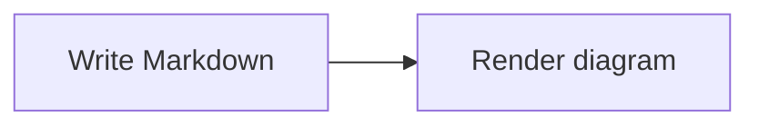

# 博客图表约定

## 工具选择

- draw.io：架构图、文章主图、需要手工布局和强调关系的图。
- Mermaid：简单流程图、时序图和经常随代码变化的图。Markdown 中直接使用 `mermaid` fenced code block。
- PlantUML：继续支持 Markdown 中已有的 `puml` / `plantuml` 代码块。

## Mermaid 工作流

在文章或笔记中直接写标准 Mermaid fenced code block：

````markdown

````

不需要生成或提交额外的 SVG 文件。页面检测到 Mermaid 图表后，才会加载固定版本的 Mermaid renderer；没有 Mermaid 的页面不会下载它。当前 renderer 固定为 `mermaid@12.0.0`，使用 `securityLevel: "strict"`。

如果浏览器无法加载 renderer，原始 Mermaid 源码会继续保留在页面中作为降级内容。

### 外部分发

站内渲染和外部分发是两条独立链路。站内仍由 Mermaid.js 在浏览器中生成 SVG；BlogCTL 向外部平台发布时，会由 [Publishing Compiler](./publishing-compiler.md) 将 Mermaid fence 编译为 PNG、上传 Cloudflare R2，再把 fence 替换成普通图片链接。

因此文章作者只维护 Mermaid 源码，正常博客构建不会运行 Mermaid CLI 或上传 R2。


## draw.io 工作流

1. 使用 draw.io Desktop 创建或编辑图。
2. 将源文件保存到 `src/diagrams/drawio/`，允许建立子目录。
3. 运行 `npm run diagrams:drawio`。脚本只重新导出新增或发生变化的图。
4. 将 `.drawio`、生成的 `.svg` 和 `src/data/drawio-manifest.json` 一起提交。
5. 在 Markdown 中引用 `/diagrams/drawio/<路径>.svg`。

例如：

```text
src/diagrams/drawio/agent/execution-loop.drawio
public/diagrams/drawio/agent/execution-loop.svg
```

```markdown

```

网站只发布静态 SVG，不在浏览器中加载 draw.io 或外部渲染服务。SVG 没有嵌入 `.drawio` 源数据，源文件单独保留在仓库中。

## 本地环境

渲染需要安装 draw.io Desktop。脚本会依次检查：

- `DRAWIO_EXECUTABLE` 环境变量；
- 系统 `PATH` 中的 `drawio` / `draw.io`；
- Windows 和 macOS 的常见安装位置。

当前电脑上的便携版 `C:\software\Office\DrawioPortable\App\Drawio\draw.io.exe` 也会被自动识别。

如果安装在自定义位置，可以在 PowerShell 中指定：

```powershell
$env:DRAWIO_EXECUTABLE = 'D:\\Apps\\draw.io\\draw.io.exe'
npm run diagrams:drawio
```

`npm run check:drawio` 不调用 draw.io，只检查源文件、SVG 与清单是否一致。GitHub Actions 的 `CI=true` 环境会自动使用这个只读模式，因此线上构建不需要安装 draw.io Desktop。
