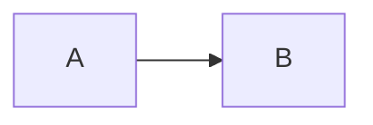

# Publishing Compiler

## Goal

The personal blog Markdown remains the canonical source. BlogCTL must produce a platform-safe representation without requiring every destination to implement the same Markdown extensions.

The compiler is intentionally **not** a generic Markdown-to-HTML rewrite. It preserves ordinary Markdown and compiles only semantic blocks whose rendering is not portable across platforms.

```text
Canonical Markdown
        |
        v
Publishing Compiler
  - preserve ordinary Markdown
  - normalize root-relative links
  - compile non-portable semantic blocks
        |
        +--> DEV.to Markdown
        +--> Chinese-platform Markdown
        +--> Medium-safe HTML fallback
        +--> future platform adapters
```

## Why this layer is necessary

Markdown is only a transport syntax. The rendering contract differs by destination:

- The ThinkerQAQ site can run a controlled Mermaid renderer.
- DEV.to accepts Markdown and remote images, but its exact Markdown extension set is not our portability contract.
- CSDN and Juejin currently expose Mermaid capabilities in their editors, but their Mermaid versions and sanitizers are controlled by those platforms.
- Medium documents normal code blocks and common raster image formats, not a native Mermaid fenced-block contract.
- Browser/session-based publishing adapters may support a different set of blocks than a platform's interactive editor.

Therefore, an article must not depend on destination-specific Mermaid behavior.

## Research basis

Primary references checked while designing this compiler:

- Mermaid CLI: <https://github.com/mermaid-js/mermaid-cli>
- Mermaid CLI npm package: <https://www.npmjs.com/package/@mermaid-js/mermaid-cli>
- Medium code blocks: <https://help.medium.com/hc/en-us/articles/35756844492439-Using-code-blocks-and-inline-code>
- Medium images: <https://help.medium.com/hc/en-us/articles/214550207-Using-images>
- DEV.to editor guide: <https://dev.to/p/editor_guide>
- Wechatsync: <https://github.com/wechatsync/Wechatsync>

The implementation targets the common denominator instead of depending on optional native Mermaid support.

## Design principles

### 1. Canonical Markdown stays human-readable

Authors continue to write:

````markdown

````

No generated publishing syntax is written back into the source article.

### 2. Special blocks are semantic islands

V1 recognizes fenced Mermaid blocks. Non-Mermaid fenced blocks are preserved after newline normalization.

The compiler does not parse and re-serialize the whole document. This limits formatting churn and keeps existing Markdown behavior stable.

Future handlers can follow the same pattern:

```text
mermaid  -> Diagram asset
puml     -> Diagram asset
math     -> Portable math representation
callout  -> Platform-safe quote/admonition
```

### 3. External publishing uses a stable image contract

For external platforms a Mermaid block becomes a normal Markdown image:

```markdown

```

PNG is used for syndication because it is accepted more consistently than SVG or executable diagram syntax.

The personal blog keeps its current native Mermaid rendering. The PNG exists specifically as a portable publishing artifact.

### 4. Artifacts are content-addressed

The asset key is derived from:

```text
SHA-256(
  pinned renderer identity
  + normalized Mermaid source
)
```

The current renderer identity is:

```text
@mermaid-js/mermaid-cli@11.17.0
```

Only the first 24 hexadecimal characters are used in the public filename. A source or renderer-version change therefore creates a new URL automatically.

### 5. Rendering and hosting are separate concerns

The build renderer creates:

```text
public/media/generated/mermaid/<hash>.png
```

Astro/GitHub Pages publishes it at:

```text
https://thinkerqaq.github.io/media/generated/mermaid/<hash>.png
```

BlogCTL only needs the deterministic public URL. It does not need Cloudflare R2 credentials. A future asset-store abstraction may upload the same artifact to R2 without changing the compiler contract.

## Platform behavior

| Destination | Compiler output | Reason |
| --- | --- | --- |
| ThinkerQAQ site | Original Mermaid source | Existing controlled browser renderer |
| DEV.to | Markdown image using generated PNG | Stable across Forem renderer changes |
| CSDN / Juejin / other Chinese adapters | Markdown image using generated PNG | Do not depend on each editor's Mermaid version |
| Medium copy fallback | HTML `<figure>` using generated PNG | Preserves visual result |
| Medium live delta | Fail before publish when body images are required | Current adapter has no verified body-image delta/upload |

## Site build

```text
private blog-content
        |
        | assemble-content
        v
engine/src/content/articles
        |
        | npm run diagrams
        v
scan Mermaid fences
        |
        | pinned Mermaid CLI
        v
public/media/generated/mermaid/<hash>.png
        |
        | Astro build
        v
GitHub Pages
```

The default renderer command is equivalent to:

```bash
npx --yes -p @mermaid-js/mermaid-cli@11.17.0 mmdc ...
```

The CLI is downloaded only when an uncached Mermaid artifact actually needs rendering. Content without Mermaid does not pay the Puppeteer/Chromium cost.

For environments that need a custom Puppeteer configuration:

```bash
MERMAID_PUPPETEER_CONFIG_FILE=/path/to/puppeteer-config.json npm run publishing:assets
```

## Syndication flow

```text
canonical Markdown
        |
        | compilePublishingMarkdown(platform)
        v
portable Markdown / HTML
        |
        +--> DEV API
        +--> Wechatsync compatibility adapter
        +--> Medium fallback renderer
```

The Chinese compatibility route receives a public HTTP image URL rather than a local file path. Rendering and platform upload remain separate concerns.

## Medium correctness rule

The current BlogCTL Medium adapter can write text deltas but does not yet have a verified body-image upload/delta implementation.

The compiler therefore:

1. converts Mermaid to the same generated PNG URL;
2. emits the PNG correctly in the copy/paste HTML fallback;
3. marks the draft as requiring an HTML fallback;
4. stops live Medium publishing before creating a malformed draft.

Native Medium body-image automation should only be added after the current editor's upload request and image delta shape are captured and tested.

## Deployment ordering

A generated Mermaid URL is available after the personal-blog deployment containing that asset completes.

Recommended order:

```text
1. Publish/merge canonical article
2. GitHub Pages build generates Mermaid PNG
3. Confirm the personal blog deployment succeeds
4. Run BlogCTL syndication
```

A future live-sync preflight can issue a HEAD request for generated assets. V1 deliberately keeps network checks outside the compiler so tests and dry runs remain deterministic.

## Compiler API

### `compilePublishingMarkdown`

```js
compilePublishingMarkdown(markdown, {
  platform: "devto",
  siteOrigin: "https://thinkerqaq.github.io",
})
```

Returns the compiled Markdown plus referenced content-addressed assets.

### `collectPublishingAssets`

Scans Markdown for semantic blocks and returns deduplicated assets without rewriting the document.

### `renderMermaidAsset`

Renders a missing PNG and skips an already cached content-addressed artifact.

## Failure policy

| Failure | Policy |
| --- | --- |
| Empty Mermaid block | Fail compilation |
| Mermaid CLI exits non-zero | Fail asset build |
| Renderer produces no PNG | Fail asset build |
| Medium live adapter sees a body image | Fail before draft creation and point to HTML fallback |
| Destination has native Mermaid support | Still use PNG for portable syndication |
| Fenced code contains root-relative examples | Preserve them; do not rewrite inside the fence |

## Security

- Mermaid remains source text in canonical Markdown.
- The site renderer uses strict Mermaid security.
- The publishing renderer uses `securityLevel: "strict"`.
- External destinations receive a static PNG, not executable Mermaid HTML/JS.
- Artifact filenames are content hashes and do not contain user-controlled paths.

## V1 scope

Implemented:

- Mermaid fence detection.
- Deterministic Mermaid asset IDs.
- PNG rendering and content-addressed caching.
- Site-build asset scanning.
- DEV.to compiler integration.
- Chinese-platform compiler integration.
- Medium copy/paste HTML image rendering.
- Medium live-sync fail-safe for body images.
- Fenced-code-safe root-link normalization.
- Unit tests for compiler behavior and renderer caching.

Not implemented yet:

- Native Medium body-image upload/deltas.
- R2 upload.
- Live HEAD preflight before syndication.
- Full Markdown AST re-serialization.
- PlantUML migration into this compiler.
- Refactoring existing article diagrams to Mermaid.

## Next step

After this infrastructure is merged and deployed, the Mutex implementation article can safely migrate its two large ASCII diagrams:

1. Java/JVM/OS/x86 cross-layer path -> `sequenceDiagram`;
2. Fast Path / Slow Path / Spin / Park -> `flowchart`.

Small explanatory text diagrams should stay as text unless Mermaid materially improves readability.
