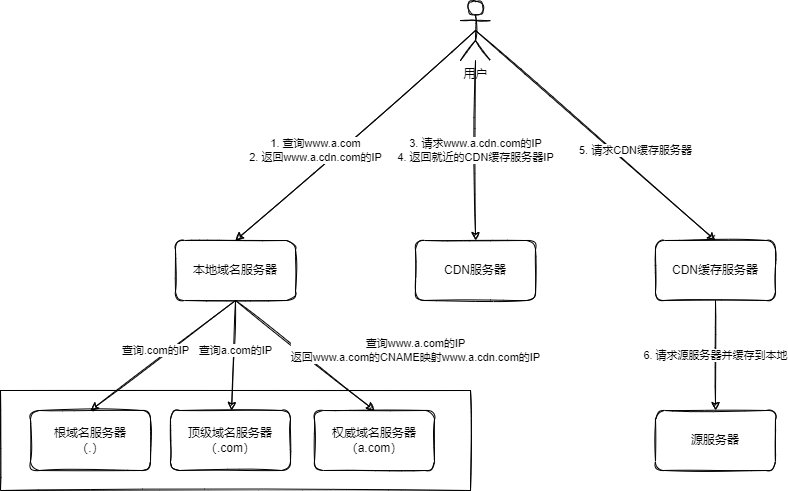

## 1. 什么是 CDN

- 内容分发网络
- 由全球范围内的代理服务器组成，给用户就近提供**静态内容**，说白了就是缓存

## 2. 为什么需要 CDN

- 缓存提高访问速度

## 3. CDN 缺点

- 时效性

## 4. CDN 工作原理

- 开发人员
  1. 开发人员架设好`www.a.com`<->`3.3.3.3`的网站
  2. 开发人员去 CDN 注册`www.a.com`<->`3.3.3.3`，得到 CNAME`a.www.tbcdn.com`
  3. 开发人员去 DNS 服务器注册 CNAME 映射`www.a.com`<->`a.www.tbcdn.com`
- 用户 1. 用户请求`www.a.com`的资源 1. 计算机本地缓存中有没有 IP，有则返回 2. `/etc/hosts`文件中有没有 IP，有则返回 3. 向本地域名服务器`8.8.8.8`发起请求，通过递归或者迭代查询到`www.a.com`的 CNAME 映射为`a.www.tbcdn.com` 4. **本地域名服务器向授权 DNS `www.tbcdn.com` 查询** 5. 授权 DNS `www.tbcdn.com` 根据一定的负载均衡策略，返回一个 IP 地址，假设是`2.2.2.2` 6. 用户请求`2.2.2.2`获取资源 1. 如果`2.2.2.2`对应的节点已缓存该资源，则会将数据直接返回给用户 2. 如果`2.2.2.2`对应的节点没有缓存该资源，则会请求源网站`3.3.3.3`获取资源并缓存，再返回给用户
  

## 5. CDN 更新模式

### 5.1. Push

- 分发由源站发起，主动将内容推送到各个 CDN 节点
- 优点：实时性高
- 缺点：服务器负载高；需要 CDN+源站配合

### 5.2. Pull

- 分发由用户发起，用户第一次查询时 CDN 发现没内容，那么从源站获取内容并缓存，第二次查询就能直接从 CDN 获取了
- 优点：服务器负载低
- 缺点：实时性低；不需要源站配合

## 6. 参考

- [工作原理 \- CDN \- 阿里云](https://help.aliyun.com/document_detail/122172.html)
- [系统设计组件：CDN 原理简介 \- 知乎](https://zhuanlan.zhihu.com/p/99991992)
- [CDN 是什么？使用 CDN 有什么优势？ \- 知乎](https://www.zhihu.com/question/36514327/answer/68143522)
