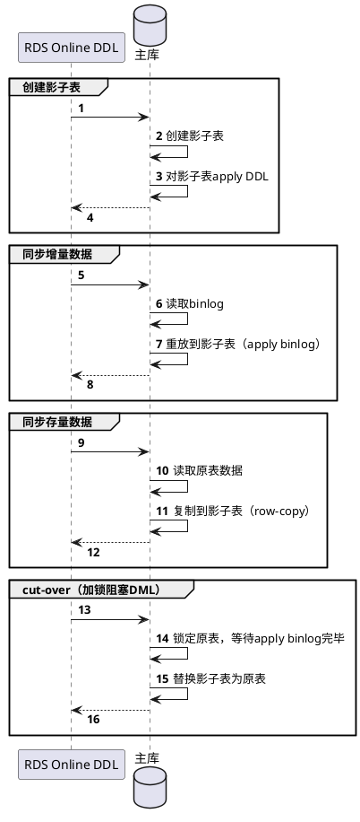

## 1. 锁是什么
- [数据库锁.md](../数据库锁.md)
## 2. 锁的实现
- trx信息 ：代表这个锁结构是哪个事务生成的。
- is_waiting ：代表当前事务是否在等待
## 3. 锁的分类
- 根据加锁的范围，MySQL里面的锁大致可以分成全局锁、表级锁和行锁三类
### 3.1. 全局锁
#### 3.1.1. 是什么
- `Flush tables with read lock`对整个数据库实例加锁
- 整个库处于只读状态，其他线程的以下语句会被阻塞：数据更新语句（数据的增删改）、数据定义语句（包括建表、修改表结构等）和更新类事务的提交语句

#### 3.1.2. 为什么需要
- 全库逻辑备份
##### 3.1.2.1. MVCC RR vs 全局锁
- RR可以拿到一致性视图，那么其实没有必要使用全局锁，但是RR是InnoDB存储引擎特有的
### 3.2. 表级锁
#### 3.2.1. 表锁
##### 3.2.1.1. 是什么
- 线程A中执行`lock tables t1 read, t2 write`，那么线程A可以读t1，读写t2，但是不能写t1；同时其他线程也不能写t1，读写t2
##### 3.2.1.2. 为什么需要
- 在还没有出现更细粒度的锁的时候，表锁是最常用的处理并发的方式
#### 3.2.2. 元数据锁
##### 3.2.2.1. 是什么
- 当对一个表做增删改查操作的时候，加MDL读锁；当要对表做结构变更操作的时候，加MDL写锁
##### 3.2.2.2. 为什么需要
- 比如查询数据的同时，表结构被改了，那么数据就不正确了
##### 3.2.2.3. 线上DDL
- 为了避免死锁，修改表结构的时候加上WAIT
```sql
ALTER TABLE tbl_name NOWAIT add column ...
ALTER TABLE tbl_name WAIT N add column ... 
```

[Mysql ALTER TABLE 加字段的时候到底锁不锁表？ \- 掘金](https://juejin.cn/post/7002180864008257543?utm_source=pocket_saves)
[记一次mysql执行DDL导致锁表\_祈雨v的博客\-CSDN博客\_ddl造成锁](https://blog.csdn.net/sz85850597/article/details/106993582)
[一条 DDL 引发的疑问与探索：MySQL Online DDL \- 飞书云文档](https://bytedance.feishu.cn/docx/doxcngTJgeOvm0aTCF4eVNbl02d)
[MySQL Online DDL 详解 （学员版）\.pdf \- 飞书云文档](https://bytedance.feishu.cn/file/boxcnbvRskzd87fCWnJKtKRNhsZ)
[MySQL工具之gh\-ost原理解析 \- 墨天轮](https://www.modb.pro/db/105821)
[MySQL\-批量更新数据的六种方法 \- 掘金](https://juejin.cn/post/7043299133360177189)
[GitHub \- github/gh\-ost: GitHub's Online Schema\-migration Tool for MySQL](https://github.com/github/gh-ost)


###### 3.2.2.3.1. gh-ost



## 4. MyISAM
- 仅支持表级锁
- 由于不支持事务，所以是session级别的
    - sessionA select查询，那么需要加表级的S锁；此时sessionB update，需要加表级的X锁，发现已经有其他session加了S锁，那么只能阻塞


### 4.1. 加写锁实验
- session1

```sql
# 加写锁
lock table mylock write;
# 可以查询加锁的表
select * from mylock;

# 不能查询其他表
select * from ttest;

# 可以修改加锁的表
update mylock set name = '111' where id = 1;

unlock tables ;
```

- session2

```sql
# 查询session1加了写锁的表会阻塞
select * from mylock;

# 可以查询其他表
select * from ttest;

# 修改session1加了写锁的表会阻塞
update mylock set name = '222' where id = 1;
```


### 4.2. 加读锁实验
- session 1

```sql
# 加读锁
lock table mylock read;
# 可以查询加锁的表
select * from mylock;
# 不能更改加了读锁的表
update mylock set name = 'qqq' where id = 1;
# 不能查询其他表
select * from ttest;
# 一解锁session2的写操作才能继续进行
unlock tables ;
```


- session2

```sql
# 可以查询其他session锁的表
select * from mylock;
# 更改会阻塞
update mylock set name = 'qqq' where id = 1;
# 可以查询其他表
select * from ttest;

```


## 5. InnoDB
- 支持表级锁和行级锁
- 由于支持事务，所以是事务级别的
- 表级别的S和X锁是个鸡肋
    - 事务A执行DDL时，事务B执行DML会阻塞。这里用的不是表级锁，而是元数据锁
- 表级别的IS和IX锁同样是个鸡肋
    - 本来IS和IX就是为表级别的S和X锁服务的，既然S和X锁鸡肋，那么衍生出来的IS和IX锁同样是个鸡肋
- 表级别的 AUTO-INC锁
    - 用于自增列
- 行锁
    - Record Locks：
        - 单个行记录上的锁
        - 分S锁和X锁
        - 事务A加某条记录加了S锁，事务B可以继续加S锁，但是不能加X锁
        - 事务A加某条记录加了X锁，事务B既不可以加S锁，也不可以加X锁
    - Gap Locks
        - 间隙锁，锁定一个范围，不包括记录本身
        - MySQL在Repetable Read级别下就解决了幻读问题，他是通过加Gap Lock解决的
        - 比如已存在的主键范围是`[1,20]`，如果在Supremum记录加了Gap Lock，那么意味着Supremum记录之前（不包括Supremum记录），即`[21,+∞)`都不能插入记录
        - Gap Locks仅用于解决幻读问题，和其他lock完全不冲突
    - Next-Key Locks
        - record+gap 锁定一个范围，包含记录本身
        - 想锁住某条记录，又想阻止其他事务在该记录前边的 间隙 插入新记录，即对`[A,B]`加锁
        - Gap Locks+Record Locks


### 5.1. 行锁实验
- session1

```sql
# 首先把autocommit关闭
# 查询
select * from ttest;
# 更新id为1的记录，会加行锁
update ttest set status = 'never' where id = 1;
# 再次查询已经更新了
select * from ttest;

```

- session2

```sql
# session1已经更新了，但我这边是看不到的，事务的隔离级别造成的
select * from ttest;
# 如果我想更新session1中同一行记录，会造成阻塞。这就是行锁
update ttest set status = 'never' where id = 1;


```

### 5.2. 行锁升级表锁实验
varchar类型的索引如果使用了强制类型转换那么升级为表锁

- session1

```sql
# title有索引，同时是varchar的，但是where后面不小心写成整形的就会升级成表锁
update tb_item set title = 'zzzzz', sell_point = 'zzz' where title = 121;
```


### 5.3. 间隙锁实验
间隙锁。就是id不连续，其中一个按照范围【比如1<=id<=6】更新加锁，另一个插入的数据刚好再这个范围内【比如id为2】，所以阻塞


### 5.4. 全表更新
[update 没有索引，会锁全表！\-云社区\-华为云](https://bbs.huaweicloud.com/blogs/300169)
[mysql update语句锁行还是锁表?\_小小张自由—>张有博的博客\-CSDN博客\_mysql update 锁表](https://blog.csdn.net/promsing/article/details/124966388)
