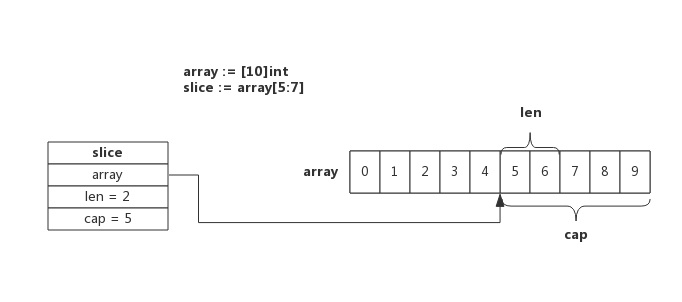

## 1. slice 是什么

支持动态扩容的数组

## 2. 为什么需要 slice

array 元素长度固定，无法动态扩容

## 3. 如何使用 slice

### 3.1. 基本使用

```go
func TestSlice2(t *testing.T) {
	var a []int
	a = append(a, 1)                 // 追加1个元素
	a = append(a, 2, 3, 4)           // 追加多个元素, 手写解包方式
	a = append(a, []int{5, 6, 7}...) // 追加一个切片, 切片需要解包

	fmt.Println(a)

	a = a[:len(a)-1] // 删除尾部1个元素
	fmt.Println(a)

	fmt.Println(a[0])

	a[0] = 9999
	fmt.Println(a[0])
}

//输出
[1 2 3 4 5 6 7]
[1 2 3 4 5 6]
1
9999
```

### 3.2. 函数传参是引用

```go

func testSlices(slices []int) {
	slices[0] = 2
	fmt.Println(&slices, slices)
}

func TestSlice1(t *testing.T) {
	ints := make([]int, 1)
	testSlices(ints)
	fmt.Println(&ints, ints)

}

//输出
&[2] [2]
&[2] [2]

```

- 虽然传的是引用，但是为了避免扩容后 slice 改变，函数返回 slice

```go
func testSlices(slices []int) {
	fmt.Println(len(slices), cap(slices), slices)
	slices = append(slices, 1)//增加长度，slices改变了
	slices[0] = 4
	fmt.Println(len(slices), cap(slices), slices)
}

func TestSlice3(t *testing.T) {
	ints := make([]int, 1)
	testSlices(ints)
	fmt.Println(len(ints), cap(ints), ints)

}

//输出
1 1 [0]
2 2 [4 1]
1 1 [0]

```

### 3.3. nil slice 和 empty slice

声明或者 new 创建的是 nil slice，而 make 创建的是 empty slice

```go
func TestSlice4(t *testing.T) {
	var slice []int
	fmt.Println(slice == nil, slice, len(slice), cap(slice))

	slice2 := *new([]int)
	fmt.Println(slice2 == nil, slice2, len(slice2), cap(slice2))

	slice3 := make([]int, 0, 0)
	fmt.Println(slice3 == nil, slice3, len(slice3), cap(slice3))

	fmt.Println(reflect.DeepEqual(slice, slice2), reflect.DeepEqual(slice, slice3))

}

//输出
true [] 0 0
true [] 0 0
false [] 0 0
true false
```


### 3.4. nil slice 可以直接 append

nil slice 或者 empty slice 都是可以通过调用 append 函数来获得底层数组的扩容。最终都是调用 mallocgc 来向 Go 的内存管理器申请到一块内存，然后再赋给原来的 nil slice 或 empty slice，然后摇身一变，成为“真正”的 slice 了。

### 3.5. slice 是不可变的

slice 本身是不可变的，但是底层数组如果暴露出去了，那么数组是可以改变的

```go
func TestSlice5(t *testing.T) {
	s := []int{1, 1, 1}
	f(s)
	fmt.Println(s)

}

func f(s []int) {
	for i := range s {
		s[i] += 1
	}
}
//输出
[2 2 2]
```

### 3.6. 拷贝

将 src 的元素复制到 dst 中，拷贝数量取两者最小值，不会触发扩容

## 4. slice 原理

### 4.1. 数据结构

```go
// runtime/slice.go
type slice struct {
	array unsafe.Pointer // 指针，指向底层的数组
	len   int // 已使用的长度
	cap   int // 总长度。已使用+未使用=总长度
}

```


### 4.2. 创建

#### 4.2.1. new

```go
var ints []int//等价于ints := new([]int)
```


#### 4.2.2. make

```go
ints := make([]int, 2, 5)
```


```go
func main() {
	slice := make([]int, 5, 10) // 长度为5，容量为10
	slice[2] = 2 // 索引为2的元素赋值为2
	fmt.Println(slice)
}
```

使用`go tool compile -S main.go`打印汇编

```asm
//main函数定义，栈帧大小为 96B
0x0000 00000 (main.go:5)TEXT    "".main(SB), $96-0
0x0000 00000 (main.go:5)MOVQ    (TLS), CX
0x0009 00009 (main.go:5)CMPQ    SP, 16(CX)
0x000d 00013 (main.go:5)JLS     228
0x0013 00019 (main.go:5)SUBQ    $96, SP
0x0017 00023 (main.go:5)MOVQ    BP, 88(SP)
0x001c 00028 (main.go:5)LEAQ    88(SP), BP
0x0021 00033 (main.go:5)FUNCDATA    $0, gclocals·69c1753bd5f81501d95132d08af04464(SB)
0x0021 00033 (main.go:5)FUNCDATA    $1, gclocals·57cc5e9a024203768cbab1c731570886(SB)
0x0021 00033 (main.go:5)LEAQ    type.int(SB), AX
0x0028 00040 (main.go:6)MOVQ    AX, (SP)
0x002c 00044 (main.go:6)MOVQ    $5, 8(SP)
0x0035 00053 (main.go:6)MOVQ    $10, 16(SP)
0x003e 00062 (main.go:6)PCDATA  $0, $0
//创建slice
0x003e 00062 (main.go:6)CALL    runtime.makeslice(SB)
0x0043 00067 (main.go:6)MOVQ    24(SP), AX
0x0048 00072 (main.go:6)MOVQ    32(SP), CX
0x004d 00077 (main.go:6)MOVQ    40(SP), DX
0x0052 00082 (main.go:7)CMPQ    CX, $2
0x0056 00086 (main.go:7)JLS     221
0x005c 00092 (main.go:7)MOVQ    $2, 16(AX)
0x0064 00100 (main.go:8)MOVQ    AX, ""..autotmp_2+64(SP)
0x0069 00105 (main.go:8)MOVQ    CX, ""..autotmp_2+72(SP)
0x006e 00110 (main.go:8)MOVQ    DX, ""..autotmp_2+80(SP)
0x0073 00115 (main.go:8)MOVQ    $0, ""..autotmp_1+48(SP)
0x007c 00124 (main.go:8)MOVQ    $0, ""..autotmp_1+56(SP)
0x0085 00133 (main.go:8)LEAQ    type.[]int(SB), AX
0x008c 00140 (main.go:8)MOVQ    AX, (SP)
0x0090 00144 (main.go:8)LEAQ    ""..autotmp_2+64(SP), AX
0x0095 00149 (main.go:8)MOVQ    AX, 8(SP)
0x009a 00154 (main.go:8)PCDATA  $0, $1
//类型转换。调用 fmt.Println需要将 slice 作一个转换
0x009a 00154 (main.go:8)CALL    runtime.convT2Eslice(SB)
0x009f 00159 (main.go:8)MOVQ    16(SP), AX
0x00a4 00164 (main.go:8)MOVQ    24(SP), CX
0x00a9 00169 (main.go:8)MOVQ    AX, ""..autotmp_1+48(SP)
0x00ae 00174 (main.go:8)MOVQ    CX, ""..autotmp_1+56(SP)
0x00b3 00179 (main.go:8)LEAQ    ""..autotmp_1+48(SP), AX
0x00b8 00184 (main.go:8)MOVQ    AX, (SP)
0x00bc 00188 (main.go:8)MOVQ    $1, 8(SP)
0x00c5 00197 (main.go:8)MOVQ    $1, 16(SP)
0x00ce 00206 (main.go:8)PCDATA  $0, $1
//打印函数
0x00ce 00206 (main.go:8)CALL    fmt.Println(SB)
0x00d3 00211 (main.go:9)MOVQ    88(SP), BP
0x00d8 00216 (main.go:9)ADDQ    $96, SP
0x00dc 00220 (main.go:9)RET
0x00dd 00221 (main.go:7)PCDATA  $0, $0
0x00dd 00221 (main.go:7)CALL    runtime.panicindex(SB)
0x00e2 00226 (main.go:7)UNDEF
0x00e4 00228 (main.go:7)NOP
0x00e4 00228 (main.go:5)PCDATA  $0, $-1
//栈空间扩容。在函数开始处，会检查当前栈空间是否足够，不够的话需要调用它来进行扩容
0x00e4 00228 (main.go:5)CALL    runtime.morestack_noctxt(SB)
0x00e9 00233 (main.go:5)JMP     0
```

创建 slice 的函数[cmd/compile/internal/types.NewSlice](https://github.com/golang/go/blob/616c39f6a636166447bdaac4f0871a5ca52bae8c/src/cmd/compile/internal/types/type.go#L484-L496)

```go
func NewSlice(elem *Type) *Type {
	if t := elem.Cache.slice; t != nil {
		if t.Elem() != elem {
			Fatalf("elem mismatch")
		}
		return t
	}

	t := New(TSLICE)
	//只包含元素类型
	t.Extra = Slice{Elem: elem}
	elem.Cache.slice = t
	return t
}
```

参数检查[cmd/compile/internal/gc.typecheck1](https://github.com/golang/go/blob/b7d097a4cf6b8a9125e4770b54d33826fa803023/src/cmd/compile/internal/gc/typecheck.go#L327-L2126)

```go
func typecheck1(n *Node, top int) (res *Node) {
	switch n.Op {
	...
	case OMAKE:
		args := n.List.Slice()

		i := 1
		switch t.Etype {
		case TSLICE:
		    //必须传len
			if i >= len(args) {
				yyerror("missing len argument to make(%v)", t)
				return n
			}

			l = args[i]
			i++
			var r *Node
			if i < len(args) {
				r = args[i]
			}
			...
			//保证传入的容量 cap 一定大于或者等于 len
			if Isconst(l, CTINT) && r != nil && Isconst(r, CTINT) && l.Val().U.(*Mpint).Cmp(r.Val().U.(*Mpint)) > 0 {
				yyerror("len larger than cap in make(%v)", t)
				return n
			}

			n.Left = l
			n.Right = r
			n.Op = OMAKESLICE
		}
	...
	}
}
```

运行时[runtime.makeslice](https://github.com/golang/go/blob/440f7d64048cd94cba669e16fe92137ce6b84073/src/runtime/slice.go#L34-L50)

```go
func makeslice(et *_type, len, cap int) unsafe.Pointer {
//计算当前切片占用的内存空间并在堆上申请一片连续的内存
	mem, overflow := math.MulUintptr(et.size, uintptr(cap))
	if overflow || mem > maxAlloc || len < 0 || len > cap {
	//内存空间 = 切片中元素大小 x 切片容量
		mem, overflow := math.MulUintptr(et.size, uintptr(len))
		if overflow || mem > maxAlloc || len < 0 {
			panicmakeslicelen()
		}
		panicmakeslicecap()
	}

	return mallocgc(mem, et, true)
}
```

#### 4.2.3. 使用数组创建

```go
slice := array[5:7]
```



### 4.3. 追加

如果 append 返回的**新切片**不需要赋值回原有的变量，就会进入如下的处理流程

```go
// append(slice, 1, 2, 3)
//获取它的数组指针、大小和容量
ptr, len, cap := slice
newlen := len + 3
//如果在追加元素后切片的大小大于容量，那么就会调用 runtime.growslice 对切片进行扩容并将新的元素依次加入切片
if newlen > cap {
    ptr, len, cap = growslice(slice, newlen)
    newlen = len + 3
}
*(ptr+len) = 1
*(ptr+len+1) = 2
*(ptr+len+2) = 3
return makeslice(ptr, newlen, cap)
```

如果 append 后的切片会覆盖原切片

```go
// slice = append(slice, 1, 2, 3)
a := &slice
ptr, len, cap := slice
newlen := len + 3
if uint(newlen) > uint(cap) {
   newptr, len, newcap = growslice(slice, newlen)
   vardef(a)
   //不赋值回原有的变量
   *a.cap = newcap
   *a.ptr = newptr
}
newlen = len + 3
*a.len = newlen
*(ptr+len) = 1
*(ptr+len+1) = 2
*(ptr+len+2) = 3
```

#### 4.3.1. 扩容规则

```go
func growslice(et *_type, old slice, cap int) slice {
	newcap := old.cap
	doublecap := newcap + newcap
	//如果期望容量大于当前容量的两倍就会使用期望容量；
	if cap > doublecap {
		newcap = cap
	} else {
	//如果当前切片的长度小于 1024 就会将容量翻倍；
		if old.len < 1024 {
			newcap = doublecap
		} else {
		//如果当前切片的长度大于 1024 就会每次增加 25% 的容量，直到新容量大于期望容量
			for 0 < newcap && newcap < cap {
				newcap += newcap / 4
			}
			if newcap <= 0 {
				newcap = cap
			}
		}
	}
```

如果新的大小是当前大小 2 倍以上，则大小增长为新大小
否则循环以下操作：如果当前大小小于 1024，按每次 2 倍增长，否则每次按当前大小 1/4 增长。直到增长的大小超过或等于新大小。

- 扩容长度
  - 
- 扩容内存大小
  - 扩容长度\*类型大小？不是的，需要匹配内存规格
  - 

### 4.4. 访问

len 和 cap 由[cmd/compile/internal/gc.epxr ](https://github.com/golang/go/blob/a037582efff56082631508b15b287494df6e9b69/src/cmd/compile/internal/gc/ssa.go#L1975-L2724)处理

```go
func (s *state) expr(n *Node) *ssa.Value {
	switch n.Op {
	case OLEN, OCAP:
		switch {
		case n.Left.Type.IsSlice():
			op := ssa.OpSliceLen
			if n.Op == OCAP {
				op = ssa.OpSliceCap
			}
			return s.newValue1(op, types.Types[TINT], s.expr(n.Left))
		...
		}
	...
	}
}
```

按照下标访问

```go
func (s *state) expr(n *Node) *ssa.Value {
	switch n.Op {
	case OINDEX:
		switch {
		case n.Left.Type.IsSlice():
			p := s.addr(n, false)
			return s.load(n.Left.Type.Elem(), p)
		...
		}
	...
	}
}
```

## 5. 参考

- [深度解密 Go 语言之 Slice \- 掘金](https://juejin.im/post/6844903811429957646#heading-6)
- [Go 语言切片的实现原理 \| Go 语言设计与实现](https://draveness.me/golang/docs/part2-foundation/ch03-datastructure/golang-array-and-slice/)
