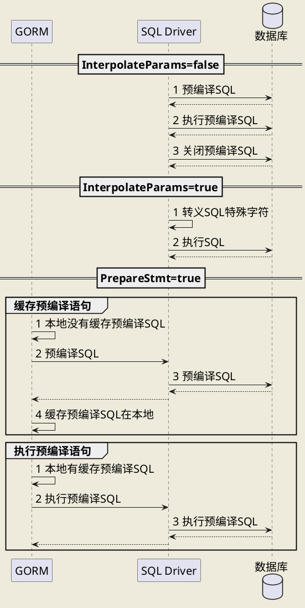

## 1. 是什么

## 2. 有什么
### 2.1. 连接
- `DB`是线程安全的
- `func Open(driverName, dataSourceName string) (*DB, error)`Open只是验证连接串格式，不是打开连接；需要用PING
- `func (db *DB) Ping() error`需要的时候创建连接，并验证连接是否活着
- 0 < MaxidleConnection < MaxOpenConnection
- `func (db *DB) Close() error`用于关闭一个连接，需要等到这个连接的所有查询都结束，很少使用

### 2.2. CRUD
- `func (db *DB) Exec(query string, args ...interface{}) (Result, error)`执行CUD SQL，第2个参数是占位符，需要加上`args...`，返回Result，里面封装了lastintertedId和rowaffected
- `func (db *DB) QueryRow(query string, args ...interface{}) *Row`查询最多一行，返回不为空是个Row，但是需要调用Row.Scan才能释放，如果有多条只取第一条，一条都没有报错
- `func (db *DB) Query(query string, args ...interface{}) (*Rows, error)`查询多行，返回不为空是个Rows，可以调用Next查看是否有下一个，调用Rows.Scan复制列到dest
    - Scan的时候如果有个字段错了，那么后面都会置为零值
    - Scan无法处理空值，字段需要定义为`sql.NullInt64`
- `func (db *DB) Prepare(query string) (*Stmt, error)`预编译sql，返回Stmt，需要Close

### 2.3. 事务
- `func (db *DB) Begin() (*Tx, error)`用于开启一个事务，返回Tx，默认的隔离级别依赖于driver
- `func (tx *Tx) Commit() error`提交事务
- `func (tx *Tx) Rollback() error`回滚事务
- 同样有QueryRow、Query、Exec方法
## 3. 预编译

SQL预编译有两个作用，一个是防止SQL注入，另一个是可缓存提高性能


防止注入的原因是编译后语法树已经固定了，不能更改也就不会被注入
缓存提高性能的原因是数据库不用每次都执行解析SQL、生成执行计划这些耗时操作。这个需要客户端（Driver库）配合缓存


go-sql-driver有个参数InterpolateParams，默认为false，此时会开启预编译功能并跟服务器交互三次；如果为true，那么会直接把SQL中的占位符?直接替换成具体值，此时虽然只会跟服务器交互一次，但是没有预编译会有注入问题，go-sql-driver是在客户端转义了一把，这样也能解决部分注入，不过在多编码环境下是有问题的。但是字节默认都是UTF-8编码，没有这个问题，所以GORM是默认把这个值设为true


缓存这方面go-sql-driver是没有做的，GORM做了这个工作，就是PrepareStmt，这个值设为true的时候，GORM会通过go-sql-driver预编译SQL，然后在本地缓存预编译的语句，下次可以直接拿来用




## 4. 其他库
### 4.1. sql-builder

```go
package sqlbuilder_demo

import (
	"database/sql"
	"fmt"
	_ "github.com/go-sql-driver/mysql"
	"github.com/huandu/go-sqlbuilder"
	"time"
)

var db *sql.DB
var userStruct = sqlbuilder.NewStruct(new(TbUser))

//type TbUser struct {
//	Id       sql.NullInt64         `db:"id"`
//	Username string        `db:"username"`
//	Password string        `db:"password"`
//	Level    sql.NullInt64 `db:"level"`
//	Created  int64    `db:"created"`
//	Updated  int64    `db:"updated"`
//
//}

type TbUserVo struct {
	Collection string
	Created    int64
	Email      string
	Id         int64
	Level      int64
	Password   string
	Perms      string
	Phone      string
	Updated    int64
	Username   string
}

type TbUser struct {
	Collection sql.NullString `db:"collection"`
	Created    time.Time      `db:"created"`
	Email      sql.NullString `db:"email"`
	Id         int64          `db:"id"`
	Level      sql.NullInt64  `db:"level"`
	Password   string         `db:"password"`
	Perms      sql.NullString `db:"perms"`
	Phone      sql.NullString `db:"phone"`
	Updated    time.Time      `db:"updated"`
	Username   string         `db:"username"`
}

func SelectDemo() {
	selectBuilder := sqlbuilder.NewSelectBuilder()
	selectBuilder.Select("id", "username")
	selectBuilder.From("tb_user")
	selectBuilder.Where(selectBuilder.In("phone", 13488888888, 13333333333))
	sql, args := selectBuilder.Build()
	fmt.Println(sql, args)
}

func UserCountSql() {

	builder := sqlbuilder.NewSelectBuilder()
	builder.Select("count(*)")
	builder.From("tb_user")
	builder.Where(builder.GreaterThan("id", 1))
	sql, args := builder.Build()
	fmt.Println(sql, args)
	row := db.QueryRow(sql, args...)
	var count int
	err := row.Scan(&count)
	if err != nil {
		fmt.Println(err)

	}
	fmt.Println(count)
}

func UserListSql() {
	//默认查询所有字段
	builder := userStruct.SelectFrom("tb_user")
	builder.Where(builder.GreaterThan("id", 10))
	sql, args := builder.Build()
	fmt.Println(sql, args)
	rows, err := db.Query(sql, args...)
	if err != nil {
		fmt.Println(err)
		return
	}

	users := make([]TbUser, 0)
	for rows.Next() {
		var user TbUser
		//反射获取所有字段
		err = rows.Scan(userStruct.Addr(&user)...)
		//err = rows.Scan(&user.Id, &user.Level,&user.Password)
		if err != nil {
			fmt.Println(err)
			continue
		}
		users = append(users, user)
	}

	fmt.Println(users)
}

func UserInsertSql(user TbUser) {
	//不用指定列和values
	builder := userStruct.InsertInto("tb_user", user)
	//也可以指定
	//builder.Cols("id", "username", "password", "created", "updated")
	//builder.Values(user.Id, user.Username, user.Password, user.Created, user.Updated)
	sql, args := builder.Build()
	fmt.Println(sql, args)
	result, err := db.Exec(sql, args...)
	if err != nil {
		fmt.Println(err)
		return

	}
	fmt.Println(result.LastInsertId())

}

func UserDeleteSql() {

	builder := userStruct.DeleteFrom("tb_user")
	builder.Where(builder.Equal("id", 1))
	sql, args := builder.Build()
	fmt.Println(sql, args)
	result, err := db.Exec(sql, args...)
	if err != nil {
		fmt.Println(err)
		return

	}
	fmt.Println(result.RowsAffected())

}

func UserUpdateSqlSelective(userVo TbUserVo) {
	updateBuilder := sqlbuilder.NewUpdateBuilder()
	updateBuilder.Update("tb_user")
	updateBuilder.SetMore(updateBuilder.Assign("email", sql.NullString{
		String: userVo.Email,
		Valid:  true,
	}))

	if userVo.Collection != "" {
		updateBuilder.SetMore(updateBuilder.Assign("collection", sql.NullString{
			String: userVo.Collection,
			Valid:  true,
		}))

	}
	if userVo.Level != 0 {
		updateBuilder.SetMore(updateBuilder.Assign("level", sql.NullInt64{
			Int64: userVo.Level,
			Valid: true,
		}))
	}
	if userVo.Password != "" {
		updateBuilder.SetMore(updateBuilder.Assign("password", userVo.Password))
	}
	if userVo.Phone != "" {
		updateBuilder.SetMore(updateBuilder.Assign("phone", sql.NullString{
			String: userVo.Phone,
			Valid:  true,
		}))

	}
	if userVo.Perms != "" {
		updateBuilder.SetMore(updateBuilder.Assign("perms", sql.NullString{
			String: userVo.Perms,
			Valid:  true,
		}))
	}
	updateBuilder.SetMore(updateBuilder.Assign("updated", time.Now()))
	updateBuilder.SetMore(updateBuilder.Assign("created", time.Now()))

	updateBuilder.Where(updateBuilder.Equal("id", userVo.Id))
	sql, args := updateBuilder.Build()
	fmt.Println(sql, args)
	result, err := db.Exec(sql, args...)
	if err != nil {
		fmt.Println(err)
		return

	}
	fmt.Println(result.RowsAffected())

}

func UserUpdateSql(user TbUser) {
	builder := userStruct.Update("tb_user", user)
	builder.Where(builder.Equal("id", 666))
	sql, args := builder.Build()
	fmt.Println(sql, args)
	result, err := db.Exec(sql, args...)
	if err != nil {
		fmt.Println(err)
		return

	}
	fmt.Println(result.RowsAffected())

}


func TestTx() {
	//加上超时时间
	ctx, cancel := context.WithTimeout(context.Background(), time.Duration(2)*time.Second)
	defer cancel()
	//开启事务
	tx, err := db.BeginTx(ctx, nil)
	if err != nil {
		fmt.Println(err)
	}
	_, err = tx.Exec("insert into ttest (status, creater, created) values (?, ?, ?)", "test", "zsk", time.Now())
	if err != nil {
		fmt.Println(err)
		tx.Rollback()
		return
	}
	_, err = tx.Exec("insert into ttest (status, creater, created) values (?, ?, ?)", "test2", "zsk2", time.Now())
	if err != nil {
		fmt.Println(err)
		tx.Rollback()
		return
	}

	//模拟不在sql执行的其他操作
	//如果超时了，会自动回滚
	//耗时任务不要放在事务中，连接无法释放
	time.Sleep(time.Duration(5) * time.Second)

	if err := tx.Commit(); err != nil {
		fmt.Println(err)
		tx.Rollback()
	}

	//已经提交的事务不能重新提交或者回滚
	//if err := tx.Commit(); err != nil {
	//	fmt.Println(err)//sql: transaction has already been committed or rolled back
	//	if err := tx.Rollback(); err != nil {
	//		fmt.Println(err)//sql: transaction has already been committed or rolled back
	//	}
	//}

}


func init() {
	var err error
	db, err = sql.Open("mysql", "root:zskroot@(127.0.0.1:3306)/tao?charset=utf8")
	if err != nil {
		panic(err)
	}
}

```
### 4.2. xorm
#### 4.2.1. reverse tool

##### 4.2.1.1. 安装

```
go get xorm.io/reverse
go get github.com/go-sql-driver/mysql
```

##### 4.2.1.2. 使用

- 配置文件tao.yml

```yml
kind: reverse
name: mydb
source:
  database: mysql
  conn_str: 'root:zskroot@(127.0.0.1:3306)/tao?charset=utf8'
targets:
  - type: codes
    language: golang
    output_dir: ./
```

- 命令

```
cd models
reverse -f tao.yml
```
## 5. 参考
- [huandu/go\-sqlbuilder: A flexible and powerful SQL string builder library plus a zero\-config ORM\.](https://github.com/huandu/go-sqlbuilder)
- [Go操作MySql数据库的方式 \| 起风了](https://xuchao918.github.io/2019/06/13/Go%E6%93%8D%E4%BD%9CMySql%E6%95%B0%E6%8D%AE%E5%BA%93%E7%9A%84%E6%96%B9%E5%BC%8F/)
- [database \- SetMaxOpenConns and SetMaxIdleConns \- Stack Overflow](https://stackoverflow.com/questions/31952791/setmaxopenconns-and-setmaxidleconns)
- [使用xorm工具，根据数据库自动生成 go 代码 \- artong0416 \- 博客园](https://www.cnblogs.com/artong0416/p/7456674.html)
- [Xorm](https://xorm.io/)
- [xorm/README\_CN\.md at master · go\-xorm/xorm](https://github.com/go-xorm/xorm/blob/master/README_CN.md)
- [Go语言：解决数据库中null值的问题\_数据库\_绯浅yousa的笔记\-CSDN博客](https://blog.csdn.net/qq_15437667/article/details/78780945)
- [简单聊聊Golang数据库编程的那些事 \- 掘金](https://juejin.im/post/5cb94e3a5188251ad954e6f7#heading-17)
- [Golang Mysql笔记（四）\-\-\- 事务 \- 简书](https://www.jianshu.com/p/bc8120bec94e)
- [xorm/reverse: A flexsible and powerful command line tool to convert database to codes \- README\_CN\.md at master \- reverse \- Gitea: Git with a cup of tea](https://gitea.com/xorm/reverse/src/branch/master/README_CN.md)
- [Xorm](https://xorm.io/)
- [GitHub \- go\-sql\-driver/mysql: Go MySQL Driver is a MySQL driver for Go's \(golang\) database/sql package](https://github.com/go-sql-driver/mysql#interpolateparams)
- [Performance \| GORM \- The fantastic ORM library for Golang, aims to be developer friendly\.](https://gorm.io/docs/performance.html)
- [DBResolver \| GORM \- The fantastic ORM library for Golang, aims to be developer friendly\.](https://gorm.io/zh_CN/docs/dbresolver.html#%E8%AF%BB%E5%86%99%E5%88%86%E7%A6%BB)
- [postgresql \- What's the difference between these two Gorm way of query things? \- Stack Overflow](https://stackoverflow.com/questions/64464433/whats-the-difference-between-these-two-gorm-way-of-query-things)
- [Go，Gorm 和 Mysql 是如何防止 SQL 注入的\_嘿哈哈哈的博客\-CSDN博客\_interpolateparams](https://blog.csdn.net/qq_39384184/article/details/108144309)
- [database/sql 一点深入理解 \| Youmai の Blog](https://michaelyou.github.io/2018/03/30/database-sql-%E4%B8%80%E7%82%B9%E6%B7%B1%E5%85%A5%E7%90%86%E8%A7%A3/)
- [GitHub \- go\-sql\-driver/mysql: Go MySQL Driver is a MySQL driver for Go's \(golang\) database/sql package](https://github.com/go-sql-driver/mysql#connection-pool-and-timeouts)
- [Golang SQL连接池梳理 \- 赐我白日梦 \- 博客园](https://www.cnblogs.com/zhuchangwu/p/13412853.html#%E5%9B%9B%E4%B8%89%E4%B8%AA%E9%87%8D%E8%A6%81%E7%9A%84%E7%BB%93%E6%9E%84%E4%BD%93)
- [数据库预编译为何能防止SQL注入？ \- 知乎](https://www.zhihu.com/question/43581628)