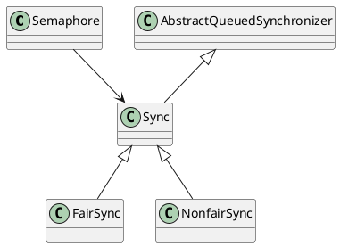

[toc]

## 1. 是什么

限流工具类，同一时间只允许n个线程访问某资源

## 2. 原理分析

### 2.1. uml

```puml
@startuml
skinparam classAttributeIconSize 0

class Semaphore{
}

class AbstractQueuedSynchronizer{
}

class Sync{
}

class FairSync{
}

class NonfairSync{

}

Sync <|-- FairSync

Sync <|-- NonfairSync

AbstractQueuedSynchronizer <|-- Sync

Semaphore --> Sync
@enduml
```

可以看出Semaphore也有公平的和非公平之分，参考

- [非公平信号量.md](非公平信号量.md)
- [公平信号量.md](公平信号量.md)
