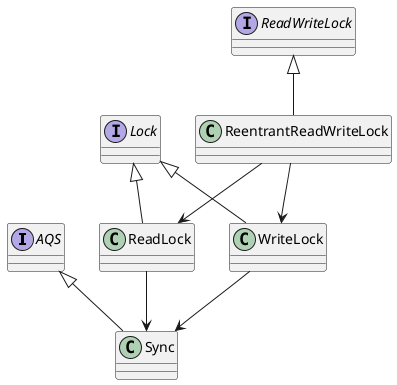

[toc]

## 1. 是什么

无论队列前面是否有人排队等待锁，我直接去抢

## 2. 怎么使用

```java
public class ReadWriteLockTest
{
    private static ReadWriteLock lock = new ReentrantReadWriteLock(true);//true表示公平
    private static Lock readLock = lock.readLock();
    private static Lock writeLock = lock.writeLock();

    private static List<Integer> data = new ArrayList<>();

    public static void main(String[] args) throws InterruptedException
    {
        Thread readThread = new Thread(() -> {
            while (true)
            {
                try
                {
                    TimeUnit.MILLISECONDS.sleep(500);
                    readLock.lock();
                    System.out.println(Thread.currentThread().getName() + " read: " + data);
                }
                catch (InterruptedException e)
                {
                    e.printStackTrace();
                }
                finally
                {
                    readLock.unlock();
                }
            }
        });
        Thread readThread2 = new Thread(() -> {
            while (true)
            {
                try
                {
                    TimeUnit.MILLISECONDS.sleep(300);

                    readLock.lock();
                    System.out.println(Thread.currentThread().getName() + " read: " + data);
                }
                catch (InterruptedException e)
                {
                    e.printStackTrace();
                }
                finally
                {
                    readLock.unlock();
                }
            }
        });
        Thread writeThread = new Thread(() -> {

            int i = 0;
            while (true)
            {
                try
                {
                    TimeUnit.MILLISECONDS.sleep(200);

                    writeLock.lock();
                    if (i % 2 == 0)
                    {
                        data.add(i);
                    }else
                    {
                        data.remove(0);
                    }
                    i++;
                }
                catch (InterruptedException e)
                {
                    e.printStackTrace();
                }
                finally
                {
                    writeLock.unlock();
                }
            }
        });

        readThread.start();
        readThread2.start();
        writeThread.start();

        readThread.join();
        readThread2.join();
        writeThread.join();

    }

}

```

## 3. 源码分析

### 3.1. uml




### 3.2. 构造方法

- ReentrantReadWriteLock

```java

public ReentrantReadWriteLock(boolean fair) {
    //初始化了Sync
    //true的话使用的是FairSync
    sync = fair ? new FairSync() : new NonfairSync();
    //初始化读写锁
    readerLock = new ReadLock(this);
    writerLock = new WriteLock(this);
}

```

- ReentrantReadWriteLock.ReadLock

```java
protected ReadLock(ReentrantReadWriteLock lock) {
    //其实就是保存了ReentrantReadWriteLock的Sync
    sync = lock.sync;
}
```

- ReentrantReadWriteLock.WriteLock
```java
protected WriteLock(ReentrantReadWriteLock lock) {
    //其实就是保存了ReentrantReadWriteLock的Sync
    sync = lock.sync;
}
```

### 3.3. 读锁加锁
- ReentrantReadWriteLock.readLock

```java
//返回就是读锁
public ReentrantReadWriteLock.ReadLock  readLock()  { return readerLock; }
```

- ReadLock.lock

```java
public void lock() {
    //使用AQS加共享锁
    sync.acquireShared(1);
}
```

#### 3.3.1. 使用AQS加共享锁

- AQS acquireShared

```java
public final void acquireShared(int arg) {
    //ReentrantReadWriteLock的Sync重写了tryAcquireShared
    //所以这里调用的是Sync的tryAcquireShared
    
    //如果返回<0说明尝试加锁失败，执行doAcquireShared入AQS队列并阻塞，等待唤醒
    //返回>=0说明加锁成功，执行后续的业务逻辑
    if (tryAcquireShared(arg) < 0)
        doAcquireShared(arg);
}
```

##### 3.3.1.1. 使用Sync尝试加共享锁

- ReentrantReadWriteLock.Sync.tryAcquireShared

```java
protected final int tryAcquireShared(int unused) {
    //当前线程
    Thread current = Thread.currentThread();
    //当前的state数目（或者说加锁【既包括读锁也包括写锁】的数量）
    int c = getState();
    //从state中获取互斥锁的数目（写锁的数量）
    //如果数量不为0（即>0）说明已经加了写锁
    if (exclusiveCount(c) != 0 &&
        //判断加锁的线程是否当前线程
        getExclusiveOwnerThread() != current)
        //不是的话返回-1表示已经有其他线程加了写锁（后面就需要入AQS队列阻塞等待唤醒）
        return -1;
    
    //走到这里说明没有线程加写锁或者加写锁的就是本线程
    
    //从state中获取共享锁的数目（读锁的数目）
    int r = sharedCount(c);
    //非公平锁：这里调用NonfairSync的readerShouldBlock判断是否需要阻塞读
    //返回false的话不需要阻塞，接着执行&&后面的逻辑
    if (!readerShouldBlock() &&
        //判断读锁数量是否小于最大数目
        r < MAX_COUNT &&
        //使用CAS加读锁
        compareAndSetState(c, c + SHARED_UNIT)) {

        //上面的if中的逻辑执行完毕后，锁state已经加好了读锁
        //下面的逻辑负责处理其他需要修改的属性

        //第一次加读锁
        if (r == 0) {
            //设置第一次加锁的线程以及初始化读锁数量
            firstReader = current;
            firstReaderHoldCount = 1;
        //第n次加锁的仍旧是第一次加锁的线程
        } else if (firstReader == current) {
            //修改读锁数量即可
            firstReaderHoldCount++;
        //第n次加锁的不是第一次加锁的线程
        } else {
            //cachedHoldCounter是缓存
            HoldCounter rh = cachedHoldCounter;
            if (rh == null || rh.tid != getThreadId(current))
                cachedHoldCounter = rh = readHolds.get();
            else if (rh.count == 0)
                readHolds.set(rh);
            rh.count++;
        }
        //返回1（正数）表示加读锁成功
        return 1;
    }

    //走到这里说明发生了以下几种情况：
    //1.需要阻塞读
    //2.读锁数目已经超过最大值
    //3.CAS加读锁失败
    return fullTryAcquireShared(current);
}
```

###### 3.3.1.1.1. 判断是否需要阻塞读【公平】

- ReentrantReadWriteLock.FairSync#readerShouldBlock

```java
final boolean readerShouldBlock() {
    //队列头节点为空或者这个头节点的线程不是当前线程的时候读需要阻塞
    return hasQueuedPredecessors();
}
```

- AQS hasQueuedPredecessors

```java
public final boolean hasQueuedPredecessors() {
    Node t = tail; // Read fields in reverse initialization order
    Node h = head;
    Node s;
    return h != t &&
        //队列实际头节点为空或者这个头节点的线程不是当前线程
        //那么返回true
        ((s = h.next) == null || s.thread != Thread.currentThread());
}
```

###### 3.3.1.1.2. 快速尝试加锁失败，那么改用死循环加锁

- ReentrantReadWriteLock.Sync#fullTryAcquireShared

```java
final int fullTryAcquireShared(Thread current) {

    HoldCounter rh = null;
    //死循环
    for (;;) {
        int c = getState();
        //写锁的数量不为0
        if (exclusiveCount(c) != 0) {
            //且加写锁的不是本线程
            if (getExclusiveOwnerThread() != current)
                //返回-1
                return -1;
            // else we hold the exclusive lock; blocking here
            // would cause deadlock.
        //没有人加写锁，如果读需要阻塞
        } else if (readerShouldBlock()) {
            // Make sure we're not acquiring read lock reentrantly
            if (firstReader == current) {
                // assert firstReaderHoldCount > 0;
            } else {
                if (rh == null) {
                    rh = cachedHoldCounter;
                    if (rh == null || rh.tid != getThreadId(current)) {
                        rh = readHolds.get();
                        if (rh.count == 0)
                            readHolds.remove();
                    }
                }
                if (rh.count == 0)
                    return -1;
            }
        }
        //走到这里说明没有加写锁，读也不需要阻塞
        if (sharedCount(c) == MAX_COUNT)
            //加锁已超过最大值
            throw new Error("Maximum lock count exceeded");
        //加读锁，同上面的tryAcquireShared
        if (compareAndSetState(c, c + SHARED_UNIT)) {
            if (sharedCount(c) == 0) {
                firstReader = current;
                firstReaderHoldCount = 1;
            } else if (firstReader == current) {
                firstReaderHoldCount++;
            } else {
                if (rh == null)
                    rh = cachedHoldCounter;
                if (rh == null || rh.tid != getThreadId(current))
                    rh = readHolds.get();
                else if (rh.count == 0)
                    readHolds.set(rh);
                rh.count++;
                cachedHoldCounter = rh; // cache for release
            }
            return 1;
        }
    }
}
```

##### 3.3.1.2. 尝试加锁失败，那么入AQS队列并阻塞，等待唤醒继续抢占锁

```java
private void doAcquireShared(int arg) {
    //构造SHARE节点加入AQS队列阻塞等待唤醒
    final Node node = addWaiter(Node.SHARED);
    boolean failed = true;
    try {
        boolean interrupted = false;
        //死循环抢占锁
        for (;;) {
            //当前节点的前一个节点是头节点
            final Node p = node.predecessor();
            if (p == head) {
                //继续尝试加共享锁
                int r = tryAcquireShared(arg);
                if (r >= 0) {
                    setHeadAndPropagate(node, r);
                    p.next = null; // help GC
                    if (interrupted)
                        selfInterrupt();
                    failed = false;
                    return;
                }
            }
            //判断是否需要阻塞
            if (shouldParkAfterFailedAcquire(p, node) &&
                //需要的话进行阻塞
                parkAndCheckInterrupt())
                interrupted = true;
        }
    } finally {
        if (failed)
            cancelAcquire(node);
    }
}
```

###### 加入AQS队列并阻塞

- addWaiter

```java
private Node addWaiter(Node mode) {
    Node node = new Node(Thread.currentThread(), mode);
    // Try the fast path of enq; backup to full enq on failure
    //快速尝试加入队尾
    Node pred = tail;
    if (pred != null) {
        node.prev = pred;
        if (compareAndSetTail(pred, node)) {
            pred.next = node;
            return node;
        }
    }
    //快速尝试加入队尾失败，那么改用enq加入队尾
    enq(node);
    return node;
}
```


参考：[5.AQS.md](../5.AQS/5.AQS.md)

### 3.4. 读锁解锁

- ReentrantReadWriteLock.ReadLock#unlock

```java
public void unlock() {
    //使用AQS解共享锁
    sync.releaseShared(1);
}
```
#### 3.4.1. 使用AQS解共享锁

- AbstractQueuedSynchronizer#releaseShared

```java
public final boolean releaseShared(int arg) {
    //调用Sync尝试解共享锁
    //如果共享锁【读锁】已经全部释放完，那么执行doReleaseShared
    if (tryReleaseShared(arg)) {
        doReleaseShared();
        return true;
    }
    return false;
}
```
##### 3.4.1.1. 使用Sync尝试解锁

- ReentrantReadWriteLock.Sync#tryReleaseShared

```java
protected final boolean tryReleaseShared(int unused) {
    Thread current = Thread.currentThread();
    //当前线程就是第一次加读锁的线程
    if (firstReader == current) {
        //所有读锁都释放完毕
        if (firstReaderHoldCount == 1)
            //那么置加锁线程为空
            firstReader = null;
        //没有释放完那么减读锁数量
        else
            firstReaderHoldCount--;
    //当前线程不是第一次加读锁的线程
    } else {
        HoldCounter rh = cachedHoldCounter;
        if (rh == null || rh.tid != getThreadId(current))
            rh = readHolds.get();
        int count = rh.count;
        if (count <= 1) {
            readHolds.remove();
            if (count <= 0)
                throw unmatchedUnlockException();
        }
        --rh.count;
    }
    //死循环修改state数量
    for (;;) {
        int c = getState();
        int nextc = c - SHARED_UNIT;
        //CAS修改state数量
        if (compareAndSetState(c, nextc))
            return nextc == 0;//减为0了那么返回true
    }
}
```

##### 3.4.1.2. 所有共享锁都被释放，唤醒AQS队列中头节点的下一个节点

- AbstractQueuedSynchronizer#doReleaseShared

```java
private void doReleaseShared() {

    for (;;) {
        Node h = head;
        //队列不为空
        if (h != null && h != tail) {
            int ws = h.waitStatus;
            //头节点的状态为SIGNAL【即承诺唤醒下一个节点】
            if (ws == Node.SIGNAL) {
                //CAS设置状态为0
                if (!compareAndSetWaitStatus(h, Node.SIGNAL, 0))
                    continue;            // loop to recheck cases
                //唤醒头节点的下一个节点
                unparkSuccessor(h);
            }
            else if (ws == 0 &&
                     !compareAndSetWaitStatus(h, 0, Node.PROPAGATE))
                continue;                // loop on failed CAS
        }
        if (h == head)                   // loop if head changed
            break;
    }
}
```

###### 3.6.1.2. 唤醒AQS队列中头节点的下一个节点

- unparkSuccessor

```java
private void unparkSuccessor(Node node) {
    
    int ws = node.waitStatus;
    //如果当前节点的状态是正常的？
    if (ws < 0)
        //当前节点的状态<0,则把状态改为0
        //0是空的状态，因为node这个节点的线程释放了锁后续不需要做任何
        compareAndSetWaitStatus(node, ws, 0);
 
    
     //获取当前节点的下一个节点
    Node s = node.next;
    //如果下一个节点是空（即当前节点是尾节点）或者下一个节点的状态>0（取消）
    if (s == null || s.waitStatus > 0) {
        s = null;
        //从尾节点往前遍历至当前节点
        for (Node t = tail; t != null && t != node; t = t.prev)
            //找到最靠近当前节点的状态<=0（非取消）的节点
            if (t.waitStatus <= 0)
                s = t;
    }
    //唤醒当前节点的下一个节点
    if (s != null)
        LockSupport.unpark(s.thread);
}
```

### 3.5. 写锁加锁
- writeLock

```java
//返回的就是写锁
public ReentrantReadWriteLock.WriteLock writeLock() { return writerLock; }
```

- ReentrantReadWriteLock.WriteLock#lock

```java
public void lock() {
    //调用AQS加锁
    sync.acquire(1);
}
```

#### 3.5.1. 调用AQS加互斥锁

- AQS.acquire

```java
public final void acquire(int arg) {
    //tryAcquire加锁成功则返回true，那么执行业务逻辑
    //加锁失败返回false，那么需要加入阻塞队列，阻塞等待唤醒
    if (!tryAcquire(arg) &&
        acquireQueued(addWaiter(Node.EXCLUSIVE), arg))
        selfInterrupt();
}

```

##### 3.5.1.1. 使用Sync尝试加互斥锁

- ReentrantReadWriteLock.Sync#tryAcquire

```java
protected final boolean tryAcquire(int acquires) {

    //获取当前线程
    Thread current = Thread.currentThread();
    //获取state数量【读写锁的数量】
    int c = getState();
    //从state中写锁的数量
    int w = exclusiveCount(c);
    //已经加了写锁
    if (c != 0) {
        //但是加锁的不是我，那么返回false表示加锁失败
        // (Note: if c != 0 and w == 0 then shared count != 0)
        if (w == 0 || current != getExclusiveOwnerThread())
            return false;
        //加锁的是我，重入
        if (w + exclusiveCount(acquires) > MAX_COUNT)
            throw new Error("Maximum lock count exceeded");
        // 修改state数量
        setState(c + acquires);
        return true;
    }
    //走到这里说明还没有人加写锁
    //这里写需要阻塞
    if (writerShouldBlock() ||
        //或者 CAS加锁失败
        !compareAndSetState(c, c + acquires))
        //那么返回false
        return false;
    
    //走到这里说明上面的逻辑加写锁成功，设置占有锁的线程为当前线程
    setExclusiveOwnerThread(current);
    return true;
}

```

###### 3.5.1.1.1. 判断写是否需要阻塞【公平】

- ReentrantReadWriteLock.FairSync#writerShouldBlock

```java
final boolean writerShouldBlock() {
    return hasQueuedPredecessors();
}
```

- AQS hasQueuedPredecessors

```java
public final boolean hasQueuedPredecessors() {
    Node t = tail; // Read fields in reverse initialization order
    Node h = head;
    Node s;
    return h != t &&
        //队列实际头节点为空或者这个头节点的线程不是当前线程
        //那么返回true
        ((s = h.next) == null || s.thread != Thread.currentThread());
}
```

##### 3.5.1.2. 尝试加锁失败，那么入AQS队列并阻塞，等待唤醒继续抢占锁

- addWaiter

```java
//...
```
- acquireQueued

```java
//...
```

参考：[5.AQS.md](../5.AQS/5.AQS.md)

### 3.6. 写锁解锁

- ReentrantReadWriteLock.WriteLock#unlock

```java
public void unlock() {
    //AQS解锁
    sync.release(1);
}
```

#### 3.6.1. 调用AQS解互斥锁

- AbstractQueuedSynchronizer#release

```java
public final boolean release(int arg) {
    //调用Sync尝试解互斥锁
    //如果互斥量全部解锁完了，那么返回true，执行下面的逻辑
    if (tryRelease(arg)) {
        Node h = head;
        if (h != null && h.waitStatus != 0)
            //唤醒AQS队列中的头节点
            unparkSuccessor(h);
        return true;
    }
    return false;
}
```


##### 3.6.1.1. 调用Sync尝试解互斥锁
- ReentrantReadWriteLock.Sync#tryRelease

```java
protected final boolean tryRelease(int releases) {
    if (!isHeldExclusively())
        throw new IllegalMonitorStateException();
    //减state量
    int nextc = getState() - releases;
    //写锁的互斥量是否减为0
    boolean free = exclusiveCount(nextc) == 0;
    if (free)
        //减为0了那么修改占用锁的线程为空
        setExclusiveOwnerThread(null);
    //修改state量
    setState(nextc);
    return free;
}
```

##### 3.6.1.2. 尝试解锁成功后，唤醒AQS队列中头节点的下一个节点

- unparkSuccessor

```java
private void unparkSuccessor(Node node) {
    
    int ws = node.waitStatus;
    //如果当前节点的状态是正常的？
    if (ws < 0)
        //当前节点的状态<0,则把状态改为0
        //0是空的状态，因为node这个节点的线程释放了锁后续不需要做任何
        compareAndSetWaitStatus(node, ws, 0);
 
    
     //获取当前节点的下一个节点
    Node s = node.next;
    //如果下一个节点是空（即当前节点是尾节点）或者下一个节点的状态>0（取消）
    if (s == null || s.waitStatus > 0) {
        s = null;
        //从尾节点往前遍历至当前节点
        for (Node t = tail; t != null && t != node; t = t.prev)
            //找到最靠近当前节点的状态<=0（非取消）的节点
            if (t.waitStatus <= 0)
                s = t;
    }
    //唤醒当前节点的下一个节点
    if (s != null)
        LockSupport.unpark(s.thread);
}
```

