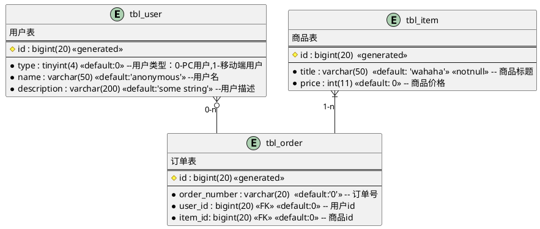

## 1. 是什么
- 提供了表示实体类型、属性和联系的方法，用来描述现实世界的概念模型
## 2. 例子

## 3. 参考
- [Entity Relationship diagram syntax and features](https://plantuml.com/zh/ie-diagram)
- [抽象思维实践——ddl2plantuml开发记录](https://juejin.cn/post/6844904016271376398)
