## 1. DOT语言
### 1.1. 三要素
- 图
    - 使用`graph`或者`digraph`定义
- 节点
    - 一个变量名就是一个node
- 边
    - 使用`--`或者`->`定义
### 1.2. 注释
- 使用`//`或者`/**/`
### 1.3. 语句
- 语句之间使用`;`分割
### 1.4. 属性
- 使用`[key=value, key1=value1, key3="value3, value4"]`

## 2. 图
### 2.1. 定义
#### 2.1.1. 有向图
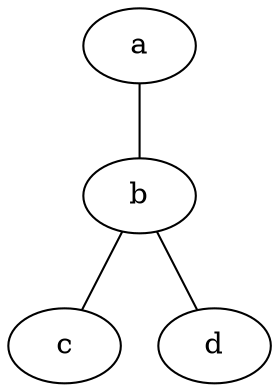

#### 2.1.2. 无向图
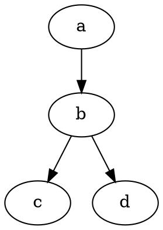
### 2.2. 图的属性
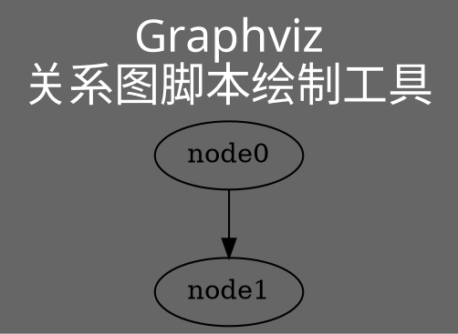

### 2.3. 子图
- 使用`subgraph`定义，名字为`cluster_xxx`
- 子图继承父图的属性，但可以对其进行重定义覆盖，范围仅限于该子图，不会对父图或兄弟图进行污染
- Graphviz中，关系只存在节点之间，不存在节点与子图，子图和子图的关系；要解决这个问题，可以将上层的compound设置为true，然后通过将边属性中的lhead和ltail设定为相应的子图来建立

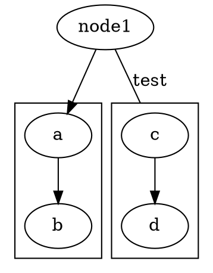

## 3. 节点

### 3.1. 定义
#### 3.1.1. 普通节点
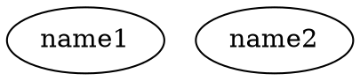

#### 3.1.2. 表格节点
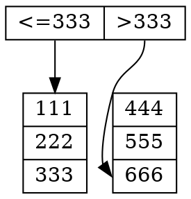

### 3.2. 节点属性

#### 3.2.1. 全局
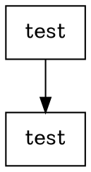

#### 3.2.2. 局部
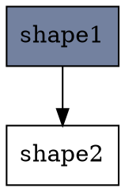
### 3.3. 端点
- 节点有 8 个端口可以用于连接： "n", "ne", "e", "se", "s", "sw", "w" 和 "nw"
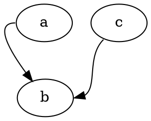

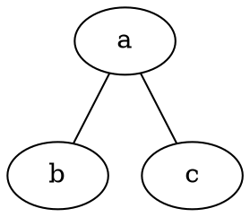
## 4. 连线

### 4.1. 定义
#### 4.1.1. 有向
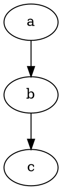

#### 4.1.2. 无向
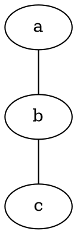
### 4.2. 连线属性
#### 4.2.1. 全局
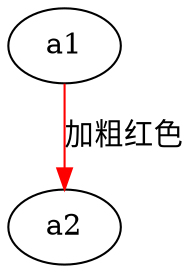

#### 4.2.2. 局部
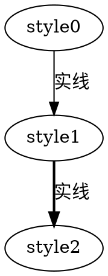

## 5. 例子

### 5.1. binary search tree
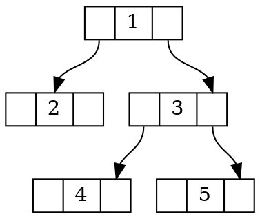
### 5.2. hash table
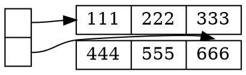

### 5.3. 人脸识别
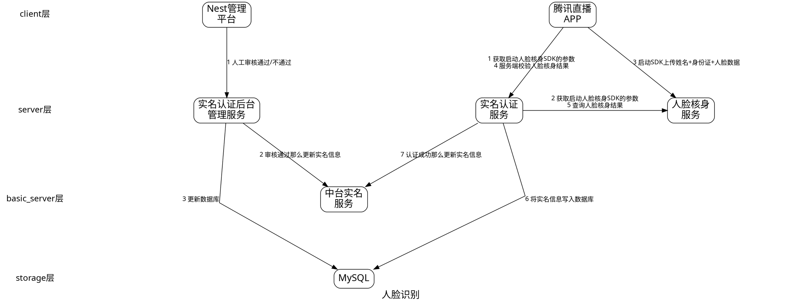

### 5.4. 通用

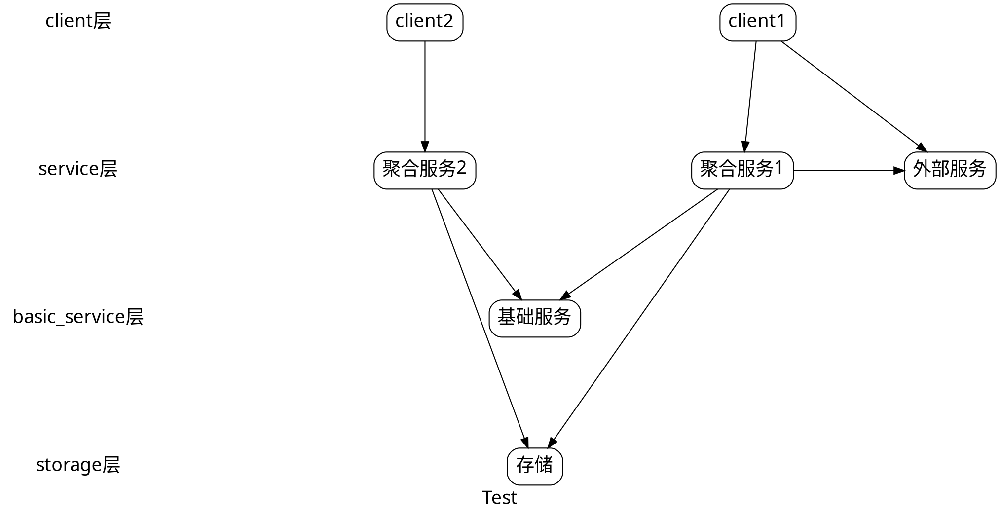
## 6. 参考
- [开源项目：【自动】绘图工具 Graphviz——《太子党关系网络》就是用它制作 @ 编程随想的博客](https://program-think.blogspot.com/2016/02/opensource-review-graphviz.html#head-5)
- [Data Structures](https://graphviz.org/Gallery/directed/datastruct.html)
- [使用 dot 画图工具](https://jeanhwea.github.io/article/drawing-graphs-with-dot.html)
- [程序员如何更好的表达自己的想法\- Graphviz:关系图脚本绘制工具](https://stidio.github.io/2017/07/how_do_programmer_express_yourself_better-graphviz/)
- [Documentation](https://graphviz.org/documentation/)
- [用Graphviz自动布局各种图 \| 陈颂光](https://www.chungkwong.cc/dot.html)

