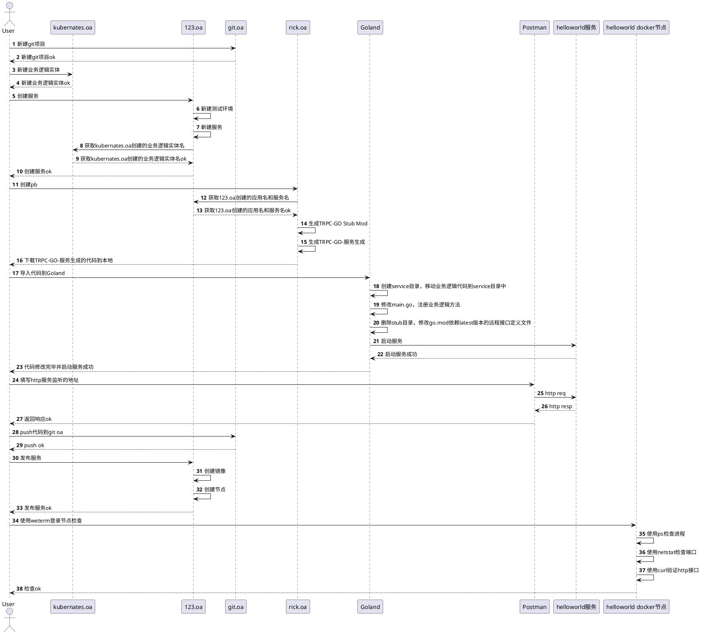

## 1. 是什么
用户和系统的各个组件之间的交互流程，主要描述消息如何传递的
[电商详情页的设计.md](../电商详情页的设计.md)
## 2. 例子

```puml
@startuml

autonumber

actor User
participant kubernates.oa
participant 123.oa
participant git.oa
participant rick.oa
participant Goland
participant Postman
participant helloworld服务
participant "helloworld docker节点"

User -> git.oa: 新建git项目
User <-- git.oa: 新建git项目ok
User -> kubernates.oa: 新建业务逻辑实体
User <-- kubernates.oa: 新建业务逻辑实体ok
User -> 123.oa: 创建服务
123.oa -> 123.oa: 新建测试环境
123.oa -> 123.oa: 新建服务
123.oa -> kubernates.oa: 获取kubernates.oa创建的业务逻辑实体名
123.oa <-- kubernates.oa: 获取kubernates.oa创建的业务逻辑实体名ok
User <-- 123.oa: 创建服务ok
User -> rick.oa: 创建pb
rick.oa -> 123.oa: 获取123.oa创建的应用名和服务名
rick.oa <-- 123.oa: 获取123.oa创建的应用名和服务名ok
rick.oa -> rick.oa: 生成TRPC-GO Stub Mod
rick.oa -> rick.oa: 生成TRPC-GO-服务生成
User <-- rick.oa: 下载TRPC-GO-服务生成的代码到本地
User -> Goland: 导入代码到Goland
Goland -> Goland: 创建service目录，移动业务逻辑代码到service目录中
Goland -> Goland: 修改main.go，注册业务逻辑方法
Goland -> Goland: 删除stub目录，修改go.mod依赖latest版本的远程接口定义文件
Goland -> helloworld服务: 启动服务
Goland <-- helloworld服务: 启动服务成功
User <-- Goland: 代码修改完毕并启动服务成功
User -> Postman: 填写http服务监听的地址
Postman -> helloworld服务: http req
Postman <-- helloworld服务: http resp
User <-- Postman: 返回响应ok
User -> git.oa: push代码到git oa
User <-- git.oa: push ok
User -> 123.oa: 发布服务
123.oa -> 123.oa: 创建镜像
123.oa -> 123.oa: 创建节点
User <-- 123.oa: 发布服务ok

User -> "helloworld docker节点": 使用weterm登录节点检查
"helloworld docker节点" -> "helloworld docker节点": 使用ps检查进程
"helloworld docker节点" -> "helloworld docker节点": 使用netstat检查端口
"helloworld docker节点" -> "helloworld docker节点": 使用curl验证http接口
User <-- "helloworld docker节点": 检查ok
@enduml
```