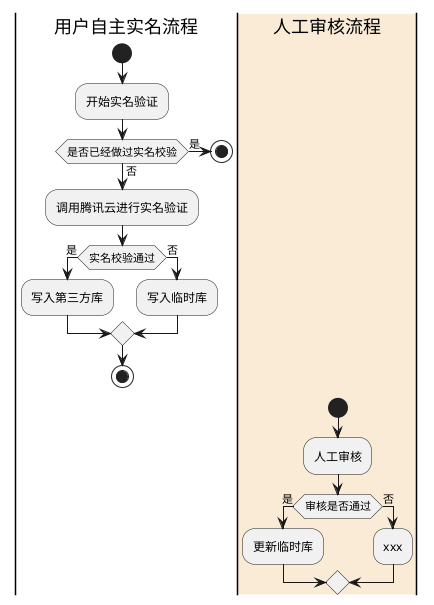
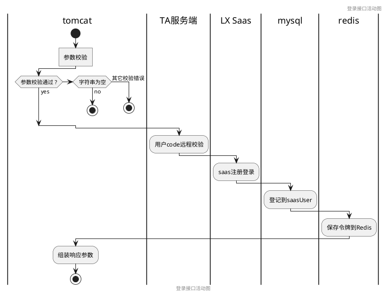

## 1. 是什么
某个流程的详细步骤，比如用于描述某个复杂函数的流程
[Hystrix.md](../../Java/Framework/Spring_Cloud/Hystrix/Hystrix.md)
## 2. 例子

```puml
@startuml

|用户自主实名流程|
start
:开始实名验证;
if (是否已经做过实名校验) then (是)
  stop
else (否)
  :调用腾讯云进行实名验证;
  if (实名校验通过) then (是)
  :写入第三方库;
  else (否)
  :写入临时库;
  endif
endif

stop
|#AntiqueWhite|人工审核流程|
start
:人工审核;
if (审核是否通过) then (是)
    :更新临时库;
else (否)
    :xxx;
endif
@enduml
```

```puml
@startuml
header 登录接口活动图
footer 登录接口活动图
|tomcat|
start
:参数校验]

if (参数校验通过 ?) then (yes)
elseif (字符串为空) then (no)
stop
else (其它校验错误)
    stop
endif

|TA服务端|
:用户code远程校验;
|LX Saas|
:saas注册登录;
|mysql|
:登记到saasUser;
|redis|
:保存令牌到Redis;
|tomcat|
:组装响应参数;
stop

@enduml
```