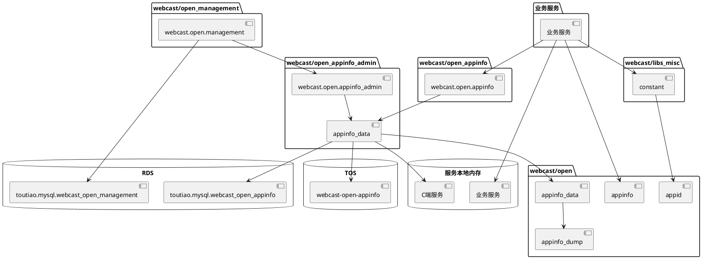

## 1. 是什么

描述每一层的组件，比如用于描述开源软件分层架构，展示了软件与**软件组件（比如库函数）的依赖**关系

## 2. 例子

```puml
@startuml


package "webcast/open_management" {
    component "webcast.open.management" as management
}

package "webcast/open_appinfo_admin" {
    component "webcast.open.appinfo_admin" as appinfo_admin
    component "appinfo_data" as appinfo_data
}

package "webcast/open_appinfo" {
    component "webcast.open.appinfo" as appinfo

}


package "webcast/open" {
    component "appinfo_dump" as appinfo_dump
    component "appid" as appid
    component "appinfo" as appinfo2
    component "appinfo_data" as appinfo_data2
}

package "webcast/libs_misc" {
    component "constant" as constant
}

package "业务服务" {
    component "业务服务" as c11

}

database "RDS" {
    component "toutiao.mysql.webcast_open_management" as webcast_open_management
    component "toutiao.mysql.webcast_open_appinfo" as webcast_open_appinfo
}

database "服务本地内存" {
    component "C端服务" as d1
    component "业务服务" as d2
}

database "TOS" {
    component "webcast-open-appinfo" as t
}

management-->webcast_open_management
management-->appinfo_admin

appinfo_admin-->appinfo_data
appinfo_data-->webcast_open_appinfo


appinfo_data-->appinfo_data2
appinfo_data2-->appinfo_dump
appinfo_data-->t
appinfo_data-->d1


appinfo-->appinfo_data

c11-->constant
constant-->appid

c11-->appinfo
c11-->appinfo2
c11-->d2
@enduml
```
