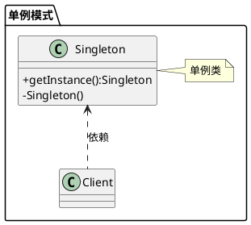

[toc]
 

一个类有且仅有一个实例对象

## 1. uml


## 2. Java

### 2.1. 饿汉式
- MySingleton
```java
public class MySingleton
{
    //jvm加载到该文件时马上创建对象
    private static MySingleton singleton = new MySingleton();

    //外部不能创建
    private MySingleton()
    {}

    //只能通过这个方法获取实例
    public static MySingleton getSingleton()
    {
        return singleton;
    }
}
```

- Client

```java
public class Client
{
    public static void main(String[] args)
    {
        MySingleton singleton = MySingleton.getSingleton();

        MySingleton singleton2 = MySingleton.getSingleton();

        //同一个对象实例
        System.out.println(singleton == singleton2);

    }
}

```
- 特点
    - 会在加载类后一开始就被初始化，即使这个实例没有被使用到


### 2.2. 懒汉式：对整个方法加锁
```java
public class MySingleton
{
    private static MySingleton singleton = null;
    //外部不能创建
    private MySingleton()
    {}

    public static synchronized MySingleton getInstance() {//必须用synchronized修饰保证线程安全
        if (instance == null) {
            instance = new MySingleton();
        }
        return instance;
    }
}
```
- 特点
    - 只有在真正用到的时候才会创建实例
    - 每次调用都要加锁，但其实只有第一次创建的时候才需要

### 2.3. 懒汉式：双重检测锁/DCL

#### 2.3.1. 第一个版本：只用sychronized块


```java
public class MySingleton
{
    private static MySingleton singleton = null;
    //外部不能创建
    private MySingleton()
    {}
    
    public static MySingleton getSingleton() {
        if (instance == null) { //Single Checked，可能有多个线程同时进入到这里
            synchronized (MySingleton.class) {
                instance = new MySingleton();
            }
        }
        return instance ;
    }
}
```


#### 2.3.2. 第二个版本：sychronized块+double check

```java
public class MySingleton
{
    private static MySingleton singleton = null;
    //外部不能创建
    private MySingleton()
    {}
    
    public static MySingleton getSingleton() {
        if (instance == null) {                         //Single Checked
            synchronized (MySingleton.class) {
                if (instance == null) {                 //Double Checked
                    instance = new MySingleton();
                }
            }
        }
        return instance ;
    }
}
```
- 问题：指令重排序
[对象的创建过程.md](../../Java/JVM/类加载/对象的创建过程.md)
`instance = new MySingleton()`有问题，这句话分成三步
    1. 分配内存
    2. 调用 Singleton 的构造函数来初始化成员变量
    3. 将instance变量的引用指向分配的内存空间
JIT存在指令重排序，如果线程1的顺序是1-3-2，线程2的顺序是1-2-3。
当线程1执行到3的时候，线程2执行获取了单例，但是还没有初始化，那么使用时就会出错
- 解决
加上volatile，利用其有序性

#### 2.3.3. 第三个版本：sychronized块+double check+volatile

```java
public class MySingleton {
    private volatile static MySingleton instance; //声明成 volatile
    private MySingleton (){}

    public static Singleton getSingleton() {
        if (instance == null) {                         
            synchronized (MySingleton.class) {
                if (instance == null) {       
                    instance = new MySingleton();
                }
            }
        }
        return instance;
    }
   
}
```

根据volatile的happen before规则，volatile写happen before于volatile 读之前。


### 2.4. 静态内部类
```java
public final class MySingleton
{
    private static class SingletonHolder
    {
        private static final MySingleton INSTANCE = new MySingleton();
    }

    private MySingleton()
    {
    }

    public static MySingleton getInstance()
    {
        return SingletonHolder.INSTANCE;
    }
    
    
}
```
- 特点
    - 由于 SingletonHolder 是私有的，除了 getInstance() 之外没有办法访问它，因此它是懒汉式的
    - 加载MySingleton类的时候如果没有用到内部类，那么内部类不会加载，如test方法；只有在用到静态内部类的时候才会加载，如getInstance方法
### 2.5. Enum

```java
public enum MySingleton
{
    SINGLETON(10);
    private Integer val;

    MySingleton(Integer val)
    {
        this.val = val;
    }

    public static void main(String[] args)
    {
        System.out.println(MySingleton.SINGLETON == MySingleton.SINGLETON);//true
    }
}

```

## 3. Golang
### 3.1. 线程不安全
- singleton

```go
type singleton struct {
}

//private
var instance *singleton

//public
//线程不安全
func GetInstance() *singleton {
	if instance == nil {
		instance = &singleton{}
	}
	return instance
}
```

- client

```go
func main() {
	instance := 单例.GetInstance()
	instance2 := 单例.GetInstance()

	fmt.Println(instance == instance2)

}
```

### 3.2. 线程安全

```go
//线程安全 加锁
var mutex sync.Mutex

func GetInstance2() *singleton {

	mutex.Lock()
	defer mutex.Unlock()
	if instance == nil {
		instance = &singleton{}
	}
	return instance
}
```

### 3.3. 线程安全DCL

```go
//DCL
func GetInstance3() *singleton {
	if instance == nil {
		mutex.Lock()
		defer mutex.Unlock()
		if instance == nil {
			instance = &singleton{}
		}
	}
	return instance
}


```

### 3.4. sync.Once

```go

//只执行一次
var once sync.Once

func GetInstance4() *singleton {
	once.Do(func() {
		instance = &singleton{}
	})
	return instance
}

```


## 4. 参考
- [如何正确地写出单例模式
](http://wuchong.me/blog/2014/08/28/how-to-correctly-write-singleton-pattern/index.html)
- [朝花夕拾——Java静态内部类加载\_Java\_走川\-CSDN博客](https://blog.csdn.net/zhang_yanye/article/details/50344447)
- [Golang单例模式 \- 简书](https://www.jianshu.com/p/d2fc1c998fc9)
- [senghoo/golang\-design\-pattern: 设计模式 Golang实现－《研磨设计模式》读书笔记](https://github.com/senghoo/golang-design-pattern)
