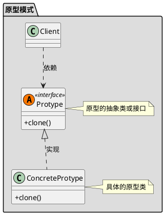

[toc]

new 一个对象需要很多数据准备,不如以某个对象为原型,clone一份,再修改value
## 1. uml


## 2. Java
### 2.1. client
```java
public class Client
{
    public static void main(String[] args) throws CloneNotSupportedException
    {
        Sheep sheep = new Sheep();
        sheep.setName("原型羊");
        sheep.setDateTime(LocalDateTime.now());

        Sheep sheep1 = (Sheep)sheep.clone();
        sheep1.setName("复制羊");

        //两者时间相同
        System.out.println(sheep);
        System.out.println(sheep1);
        System.out.println(sheep.getDateTime().equals(sheep1.getDateTime()));

        System.out.println("**********************");
        //修改sheep的时间,sheep1的时间应该不变
        sheep.setDateTime(LocalDateTime.now());

        //两者时间应该不同
        System.out.println(sheep);
        System.out.println(sheep1);
        System.out.println(sheep.getDateTime().equals(sheep1.getDateTime()));

    }
}
```
### 2.2. sheep
```java
public class Sheep implements Cloneable//实现clone接口
{
    private String name;
    //immutable,所以不用clone
    private LocalDateTime dateTime;

    @Override//重写clone方法
    public Object clone() throws CloneNotSupportedException
    {
        Object object = super.clone();

        //如果是深复制,那么需要递归复制每个属性

        return object;
    }

    @Override
    public String toString()
    {
        return "Sheep{" + "name='" + name + '\'' + ", dateTime=" + dateTime + '}';
    }

    public String getName()
    {
        return name;
    }

    public void setName(String name)
    {
        this.name = name;
    }

    public LocalDateTime getDateTime()
    {
        return dateTime;
    }

    public void setDateTime(LocalDateTime dateTime)
    {
        this.dateTime = dateTime;
    }
}

```


## 3. Golang
### 3.1. Sheep

```go
//Cloneable 是原型对象需要实现的接口
type Cloneable interface {
	Clone() Cloneable
}

type Sheep struct {
	Name string
}

func NewSheep(name string) *Sheep {
	return &Sheep{Name: name}
}

func (s *Sheep) Clone() Cloneable {
	sClone := *s
	return &sClone
}

```

### 3.2. client

```go
func main() {
	sheep := 原型模式.NewSheep("大力羊")
	cloneSheep := sheep.Clone()
	fmt.Println(sheep == cloneSheep)
}


```


## 4. 实例

```go

// globalActivitySeckillCardDao ...
var globalActivitySeckillCardDao = &ActivitySeckillCardDao{
	mutex: new(sync.RWMutex),
}

// ActivitySeckillCardDao ...
type ActivitySeckillCardDao struct {
	mutex                *sync.RWMutex
	activitySeckillCards map[int64]*model.ActivitySeckillCard
}

// GetActivitySeckillCardDaoInstance ...
func GetActivitySeckillCardDaoInstance() *ActivitySeckillCardDao {
	return globalActivitySeckillCardDao
}

// UpdateSeckillCard ...
func (a *ActivitySeckillCardDao) UpdateSeckillCard(ctx context.Context,
	seckillCards []*model.ActivitySeckillCard) {
	m := make(map[int64]*model.ActivitySeckillCard)
	for _, card := range seckillCards {
		m[card.Id] = card
	}

	a.mutex.Lock()
	a.activitySeckillCards = m
	a.mutex.Unlock()
}

// GetSeckillCardById ...
func (a *ActivitySeckillCardDao) GetSeckillCardById(seckillCardId int64) *model.ActivitySeckillCard {
	a.mutex.RLock()
	defer a.mutex.RUnlock()

	return clone.Clone(a.activitySeckillCards[seckillCardId]).(*model.ActivitySeckillCard)
}

// GetAllSeckillCard
func (a *ActivitySeckillCardDao) GetAllSeckillCard() map[int64]*model.ActivitySeckillCard {
	a.mutex.RLock()
	defer a.mutex.RUnlock()

	return clone.Clone(a.activitySeckillCards).(map[int64]*model.ActivitySeckillCard)
}
 
```