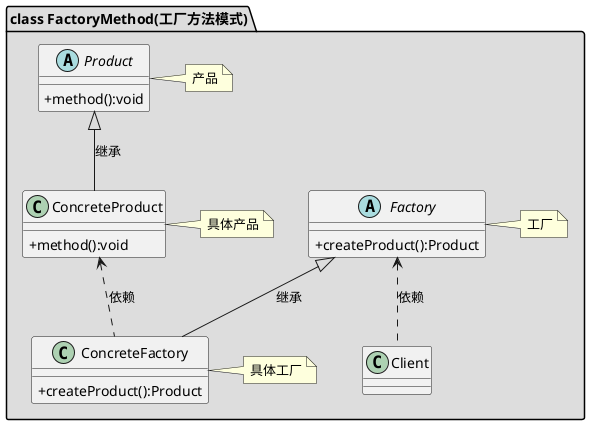

[toc]

相对于简单工厂有多个工厂类。我们可以传递具体工厂实例而不是具体的产品到子类中，当需要的时候再调用工厂实例的创建产品方法（等于把创建实例对象的时机延迟到子类中）

## 1. uml


## 2. Java
### 2.1. client
```java
public class Client
{
    public static void main(String[] args)
    {
        Car car = new AudiCarFactory().getCar();
        car.run();

        Car car2 = new QQCarFactory().getCar();
        car2.run();

    }
}

```
### 2.2. 工厂
```java

public interface CarFactory
{
    Car getCar();
}

```

```java
public class AudiCarFactory implements CarFactory
{
    @Override
    public Car getCar()
    {
        return new AudiCar();
    }
}

```
```java
public class QQCarFactory implements CarFactory
{
    @Override
    public Car getCar()
    {
        return new QQCar();
    }
}
```
### 2.3. 产品
```java
public interface Car
{
    void run();
}

```
```java
public class AudiCar implements Car
{
    @Override
    public void run()
    {
        System.out.println("奥迪");
    }
}

```
```java
public class QQCar implements Car
{
    @Override
    public void run()
    {
        System.out.println("qq car");
    }
}

```


## 3. Golang

### 3.1. 工厂

```go
/*工厂接口*/
type CarFactory interface {
	CreateCar() Car
}

/*QQ车工厂*/
type QQCarFactory struct {

}

func (Q QQCarFactory) CreateCar() Car {
	return &QQCar{}
}


/*奥迪车工厂*/
type AodiCarFactory struct {

}

func (a AodiCarFactory) CreateCar() Car {
	return &AodiCar{}
}

```

### 3.2. 产品


```go
/*汽车接口*/
type Car interface {
	Run()
}

/*QQ车*/
type QQCar struct {

}

func (Q QQCar) Run() {
	fmt.Println("QQ Car")
}

/*奥迪车*/
type AodiCar struct {

}

func (Q AodiCar) Run() {
	fmt.Println("Aodi Car")
}

```
### 3.3. client

```go
func main() {
	RunCar(&工厂方法.QQCarFactory{})
	RunCar(&工厂方法.AodiCarFactory{})

}

func RunCar(factory 工厂方法.CarFactory)  {
	factory.CreateCar().Run()
}

```