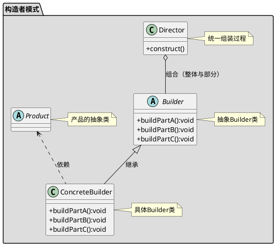

[toc]

用于构建一个对象,这个对象由许多小对象组成,且流程复杂.如各种Builder.
builder负责构建,director负责组装

## 1. uml


## 2. Java

### 2.1. client
```java
public class Client
{
    public static void main(String[] args)
    {
        AirShip ship = new MyAirshipDirector().direct(new MyAirshipBuilder());
        System.out.println(ship);
    }
}
```
### 2.2. 产品
```java
public class AirShip
{
    private Engine engine;
    private EscapeTower tower;

    public Engine getEngine()
    {
        return engine;
    }

    public void setEngine(Engine engine)
    {
        this.engine = engine;
    }

    public EscapeTower getTower()
    {
        return tower;
    }

    public void setTower(EscapeTower tower)
    {
        this.tower = tower;
    }

    @Override
    public String toString()
    {
        return "AirShip{" + "engine=" + engine + ", tower=" + tower + '}';
    }
}
```
```java
public class Engine
{
    private String name;

    public String getName()
    {
        return name;
    }

    public void setName(String name)
    {
        this.name = name;
    }

    @Override
    public String toString()
    {
        return "Engine{" + "name='" + name + '\'' + '}';
    }
}
```
```java
public class EscapeTower
{
    private String name;

    public String getName()
    {
        return name;
    }

    public void setName(String name)
    {
        this.name = name;
    }

    @Override
    public String toString()
    {
        return "EscapeTower{" + "name='" + name + '\'' + '}';
    }
}
```
### 2.3. 构造者
```java
public interface AirshipBuilder
{
    Engine buildEngine();
    EscapeTower buildTower();
}

```
```java
public class MyAirshipBuilder implements AirshipBuilder
{
    @Override
    public Engine buildEngine()
    {
        Engine engine = new Engine();
        engine.setName("我的引擎");
        return engine;
    }

    @Override
    public EscapeTower buildTower()
    {
        EscapeTower escapeTower = new EscapeTower();
        escapeTower.setName("我的逃生塔");
        return escapeTower;
    }
}
```
### 2.4. 装配者
```java
public interface AirshipDirector
{
    AirShip direct(AirshipBuilder airshipBuilder);
}
```
```java
public class MyAirshipDirector implements AirshipDirector
{
    @Override
    public AirShip direct(AirshipBuilder airshipBuilder)
    {
        //通过builder构造组件
        Engine engine = airshipBuilder.buildEngine();
        EscapeTower escapeTower = airshipBuilder.buildTower();

        //这里可以和工厂模式结合
        AirShip airShip = new AirShip();

        //装配
        airShip.setEngine(engine);
        airShip.setTower(escapeTower);

        return airShip;
    }
}

```


## 3. Golang
### 3.1. client

```go
func main() {
	fmt.Println(构建者.NewAirShipDirectorImpl().DirectAirShip(构建者.NewStrongAirShipPartsBuilder()).ToString())
	fmt.Println(构建者.NewAirShipDirectorImpl().DirectAirShip(构建者.NewWeakAirShipPartsBuilder()).ToString())
}
```

### 3.2. 产品

```go
/*宇宙飞船的零件1：引擎*/
type Engine struct {
	Name string
}

func NewEngine(name string) *Engine {
	return &Engine{Name: name}
}

/*宇宙飞船的零件2：逃生塔*/
type EscapeTower struct {
	Name string
}

func NewEscapeTower(name string) *EscapeTower {
	return &EscapeTower{Name: name}
}

/*宇宙飞船*/
type AirShip struct {
	Engine      *Engine
	EscapeTower *EscapeTower
}

func NewAirShip(engine *Engine, escapeTower *EscapeTower) *AirShip {
	return &AirShip{Engine: engine, EscapeTower: escapeTower}
}

func (a AirShip) ToString() string {
	return "引擎: " + a.Engine.Name + " 逃生塔: " +  a.EscapeTower.Name
}
```

### 3.3. 构造者

```go
/*宇宙飞船零件的构建者*/
type AirShipPartsBuilder interface {
	BuildEngine() *Engine
	BuildEscapeTower() *EscapeTower
}

type StrongAirShipPartsBuilder struct {
}

func NewStrongAirShipPartsBuilder() *StrongAirShipPartsBuilder {
	return &StrongAirShipPartsBuilder{}
}

func (s StrongAirShipPartsBuilder) BuildEngine() *Engine {
	return NewEngine("强悍的引擎")
}

func (s StrongAirShipPartsBuilder) BuildEscapeTower() *EscapeTower {
	return NewEscapeTower("强悍的逃生塔")

}


type WeakAirShipPartsBuilder struct {
}

func NewWeakAirShipPartsBuilder() *WeakAirShipPartsBuilder {
	return &WeakAirShipPartsBuilder{}
}

func (s WeakAirShipPartsBuilder) BuildEngine() *Engine {
	return NewEngine("弱逼的引擎")
}

func (s WeakAirShipPartsBuilder) BuildEscapeTower() *EscapeTower {
	return NewEscapeTower("弱逼的逃生塔")

}
```

### 3.4. 装配者

```go
/*宇宙飞船零件的组装者*/
type AirShipDirector interface {
	DirectAirShip(AirShipPartsBuilder) AirShip
}

type AirShipDirectorImpl struct {
}

func NewAirShipDirectorImpl() *AirShipDirectorImpl {
	return &AirShipDirectorImpl{}
}

func (a AirShipDirectorImpl) DirectAirShip(builder AirShipPartsBuilder) *AirShip {
	return NewAirShip(builder.BuildEngine(), builder.BuildEscapeTower())
}

```


## 4. 实例
### 4.1. HttpBuilder
```go
package builder

import (
	"bytes"
	"context"
	"net/http"
	"time"
)

// DefaultTimeout ...
const DefaultTimeout = 1

// HttpBuilder ...
type HttpBuilder struct {
	method      string
	url         string
	headers     map[string]string
	queryParams map[string]string
	body        string
	timeout     int
}

// NewHttpBuilder ...
func NewHttpBuilder() *HttpBuilder {
	return &HttpBuilder{
		headers:     make(map[string]string),
		queryParams: make(map[string]string),
	}
}

// Method ...
func (h *HttpBuilder) Method(method string) *HttpBuilder {
	h.method = method
	return h
}

// Url ...
func (h *HttpBuilder) Url(url string) *HttpBuilder {
	h.url = url
	return h
}

// Header ...
func (h *HttpBuilder) Header(key string, value string) *HttpBuilder {
	h.headers[key] = value
	return h
}

// QueryParam ...
func (h *HttpBuilder) QueryParam(key string, value string) *HttpBuilder {
	h.queryParams[key] = value
	return h
}

// Body ...
func (h *HttpBuilder) Body(body string) *HttpBuilder {
	h.body = body
	return h
}

// Timeout ...
func (h *HttpBuilder) Timeout(timeout int) *HttpBuilder {
	h.timeout = timeout
	return h
}

// 构造http client并且请求目标地址
// error不为nil时返回的resposne、CancelFunc在使用完毕后记得用defer释放资源
func (h *HttpBuilder) DoRequest() (*http.Response, context.CancelFunc, error) {
	req, err := http.NewRequest(h.method, h.url,
		bytes.NewBuffer([]byte(h.body)))
	if err != nil {
		return nil, nil, err
	}

	// 组装header
	for k, v := range h.headers {
		req.Header.Set(k, v)
	}

	// 组装query params
	query := req.URL.Query()
	for k, v := range h.queryParams {
		query.Add(k, v)
	}
	req.URL.RawQuery = query.Encode()

	// 设置timeout
	timeout := DefaultTimeout
	if h.timeout > 0 {
		timeout = h.timeout
	}
	ctx, cancel := context.WithTimeout(context.Background(),
		time.Duration(timeout)*time.Second)
	req = req.WithContext(ctx)

	// 构造client发起请求
	client := &http.Client{}
	resp, err := client.Do(req)
	if err != nil {
		defer cancel()
		return nil, nil, err
	}

	return resp, cancel, nil
}
```

- 使用

```go
response, cancelFunc, err := builder.NewHttpBuilder().
	Method(http.MethodGet).
	Url(config.GlobalTencentCloudConfig.TencentCloud.AccessToken.Url).
	QueryParam(constant.ParamAppId, appId).
	QueryParam(constant.ParamSecret, secret).
	QueryParam(constant.ParamGrantType,
		config.GlobalTencentCloudConfig.TencentCloud.AccessToken.GrantType).
	QueryParam(constant.ParamVersion,
		config.GlobalTencentCloudConfig.TencentCloud.Version).
	DoRequest()

if err != nil {
	metrics.Counter(constant.MonitorGetAccessTokenNetworkFail).Incr()

	log.ErrorContextf(ctx,
		"getAccessToken: call tencent cloud get token network err. err=%v",
		err.Error())
	return "", errs.New(trpc_utils.TransferRpcErr,
		fmt.Sprintf(constant.FuncErrorPrefix, trpc_utils.RunFuncName(),
			err))
}
defer cancelFunc()
defer response.Body.Close()
body, err := ioutil.ReadAll(response.Body)
```

### 4.2. UrlBuilder
```go
func BuildUrl(ctx context.Context, path string,
	params map[string]string) string {
	urlParams := url.Values{}
	for k, v := range params {
		urlParams.Set(k, v)
	}
	return fmt.Sprintf("%s?%s", path, urlParams.Encode())
}

```