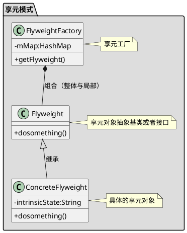

[toc]

## 1. 定义
适用于大量相同或者相似对象的创建,如线程池

## 2. uml

## 3. 使用
### 3.1. client
```java
public class Client
{
    public static void main(String[] args)
    {
        Chess chess1 = ChessFactory.getChess("黑色");
        Chess chess2 = ChessFactory.getChess("黑色");

        //相同
        System.out.println(chess1 == chess2);

        chess1.display(new Coordinate(10,20 ));

    }
}

```
### 3.2. 享元
```java
public class Chess
{
    //共享的属性
    protected String color;

    public Chess(String color)
    {
        this.color = color;
    }

    public String getColor()
    {
        return color;
    }

    public void setColor(String color)
    {
        this.color = color;
    }

    public void display(Coordinate coordinate)
    {

    }
}

```
```java
public class ConcreateChess extends Chess
{
    public ConcreateChess(String color)
    {
        super(color);
    }

    @Override
    public void display(Coordinate coordinate)
    {
        System.out.println(this.color);
        System.out.println(coordinate);
    }

}

```
```java
public class Coordinate
{
    //非共享的属性
    private int x,y;

    public Coordinate(int x, int y)
    {
        this.x = x;
        this.y = y;
    }

    @Override
    public String toString()
    {
        return "Coordinate{" + "x=" + x + ", y=" + y + '}';
    }

    public int getX()
    {
        return x;
    }

    public void setX(int x)
    {
        this.x = x;
    }

    public int getY()
    {
        return y;
    }

    public void setY(int y)
    {
        this.y = y;
    }
}
```
### 3.3. 工厂
```java
public class ChessFactory
{
    //对象池
    private static Map<String, Chess> chessMap = new HashMap<>();

    public static Chess getChess(String color)
    {
        //有的话直接从池子里取,没有的话创建再放入池子
        chessMap.putIfAbsent(color, new ConcreateChess(color));
        return chessMap.get(color);
    }
}
```