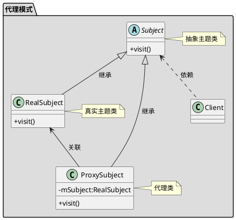

[toc]
 
## 1. 定义
不改变原有代码的基础上为类或者函数增加新功能。

我不想做跟我业务无关的东西

## 2. uml


## 3. Java
### 3.1. 静态代理
代理类在编译时生成，需要程序员自己手写
#### 3.1.1. client
```java
public class Client
{
    public static void main(String[] args)
    {
        Proxy proxy = new Proxy(new RealImpl());
        proxy.run();
    }
}
```
#### 3.1.2. 代理
```java
public class Proxy implements Real
{
    private Real real;

    public Proxy(Real real)
    {
        this.real = real;
    }

    public void run()
    {
        System.out.println("运行之前");
        this.real.run();
        System.out.println("运行之后");
    }

}
```
#### 3.1.3. 被代理
```java
public interface Real
{
    void run();
}
```
```java
public class RealImpl implements Real
{
    @Override
    public void run()
    {
        System.out.println("Real run");
    }
}
```


### 3.2. 动态代理

代理类在运行时生成， 利用的java的反射机制

#### 3.2.1. jdk 动态代理
使用接口实现动态代理，需要目标类有个接口

##### 3.2.1.1. client
```java
public class Client
{
    public static void main(String[] args)
    {
        Proxy proxy = new Proxy(new RealImpl());

        Real obj = (Real)  proxy.getProxyInstance(ClassLoader.getSystemClassLoader(), new Class[]{Real.class}, proxy);
        obj.run();
    }
}
```
##### 3.2.1.2. 代理
```java
//代理类不需要实现被代理类的接口
public class Proxy implements InvocationHandler
{
    private Real real;

    public Proxy(Real real)
    {
        this.real = real;
    }

    //为目标对象生成代理对象
    public Object getProxyInstance(ClassLoader loader, Class<?>[] interfaces, InvocationHandler h) {
        return java.lang.reflect.Proxy.newProxyInstance(loader, interfaces, h);
    }

    @Override
    public Object invoke(Object proxy, Method method, Object[] args) throws Throwable
    {
        System.out.println("*************************");
        method.invoke(real, args);
        System.out.println("*************************");
        return null;
    }
}
```
##### 3.2.1.3. 被代理
```java
public interface Real
{
    void run();
}

```
```java
public class RealImpl implements Real
{
    @Override
    public void run()
    {
        System.out.println("Real run");
    }
}
```


#### 3.2.2. cglib
通过继承目标类来实现，不能对final修饰的类进行代理
##### 3.2.2.1. client

```java
public class Client
{
    public static void main(String[] args)
    {
        Proxy proxy = new Proxy(new Real());

        Real obj = (Real) proxy.getProxyInstance();
        obj.run();
    }
}
```

##### 3.2.2.2. 代理
```java
public class Proxy implements MethodInterceptor
{
    private Real real;

    public Proxy(Real real)
    {
        this.real = real;
    }

    //为目标对象生成代理对象
    public Object getProxyInstance() {
        //工具类
        Enhancer en = new Enhancer();
        //设置父类
        en.setSuperclass(real.getClass());
        //设置回调函数
        en.setCallback(this);
        //创建子类对象代理
        return en.create();
    }

    @Override
    public Object intercept(Object o, Method method, Object[] objects, MethodProxy methodProxy) throws Throwable
    {
        System.out.println("run之前");
        // 执行目标对象的方法
        Object returnValue = method.invoke(real, objects);
        System.out.println("run之后");
        return null;
    }
}
```
##### 3.2.2.3. 被代理
```java
public class Real
{
    public void run()
    {
        System.out.println("Real run");
    }
}
```


### 3.3. Spring AOP
- 如果目标类实现了接口
那么默认情况使用JDK动态代理
也可以强制使用CGLIB
- 如果目标类没有实现接口
那么使用CGLIB


## 4. Golang
### 4.1. 被代理

```go
/*接口*/
type IReal interface {
	Do()
}

/*具体对象*/
type Real struct {
}

func NewReal() *Real {
	return &Real{}
}

func (r Real) Do() {
	fmt.Println("具体对象 doing...")
}
```

### 4.2. 代理

```go
/*代理对象*/
type Proxy struct {
	Real IReal
}

func NewProxy(real IReal) *Proxy {
	return &Proxy{Real: real}
}

func (p Proxy) Do() {
	fmt.Println("before")

	p.Real.Do()

	fmt.Println("after")
}
```

### 4.3. client

```go
func main() {
	real := 代理.NewReal()
	proxy := 代理.NewProxy(real)
	proxy.Do()
}
```

## 5. 实例
### 5.1. 缓存代理


- cache/cache.go

```go
package cache

import (
	"context"
	"fmt"
	lru "github.com/hnlq715/golang-lru"
)

var ActIdCache *lru.ARCCache

func init() {
	ActIdCache, _ = lru.NewARC(100)
}

type CacheableFunc = func(ctx context.Context, key fmt.Stringer) (interface{}, error)

//缓存由fn计算的value，如果fn返回error那么不缓存
func WithCache(lruCache *lru.ARCCache,
	fn func(ctx context.Context, key fmt.Stringer) (interface{}, error),
	ctx context.Context, key fmt.Stringer) (interface{}, error) {
	//从缓存中查，有则返回
	if value, ok := lruCache.Get(key.String()); ok {
		fmt.Printf("WithCache: get value %v from cache for key %v\n", value, key.String())
		return value, nil
	}

	//缓存中没有，那么调用目标函数。调用成功同时添加到缓存中
	value, err := fn(ctx, key)
	if err == nil {
		fmt.Printf("WithCache: add value %v to cache for key %v\n", value, key.String())
		lruCache.Add(key.String(), value)
	}
	return value, err
}

//调用目标函数失败之后降级使用缓存
func WithFallbackCache(lruCache *lru.ARCCache,
	fn func(ctx context.Context, key fmt.Stringer) (interface{}, error),
	ctx context.Context, key fmt.Stringer) (interface{}, error) {

	//先调用目标函数，调用成功同时添加到缓存中
	value, err := fn(ctx, key)
	if err == nil {
		fmt.Printf("WithFallbackCache: add value %v to cache for key %v\n", value, key.String())
		lruCache.Add(key.String(), value)
		return value, nil
	}
	//目标函数调用失败，那么降级使用缓存
	if value, ok := lruCache.Get(key.String()); ok {
		fmt.Printf("WithFallbackCache: get value %v from cache for key %v\n", value, key.String())
		return value, nil
	}

	return value, err
}

```

- model/model.go

```go
package model

import "fmt"

type ActIdCacheParam struct {
	Source string
}

func NewActIdCacheParam(source string) *ActIdCacheParam {
	return &ActIdCacheParam{Source: source}
}

func (a *ActIdCacheParam) String() string {
	return fmt.Sprintf("%s", a.Source)
}

```

- service/service.go

```go
package service

import (
	"context"
	"fmt"
	"strconv"
	"test/proxy/cache"
	"test/proxy/model"
)

//根据source获取actId
//使用cache.CacheableFunc定义表示这个函数实现了可缓存的接口
var getActIdBySourceFunc cache.CacheableFunc = func(ctx context.Context, key fmt.Stringer) (interface{}, error) {

	actIdCacheParam := key.(*model.ActIdCacheParam)
	actId, err := strconv.Atoi(actIdCacheParam.Source)
	return actId, err
}

func GetActIdBySource(source string) (int, error) {
	cachedValue, err := cache.WithCache(cache.ActIdCache, getActIdBySourceFunc, context.Background(),
		model.NewActIdCacheParam(source))
	if err != nil {
		return 0, err
	}
	actId := cachedValue.(int)
	return actId, nil
}

```

- proxy_test.go

```go
package proxy

import (
	"test/proxy/service"
	"testing"
)

func TestProxy(t *testing.T) {
	service.GetActIdBySource("11")
	service.GetActIdBySource("11")
}

```

## 6. 参考链接

- [JDK动态代理和cglib动态代理 \- 简书](https://www.jianshu.com/p/1712ef4f2717)
- [java \- What is the difference between JDK dynamic proxy and CGLib? \- Stack Overflow](https://stackoverflow.com/questions/10664182/what-is-the-difference-between-jdk-dynamic-proxy-and-cglib)
- [Java中“装饰模式”和“代理模式”有啥区别？ \- 知乎](https://www.zhihu.com/question/41988550)
- [在Golang进化的代理模式 \- 简书](https://www.jianshu.com/p/2b11163f35a3)

