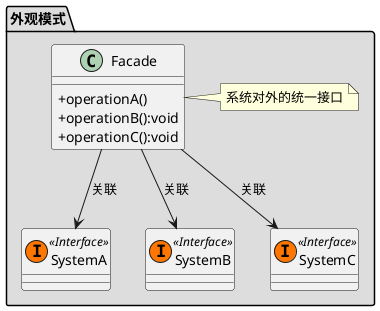

[toc]

## 1. 定义

把复杂的流程封装到一个类中,比如各种util
## 2. uml


## 3. Java
### 3.1. client
```java
public class Client
{
    public static void main(String[] args)
    {
        Facade facade = new Facade();
        facade.run();
    }
}

```
### 3.2. 复杂流程
```java
public class 流程1
{
    public void run()
    {
        System.out.println("流程1");
    }

}
```
```java
public class 流程2
{
    public void run()
    {
        System.out.println("流程1");
    }
}
```
### 3.3. 外观
```java
public class Facade
{
    public void run()
    {
        流程1 a = new 流程1();
        流程2 b = new 流程2();

        a.run();
        b.run();

    }
}
```

## 4. Golang

### 4.1. 复杂流程

```go
type ExportExcelUtilImpl struct {
}

func NewExportExcelUtilImpl() *ExportExcelUtilImpl {
	return &ExportExcelUtilImpl{}
}

func (e ExportExcelUtilImpl) Export() *Excel {
	excel := &Excel{}
	excel.Name = "导出"
	//读取数据库
	data := e.readFromDB()
	//渲染到Excel
	renderToExcel(excel, data)
	//返回Excel
	return excel
}

func (e ExportExcelUtilImpl) readFromDB() []byte {
	return nil
}

func renderToExcel(excel *Excel, data []byte) {
	excel.Data = data
}
```

### 4.2. 外观

```go
/*Util类要返回的产品*/
type Excel struct {
	Name string
	Data []byte
}

func (e Excel) ToString() string {
	return e.Name
}

/*Excel导出工具类*/
type ExportExcelUtil interface {
	Export() Excel
}
```

### 4.3. client

```go
func main() {
	fmt.Println(结构型模式.NewExportExcelUtilImpl().Export().ToString())
}

```