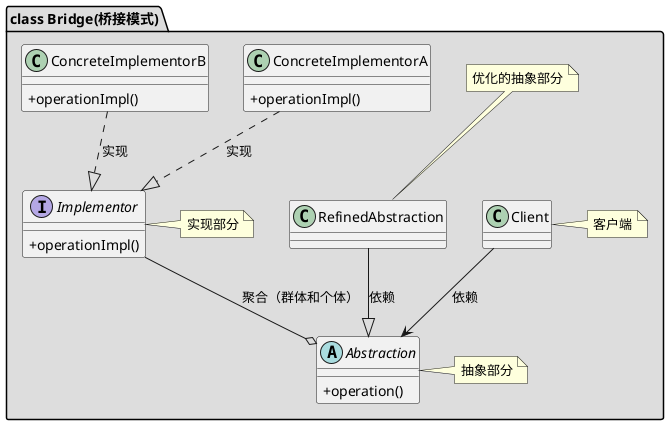

[toc]

## 1. 定义

适用于多个维度变化的类层次

## 2. uml



## 3. Java
### 3.1. client
```java
public class Client
{
    public static void main(String[] args)
    {
        //创建联想兼笔记本
        Computer computer = new Laptop(new Lenovo());
        computer.sale();
    }
}
```
### 3.2. 维度1
```java
public interface Brand
{
    void sale();
}

```
```java
public class Dell implements Brand
{

    @Override
    public void sale()
    {
        System.out.println("戴尔品牌");
    }
}
```
```java
public class Lenovo implements Brand
{

    @Override
    public void sale()
    {
        System.out.println("联想品牌");
    }
}
```
### 3.3. 维度2
```java
public class Computer
{
    protected Brand brand;

    public Computer(Brand brand)
    {
        this.brand = brand;
    }

    public void sale()
    {
        this.brand.sale();
    }
}
```
```java
class Desktop extends Computer
{
    public Desktop(Brand brand)
    {
        super(brand);
    }

    @Override
    public void sale()
    {
        super.sale();
        System.out.println("桌面机");
    }
}
```
```java
public class Laptop extends Computer
{

    public Laptop(Brand brand)
    {
        super(brand);
    }

    @Override
    public void sale()
    {
        super.sale();
        System.out.println("笔记本");
    }
}
```

## 4. 参考
- [设计模式之结构型模式总结 \- Structural Patterns \- 简书](https://www.jianshu.com/p/23725db5f2a5)