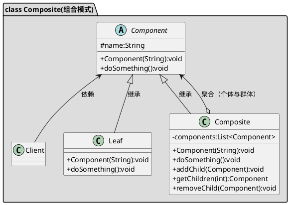

[toc]


## 1. 定义
适用于整体与局部的树形结构，用于统一叶子节点和树节点的访问，并且可以用于应用某一操作到所有子节点。
## 2. uml


## 3. Java
### 3.1. client
```java
public class Client
{
    public static void main(String[] args)
    {
        Directory file = new Directory();
        file.addChild(new ImageFile());

        file.killVirus();
    }
}
```
### 3.2. 对象
```java
public class ImageFile implements File
{
    @Override
    public void killVirus()
    {
        System.out.println("image file 杀毒");
    }
}

```
```java
public class Directory implements File
{
    private List<File> children = new ArrayList<>();

    public void addChild(File file)
    {
        this.children.add(file);
    }

    public void removeChild(File file)
    {
        this.children.remove(file);
    }


    @Override
    public void killVirus()
    {
        System.out.println("directory 杀毒");
        //天然的递归
        this.children.forEach(File::killVirus);
    }
}
```

```java
public interface File
{
    void killVirus();
}

```

## 4. Golang

### 4.1. 对象

```go
/*叶子节点和树节点的父类*/
type File interface {
	KillVirus()
	GetName() string
}

type abstractFile struct {
	Name string
}

func (a *abstractFile) GetName() string {
	return a.Name
}

/*叶子节点*/
type ImageFile struct {
	abstractFile
}

func NewImageFile(name string) *ImageFile {
	return &ImageFile{abstractFile: abstractFile{Name: name}}
}

func (i *ImageFile) KillVirus() {
	fmt.Printf("ImageFile[%s]杀毒\n", i.GetName())
}

/*树节点*/
type Directory struct {
	Children []File
	abstractFile
}

func NewDirectory(name string) *Directory {
	return &Directory{Children: make([]File, 0), abstractFile: abstractFile{Name: name}}
}

func (d *Directory) KillVirus() {
	fmt.Printf("Directory[%s]杀毒\n", d.GetName())

	for _, v := range d.Children {
		v.KillVirus()
	}
}

func (d *Directory) AddChild(file File) {
	d.Children = append(d.Children, file)
}

```

### 4.2. client

```go
func main() {
	rootDir := 组合模式.NewDirectory("根目录")
	confDir := 组合模式.NewDirectory("配置目录")
	rootDir.AddChild(组合模式.NewImageFile("wsy.jpg"))
	rootDir.AddChild(组合模式.NewImageFile("zsk.jpg"))
	rootDir.AddChild(confDir)
	confDir.AddChild(组合模式.NewImageFile("nginx.conf"))

	rootDir.KillVirus()
}

```