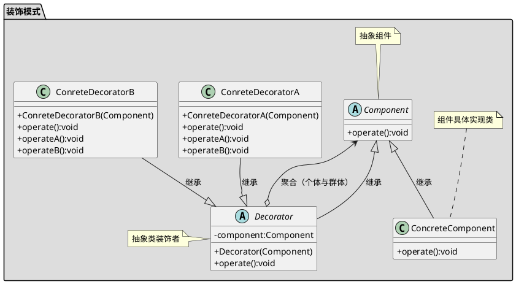

[toc]

## 1. 定义

不改变原有代码的基础上为类或者函数增加新功能。
我增强我自己的业务功能

## 2. uml


## 3. Java
### 3.1. client
```java
public class Client
{
    public static void main(String[] args)
    {
        Car car = new Mycar();
        car.run();

        System.out.println("*******************");

        //增加游泳功能
        Car swimCar = new SwimCar(car);
        swimCar.run();
    }
}
```
### 3.2. 原有对象
```java
public interface Car
{
    void run();
}
```
```java
public class Mycar implements Car
{
    @Override
    public void run()
    {
        System.out.println("my car is running...");
    }
}
```
### 3.3. 新增功能
```java
public class CarDecorator implements Car
{
    protected Car car;

    public CarDecorator(Car car)
    {
        this.car = car;
    }

    @Override
    public void run()
    {
        car.run();
    }
}
```
```java
public class SwimCar extends CarDecorator
{

    public SwimCar(Car car)
    {
        super(car);
    }

    @Override
    public void run()
    {
        this.car.run();
        System.out.println("游泳");
    }
}

```

## 4. Golang
### 4.1. 原有对象

```go
/*原有对象*/
type ICar interface {
	Run()
}

type MyCar struct {
}

func NewMyCar() *MyCar {
	return &MyCar{}
}

func (m MyCar) Run() {
	fmt.Println("I am car, I am running...")
}
```

### 4.2. 新增功能

```go
/*新增功能*/
type SwimCar struct {
	car ICar
}

func NewSwimCar(car ICar) *SwimCar {
	return &SwimCar{car: car}
}

func (s SwimCar) Run() {
	s.car.Run()
	fmt.Println("Yes, I can swim...")
}
```

### 4.3. client

```go
func main() {
	car := 装饰器.NewMyCar()
	car.Run()

	fmt.Println("============================")

	swimCar := 装饰器.NewSwimCar(car)
	swimCar.Run()
}
```

## 5. 参考
- [Java中“装饰模式”和“代理模式”有啥区别？ \- 知乎](https://www.zhihu.com/question/41988550)