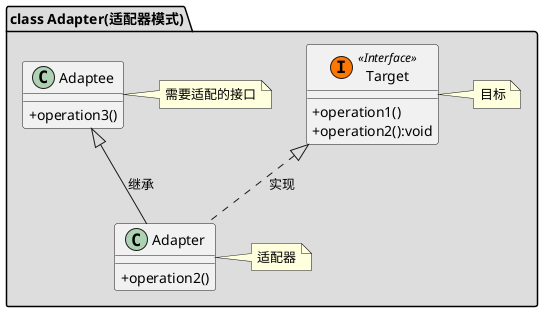

[toc]

## 1. 定义

兼容旧系统的接口

## 2. uml


## 3. Java
### 3.1. client
```java
public class Client
{
    public static void main(String[] args)
    {
        //原有接口是没参数的,现在需要一个string类型的参数
        Converter converter = new ConverterImpl(new Target());
        converter.doSomething("test");
    }
}
```
### 3.2. 被适配
```java
public class Target
{
    public void doSothing()
    {
        System.out.println("do something");
    }

}
```
### 3.3. 转换器
```java
public interface Converter
{
    void doSomething(String type);
}

```
```java
public class ConverterImpl implements Converter
{
    private Target target;

    public ConverterImpl(Target target)
    {
        this.target = target;
    }

    @Override
    public void doSomething(String type)
    {
        System.out.println(type);
        this.target.doSothing();
    }
}

```


## 4. Golang
### 4.1. 旧接口

```go
/*旧的接口*/
type IOldUserService interface {
	CreateUser(name string, age int, height int, isReal bool)
}

type OldUserServiceImpl struct {
}

func NewOldUserServiceImpl() *OldUserServiceImpl {
	return &OldUserServiceImpl{}
}

func (t OldUserServiceImpl) CreateUser(name string, age int, height int, isReal bool) {
	fmt.Printf("User name=[%s], age=[%d], height=[%d], isReal=[%t]\n",
		name, age, height, isReal)
}

```

### 4.2. 新接口

```go
/*新的接口*/
type INewUserService interface {
	CreateUser(name string, age int, height int)
}

type NewUserServiceImpl struct {
}

func NewNewUserServiceImpl() *NewUserServiceImpl {
	return &NewUserServiceImpl{}
}

func (n NewUserServiceImpl) CreateUser(name string, age int, height int) {
	fmt.Printf("User name=[%s], age=[%d], height=[%d]\n",
		name, age, height)
}
```
### 4.3. 转换器

```go
/*由于现在只用新的接口，旧的接口还不能删除，需要兼容，故需要一个转换器*/
type IConverter interface {
	CreateUser(name string, age int, height int)
}

type Converter struct {
	OldUserService IOldUserService
}

func NewConverter(oldUserService IOldUserService) *Converter {
	return &Converter{OldUserService: oldUserService}
}

func (c Converter) CreateUser(name string, age int, height int) {
	c.OldUserService.CreateUser(name, age, height, true)
}
```
### 4.4. client

```go
func main() {
	//新接口只接受3个参数
	newUserServiceImpl := 结构型模式.NewNewUserServiceImpl()
	newUserServiceImpl.CreateUser("zsk", 24, 172)

	//旧接口接受4个参数，改成新接口的格式需要一个转换器
	oldUserServiceImpl := 结构型模式.NewOldUserServiceImpl()
	converter := 结构型模式.NewConverter(oldUserServiceImpl)
	converter.CreateUser("zsk", 24, 172)
}


```