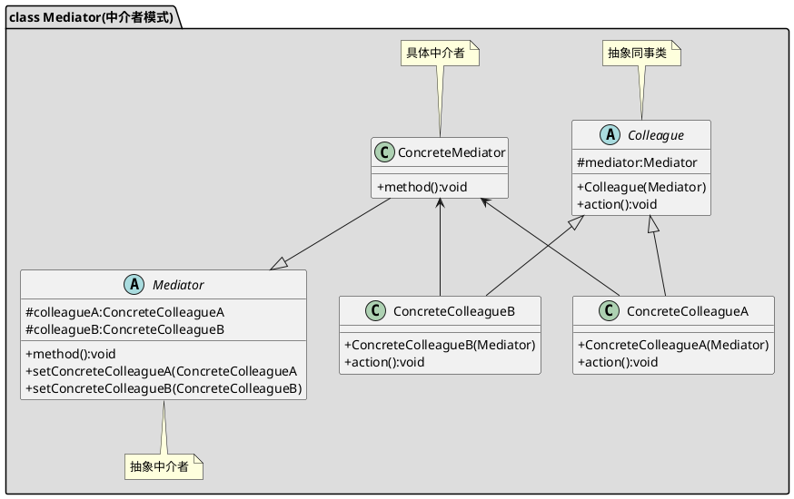

[toc]

## 1. 定义

适用于多个对象之间相互交互耦合度太高.如mvc中的c
## 2. uml

## 3. Java
### 3.1. client
```java
public class Client
{
    public static void main(String[] args)
    {
        Mediator mediator = new Boss();

        Dev dev = new Dev(mediator);
        Finacial finacial = new Finacial(mediator);

        dev.selfDo();
        //向中介发出请求
        dev.outDo("finacial");
    }
}
```

### 3.2. 中介者
```java
public interface Mediator
{
    void register(String dname,Department d);

    void command(String dname);
}
```
```java
public class Boss implements Mediator
{
    private Map<String, Department> map = new HashMap<>();

    @Override
    public void register(String dname, Department d)
    {
        map.put(dname, d);
    }

    @Override
    public void command(String dname)
    {
        map.get(dname).selfDo();
    }
}
```
### 3.3. 交互对象
```java
public interface Department
{
    void selfDo();
    void outDo(String name);
}

```
```java
public class Dev implements Department
{
    private Mediator mediator;

    public Dev(Mediator mediator)
    {
        this.mediator = mediator;
        this.mediator.register("dev", this);
    }

    @Override
    public void selfDo()
    {
        System.out.println("开发项目");
    }

    @Override
    public void outDo(String name)
    {
        System.out.println("开发部需要钱");
        mediator.command(name);
    }
}
```
```java
public class Finacial implements Department
{
    private Mediator mediator;

    public Finacial(Mediator mediator)
    {
        this.mediator = mediator;
        this.mediator.register("finacial", this);
    }

    @Override
    public void selfDo()
    {
        System.out.println("财政部发钱");
    }

    @Override
    public void outDo(String name)
    {
        System.out.println("有谁需要钱么?");
        this.mediator.command(name);
    }
}

```


## 4. Golang

### 4.1. 中介者

```go
/*中介者--计算机，处理CDDriver、CPU、VideoCard、SoundCard的交互*/
type Mediator struct {
	CD    *CDDriver
	CPU   *CPU
	Video *VideoCard
	Sound *SoundCard
}

//单例模式
var mediator *Mediator
var once sync.Once

func GetMediatorInstance() *Mediator {
	once.Do(func() {
		mediator = &Mediator{}
	})
	return mediator
}

//中介者处理各个组件的交互
func (m *Mediator) changed(i interface{}) {
	switch inst := i.(type) {
	case *CDDriver:
		m.CPU.Process(inst.Data)
	case *CPU:
		m.Sound.Play(inst.Sound)
		m.Video.Display(inst.Video)
	}
}
```

### 4.2. 交互对象

```go
/*CD驱动器负责读取数据*/
type CDDriver struct {
	Data string
}

func (c *CDDriver) ReadData() {
	c.Data = "music,image"

	fmt.Printf("CDDriver: reading data %s\n", c.Data)
	GetMediatorInstance().changed(c)
}

/*CPU负责把数据分成声音和视频*/
type CPU struct {
	Video string
	Sound string
}

func (c *CPU) Process(data string) {
	sp := strings.Split(data, ",")
	c.Sound = sp[0]
	c.Video = sp[1]

	fmt.Printf("CPU: split data with Sound %s, Video %s\n", c.Sound, c.Video)
	GetMediatorInstance().changed(c)
}

/*显卡负责处理视频*/
type VideoCard struct {
	Data string
}

func (v *VideoCard) Display(data string) {
	v.Data = data
	fmt.Printf("VideoCard: display %s\n", v.Data)
	GetMediatorInstance().changed(v)
}

/*声卡负责处理声音*/
type SoundCard struct {
	Data string
}

func (s *SoundCard) Play(data string) {
	s.Data = data
	fmt.Printf("SoundCard: play %s\n", s.Data)
	GetMediatorInstance().changed(s)
}

```

### 4.3. client

```go
func main() {
	mediator := 中介者.GetMediatorInstance()
	mediator.CD = &中介者.CDDriver{}
	mediator.CPU = &中介者.CPU{}
	mediator.Video = &中介者.VideoCard{}
	mediator.Sound = &中介者.SoundCard{}

	mediator.CD.ReadData()
}

```