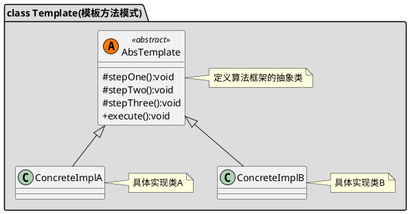

[toc]


## 1. 定义
适用于某个算法整体步骤固定,某些部分易变化.可以把变化的部分抽象出来.如servlet的doGet()和doPost()方法

## 2. uml


## 3. Java
### 3.1. client
```java
public class Client
{
    public static void main(String[] args)
    {
        BankTemplateMethod method = new BankTemplateMethod()
        {
            @Override
            public void transact()
            {
                System.out.println("我要存钱！");
            }
        };

        method.process();


        BankTemplateMethod method2 = new BankTemplateMethod()
        {
            @Override
            public void transact()
            {
                System.out.println("我要理财！");
            }
        };

        method2.process();


    }
}
```
### 3.2. 固定步骤
```java
public abstract class BankTemplateMethod
{
    private void takeNumber()
    {
        System.out.println("取号排队");
    }

    public abstract void transact();//钩子方法,放到具体的子类中实现

    private void evaluate()
    {
        System.out.println("反馈评分");
    }

    //固定的步骤
    public final void process()
    {
        this.takeNumber();

        this.transact();

        this.evaluate();
    }


}
```

## 4. Golang
### 4.1. 第一种
#### 4.1.1. client

```go
func main() {
	var downloader 模板方法.IDownloader
	downloader = 模板方法.NewFTPDownloader()
	downloader.Download("https://www.baidu.com/")

	downloader = 模板方法.NewHTTPDownloader()
	downloader.Download("https://www.baidu.com/")
}

```

#### 4.1.2. 模板方法
```go
/*下载器*/
type IDownloader interface {
	Download(url string)
}

/*模板方法内部的步骤*/
type ISteps interface {
	getContentFromUrl()
	saveContentToDisk()
}

type template struct {
	ISteps //模板方法的内部步骤接口
	url    string
}

func newTemplate(iSteps ISteps) *template {
	return &template{ISteps: iSteps}
}

/*模板方法固定的步骤*/
func (t *template) Download(url string) {
	t.url = url
	fmt.Print("准备下载\n")
	t.ISteps.getContentFromUrl()
	t.ISteps.saveContentToDisk()
	fmt.Print("下载完成\n")
	fmt.Println()
}
```

#### 4.1.3. 具体的模板方法子类

```go
/*FTP下载器实现template接口*/
type FTPDownloader struct {
	*template
}

func NewFTPDownloader() *FTPDownloader {
	downloader := &FTPDownloader{}
	downloader.template = newTemplate(downloader)
	return downloader
}

func (F *FTPDownloader) getContentFromUrl() {
	fmt.Printf("FTP从URL[%s]获取数据\n", F.url)
}

func (F *FTPDownloader) saveContentToDisk() {
	fmt.Printf("FTP把数据存放到磁盘\n")
}


/*HTTP下载器实现template接口*/
type HTTPDownloader struct {
	*template
}

func NewHTTPDownloader() *HTTPDownloader {
	downloader := &HTTPDownloader{}
	downloader.template = newTemplate(downloader)
	return downloader
}

func (H *HTTPDownloader) getContentFromUrl() {
	fmt.Printf("HTTP从URL[%s]获取数据\n", H.url)
}

func (H *HTTPDownloader) saveContentToDisk() {
	fmt.Printf("HTTP把数据存放到磁盘\n")
}
```

### 4.2. 第二种

```go
package 模板方法

import (
	"fmt"
	"testing"
)

// 接口
type IGetInfo interface {
	GetName() string
	GetAge() int
}

//抽象实现类
type BaseGetInfo struct {
}

func (b *BaseGetInfo) GetName() string {
	return "BaseGetInfo-GetName"
}

func (b *BaseGetInfo) GetAge() int {
	return 0

}

//具体类1
type GetInfo1 struct {
	*BaseGetInfo
}

func (a *GetInfo1) GetAge() int {
	return 1

}

//具体类2
type GetInfo2 struct {
	*BaseGetInfo
}

func (a *GetInfo2) GetName() string {
	return "GetInfo2-GetName"
}

//模板方法
func TemplateMethod(handler IGetInfo) {
	fmt.Println("1111")
	fmt.Println(handler.GetName(),
		handler.GetAge())
	fmt.Println("2222")
}

func TestHandle(t *testing.T) {

	TemplateMethod(&GetInfo1{})
	TemplateMethod(&GetInfo2{})

}

```
## 5. 实例
模板方法+简单工厂+策略模式


- pb.go

```go
package pb

type SwitchRoomReq struct {

}

type SwitchRoomRsp struct {

}
```
- abstract_template.go

```go
package template

import (
	"context"
	"fmt"
	"test/template/pb"
)

/*实现了IFetchDataService*/
type abstractFetchDataService struct {
	IFetchDataSteps //内部的处理步骤
	req             *pb.SwitchRoomReq
	rsp             *pb.SwitchRoomRsp
	basicInfo       interface{} //基础数据
	extraInfo       interface{} //额外数据
}

func (t *abstractFetchDataService) checkParam(ctx context.Context) error {
	fmt.Println("default checkParam")
	return nil
}

func (t *abstractFetchDataService) getBasicInfo(ctx context.Context) error {
	fmt.Println("default getBasicInfo")
	return nil

}

func (t *abstractFetchDataService) getExtraInfo(ctx context.Context) error {
	fmt.Println("default getExtraInfo")
	return nil

}

//newTemplate
func newTemplate(iSteps IFetchDataSteps) *abstractFetchDataService {
	return &abstractFetchDataService{IFetchDataSteps: iSteps}
}

/*模板方法固定的步骤*/
func (t *abstractFetchDataService) HandleRequest(ctx context.Context, req *pb.SwitchRoomReq, rsp *pb.SwitchRoomRsp) error {
	t.req = req
	t.rsp = rsp
	if err := t.IFetchDataSteps.checkParam(ctx); err != nil {
		return err
	}
	if err := t.IFetchDataSteps.getBasicInfo(ctx); err != nil {
		return err
	}
	if err := t.IFetchDataSteps.getExtraInfo(ctx); err != nil {
		return err
	}
	return nil
}

```

- content_read_template_impl.go

```go
package template

import (
	"context"
	"fmt"
)

const TypeContentReadService = 2

var contentReadServiceConstructorFunc fetchDataServiceConstructor = func() IFetchDataService {
	return NewFetchDataFromContentReadService()
}

func init() {
	GlobalServiceFactory.RegisterService(TypeContentReadService, contentReadServiceConstructorFunc)
}

/*content_read服务*/
type FetchDataFromContentReadService struct {
	*abstractFetchDataService
}

func (f *FetchDataFromContentReadService) checkParam(ctx context.Context) error {
	fmt.Println("checkParam")
	return f.abstractFetchDataService.checkParam(ctx)
}

func (f *FetchDataFromContentReadService) getBasicInfo(ctx context.Context) error {
	fmt.Println("getBasicInfo")
	return f.abstractFetchDataService.getBasicInfo(ctx)

}

//func (f *FetchDataFromContentReadService) getExtraInfo(ctx context.Context) error {
//	fmt.Println("getExtraInfo")
//	return f.abstractFetchDataService.getExtraInfo(ctx)
//
//}


//NewFetchDataFromContentReadService
func NewFetchDataFromContentReadService() *FetchDataFromContentReadService {
	service := &FetchDataFromContentReadService{}
	service.abstractFetchDataService = newTemplate(service)
	return service
}

```

- factory.go

```go
package template

import "fmt"

var GlobalServiceFactory = newServiceFactory()

//自定义func。用于创建service实例
type fetchDataServiceConstructor = func() IFetchDataService

//serviceFunc工厂
type serviceFactory struct {
	serviceMap map[int]fetchDataServiceConstructor
}

//newServiceFactory
func newServiceFactory() *serviceFactory {
	return &serviceFactory{serviceMap: make(map[int]fetchDataServiceConstructor)}
}

//根据service type获取service
func (s *serviceFactory) GetServiceByType(serviceType int) (IFetchDataService, error) {
	serviceConstructor, ok := s.serviceMap[serviceType]
	if ok {
		return serviceConstructor(), nil
	}
	err := fmt.Errorf("GetServiceByType: serviceType %v invalid", serviceType)
	return nil, err
}

//注册serviceType和serviceConstructor
func (s *serviceFactory) RegisterService(serviceType int, serviceConstructor fetchDataServiceConstructor) {
	s.serviceMap[serviceType] = serviceConstructor
}

```

- itemplate.go

```go
package template

import (
	"context"
	"test/template/pb"
)

/*对外提供获取数据列表的接口*/
type IFetchDataService interface {
	HandleRequest(ctx context.Context, req *pb.SwitchRoomReq, rsp *pb.SwitchRoomRsp) error
}

/*内部的处理步骤*/
type IFetchDataSteps interface {
	//检查参数
	checkParam(ctx context.Context) error
	//获取基础数据
	getBasicInfo(ctx context.Context) error
	//获取额外数据
	getExtraInfo(ctx context.Context) error
}

```

- template_test.go


```go
package template

import (
	"context"
	"testing"
)

func TestTemplate(t *testing.T) {
	service, _ := GlobalServiceFactory.GetServiceByType(TypeContentReadService)
	service.HandleRequest(context.Background(), nil, nil)
}
//输出
checkParam
default checkParam
getBasicInfo
default getBasicInfo
default getExtraInfo
```

## 6. 参考
- [go语言实现设计模式（三）：模版模式 \- Go语言中文网 \- Golang中文社区](https://studygolang.com/articles/5211)
- [Go继承的方法重写，继承抽象类实现\_C/C\+\+\_小笼包的专栏\-CSDN博客](https://blog.csdn.net/zhbinary/article/details/89418195)