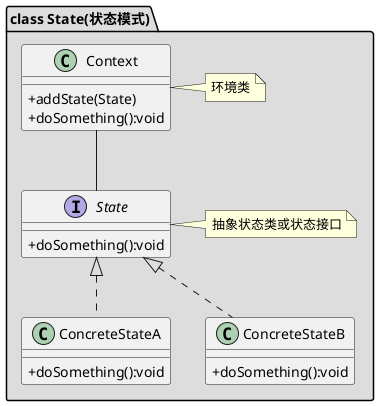

[toc]

## 1. 定义
根据状态的不同选用不同的处理逻辑，用if else太恶心

与策略模式的区别在于策略模式每种策略都是为了完成同一件事，而状态模式则是为了完成不同的事


## 2. UML


## 3. Java
### 3.1. client
```java
public class Client
{
    public static void main(String[] args)
    {
        Context context = new Context();
        context.setStatus(new FreeStatus());
        context.setStatus(new BookedStatus());
    }
}

```
### 3.2. context
```java
public class Context
{
    private Status status;

    public void setStatus(Status status)
    {
        //改变状态并且触发该状态对应的行为
        this.status = status;
        this.status.handle();
    }


}
```
### 3.3. 状态
```java
public interface Status
{
    void handle();
}

```
```java
public class BookedStatus implements Status
{
    @Override
    public void handle()
    {
        System.out.println("房间已预订");
    }
}
```
```java
public class FreeStatus implements Status
{
    @Override
    public void handle()
    {
        System.out.println("房间空闲");
    }
}

```
## 4. Golang
### 4.1. 状态

```go
/*工单处理状态*/
type ITicketStatus interface {
	Handle()
}

//处理工单
type ProcessTicketStatus struct {
}

func NewProcessTicketStatus() *ProcessTicketStatus {
	return &ProcessTicketStatus{}
}

func (p *ProcessTicketStatus) Handle() {
	fmt.Println("处理工单")
}

/*上报工单*/
type ReportTicketStatus struct {
}

func NewReportTicketStatus() *ReportTicketStatus {
	return &ReportTicketStatus{}
}

func (r *ReportTicketStatus) Handle() {
	fmt.Println("上报工单")
}
```

### 4.2. 状态管理类

```go
/*工单策略管理类*/
type TicketStatusContext struct {
	status ITicketStatus
}

func NewTicketStatusContext() *TicketStatusContext {
	return &TicketStatusContext{}
}

func (t *TicketStatusContext) Status() ITicketStatus {
	return t.status
}

func (t *TicketStatusContext) SetStatus(status ITicketStatus) {
	t.status = status
}
```

### 4.3. client
```go
func main() {
	context := 状态模式.NewTicketStatusContext()

	context.SetStatus(状态模式.NewReportTicketStatus())
	context.Status().Handle()

	context.SetStatus(状态模式.NewProcessTicketStatus())
	context.Status().Handle()
}
```