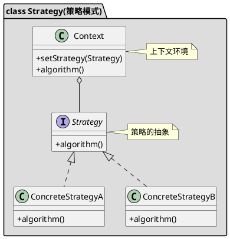

[toc]


## 1. 定义
完成同一件事有多种不同的方式，根据不同的type选择不同的算法，用if else太恶心


与状态模式的区别在于策略模式每种策略都是为了完成同一件事，而状态模式则是为了完成不同的事

## 2. uml


## 3. Java
### 3.1. client
```java
public class Client
{
    public static void main(String[] args)
    {
        double price = 100.0;

        StrategyContext context = new StrategyContext();

        //老客户少量
        context.setStrategy(new OldCustomerFew());
        context.getPrice(price);

        //新客户少量
        context.setStrategy(new NewCustomerFewer());
        context.getPrice(price);
    }
}
```
### 3.2. context
```java
public class StrategyContext
{
    private Strategy strategy;

    public Strategy getStrategy()
    {
        return strategy;
    }

    public void setStrategy(Strategy strategy)
    {
        this.strategy = strategy;
    }

    public void getPrice(double price)
    {
        System.out.println(this.strategy.getPrice(price));
    }
}
```
### 3.3. 策略
```java
public interface Strategy
{
    double getPrice(double price);
}
```
```java
public class NewCustomerFewer implements Strategy
{
    @Override
    public double getPrice(double price)
    {
        return price * 0.95;
    }
}
```
```java
public class NewCustomerMany implements Strategy
{
    @Override
    public double getPrice(double price)
    {
        return 0.9 * price;
    }
}
```
```java
public class OldCustomerFew implements Strategy
{
    @Override
    public double getPrice(double price)
    {
        return price * 0.85;
    }
}
```


## 4. Golang
### 4.1. 策略

```go
/*用户打折策略*/
type IStrategy interface {
	GetPrice(price float64) float64
}

//老用户打折多的策略
type OldCustomerMuchStrategy struct {
}

func NewOldCustomerMuch() *OldCustomerMuchStrategy {
	return &OldCustomerMuchStrategy{}
}

func (o OldCustomerMuchStrategy) GetPrice(price float64) float64 {
	return price * 0.5
}

//新用户打折少的策略
type NewCustomerMuchStrategy struct {
}

func NewNewCustomerFew() *NewCustomerMuchStrategy {
	return &NewCustomerMuchStrategy{}
}

func (o NewCustomerMuchStrategy) GetPrice(price float64) float64 {
	return price * 0.8
}

```

### 4.2. 策略管理器

```go
/*策略管理器*/
type StrategyContext struct {
	strategy IStrategy
}

func NewStrategyContext() *StrategyContext {
	return &StrategyContext{}
}

func (s *StrategyContext) Strategy() IStrategy {
	return s.strategy
}

func (s *StrategyContext) SetStrategy(strategy IStrategy) {
	s.strategy = strategy
}

//打折
func (s *StrategyContext) GetPrice(price float64)  {
	fmt.Printf("折扣后的价格：%f\n", s.strategy.GetPrice(price))
}
```

### 4.3. client

```go
func main() {
	price := 100.0
	strategyContext := 策略模式.NewStrategyContext()
	strategyContext.SetStrategy(策略模式.NewOldCustomerMuch())
	strategyContext.GetPrice(price)
	strategyContext.SetStrategy(策略模式.NewNewCustomerFew())
	strategyContext.GetPrice(price)
}
```

## 5. 实例
模板方法+简单工厂+策略模式


- pb.go

```go
package pb

type SwitchRoomReq struct {

}

type SwitchRoomRsp struct {

}
```
- abstract_template.go

```go
package template

import (
	"context"
	"fmt"
	"test/template/pb"
)

/*实现了IFetchDataService*/
type abstractFetchDataService struct {
	IFetchDataSteps //内部的处理步骤
	req             *pb.SwitchRoomReq
	rsp             *pb.SwitchRoomRsp
	basicInfo       interface{} //基础数据
	extraInfo       interface{} //额外数据
}

func (t *abstractFetchDataService) checkParam(ctx context.Context) error {
	fmt.Println("default checkParam")
	return nil
}

func (t *abstractFetchDataService) getBasicInfo(ctx context.Context) error {
	fmt.Println("default getBasicInfo")
	return nil

}

func (t *abstractFetchDataService) getExtraInfo(ctx context.Context) error {
	fmt.Println("default getExtraInfo")
	return nil

}

//newTemplate
func newTemplate(iSteps IFetchDataSteps) *abstractFetchDataService {
	return &abstractFetchDataService{IFetchDataSteps: iSteps}
}

/*模板方法固定的步骤*/
func (t *abstractFetchDataService) HandleRequest(ctx context.Context, req *pb.SwitchRoomReq, rsp *pb.SwitchRoomRsp) error {
	t.req = req
	t.rsp = rsp
	if err := t.IFetchDataSteps.checkParam(ctx); err != nil {
		return err
	}
	if err := t.IFetchDataSteps.getBasicInfo(ctx); err != nil {
		return err
	}
	if err := t.IFetchDataSteps.getExtraInfo(ctx); err != nil {
		return err
	}
	return nil
}

```

- content_read_template_impl.go

```go
package template

import (
	"context"
	"fmt"
)

const TypeContentReadService = 2

var contentReadServiceConstructorFunc fetchDataServiceConstructor = func() IFetchDataService {
	return NewFetchDataFromContentReadService()
}

func init() {
	GlobalServiceFactory.RegisterService(TypeContentReadService, contentReadServiceConstructorFunc)
}

/*content_read服务*/
type FetchDataFromContentReadService struct {
	*abstractFetchDataService
}

func (f *FetchDataFromContentReadService) checkParam(ctx context.Context) error {
	fmt.Println("checkParam")
	return f.abstractFetchDataService.checkParam(ctx)
}

func (f *FetchDataFromContentReadService) getBasicInfo(ctx context.Context) error {
	fmt.Println("getBasicInfo")
	return f.abstractFetchDataService.getBasicInfo(ctx)

}

//func (f *FetchDataFromContentReadService) getExtraInfo(ctx context.Context) error {
//	fmt.Println("getExtraInfo")
//	return f.abstractFetchDataService.getExtraInfo(ctx)
//
//}


//NewFetchDataFromContentReadService
func NewFetchDataFromContentReadService() *FetchDataFromContentReadService {
	service := &FetchDataFromContentReadService{}
	service.abstractFetchDataService = newTemplate(service)
	return service
}

```

- factory.go

```go
package template

import "fmt"

var GlobalServiceFactory = newServiceFactory()

//自定义func。用于创建service实例
type fetchDataServiceConstructor = func() IFetchDataService

//serviceFunc工厂
type serviceFactory struct {
	serviceMap map[int]fetchDataServiceConstructor
}

//newServiceFactory
func newServiceFactory() *serviceFactory {
	return &serviceFactory{serviceMap: make(map[int]fetchDataServiceConstructor)}
}

//根据service type获取service
func (s *serviceFactory) GetServiceByType(serviceType int) (IFetchDataService, error) {
	serviceConstructor, ok := s.serviceMap[serviceType]
	if ok {
		return serviceConstructor(), nil
	}
	err := fmt.Errorf("GetServiceByType: serviceType %v invalid", serviceType)
	return nil, err
}

//注册serviceType和serviceConstructor
func (s *serviceFactory) RegisterService(serviceType int, serviceConstructor fetchDataServiceConstructor) {
	s.serviceMap[serviceType] = serviceConstructor
}

```

- itemplate.go

```go
package template

import (
	"context"
	"test/template/pb"
)

/*对外提供获取数据列表的接口*/
type IFetchDataService interface {
	HandleRequest(ctx context.Context, req *pb.SwitchRoomReq, rsp *pb.SwitchRoomRsp) error
}

/*内部的处理步骤*/
type IFetchDataSteps interface {
	//检查参数
	checkParam(ctx context.Context) error
	//获取基础数据
	getBasicInfo(ctx context.Context) error
	//获取额外数据
	getExtraInfo(ctx context.Context) error
}

```

- template_test.go


```go
package template

import (
	"context"
	"testing"
)

func TestTemplate(t *testing.T) {
	service, _ := GlobalServiceFactory.GetServiceByType(TypeContentReadService)
	service.HandleRequest(context.Background(), nil, nil)
}
//输出
checkParam
default checkParam
getBasicInfo
default getBasicInfo
default getExtraInfo
```
