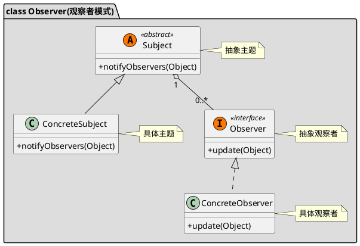

[toc]

## 1. 定义

- 某个对象状态更新,需要通知给所有对象:广播
- 由两个角色：目标、观察者
    - 观察者观察目标（监听目标）
    - 目标发生变化
    - 目标主动通知观察者。
## 2. UML


## 3. Java
### 3.1. client
```java
public class Client
{
    public static void main(String[] args)
    {
        ConcreteSubject subject = new ConcreteSubject();

        ObserverA observerA = new ObserverA();
        ObserverA observerA1 = new ObserverA();
        ObserverA observerA2 = new ObserverA();

        subject.addObserver(observerA);
        subject.addObserver(observerA1);
        subject.addObserver(observerA2);

        //改变subject的状态
        subject.setState(3000);
        System.out.println("########################");
        //我们看看，观察者的状态是不是也发生了变化
        System.out.println(observerA.getConcreteSubjectState());
        System.out.println(observerA1.getConcreteSubjectState());
        System.out.println(observerA2.getConcreteSubjectState());
    }
}
```
### 3.2. 被观察的对象
```java
public class ConcreteSubject extends Observable
{
    private int state;

    public int getState()
    {
        return state;
    }

    public void setState(int state)
    {
        this.state = state;

        //自动调用update方法
        setChanged();

        notifyObservers();
    }
}
```
### 3.3. 观察者
```java
public class ObserverA implements Observer
{
    private  int concreteSubjectState;

    @Override
    public void update(Observable o, Object arg)
    {
        this.concreteSubjectState = ((ConcreteSubject)o).getState();
    }


    public int getConcreteSubjectState()
    {
        return concreteSubjectState;
    }

    public void setConcreteSubjectState(int concreteSubjectState)
    {
        this.concreteSubjectState = concreteSubjectState;
    }
}
```

## 4. Golang
### 4.1. 主题

```go
/*主题*/
type ISubject interface {
	Attach(sub ISubscriber)
	UpdateTopic(topic string)
}

type Subject struct {
	subscribers []ISubscriber //订阅者
	topic       string        //主题内容
}

func NewSubject() *Subject {
	return &Subject{subscribers: make([]ISubscriber, 0)}
}

//添加订阅者
func (s *Subject) Attach(sub ISubscriber) {
	s.subscribers = append(s.subscribers, sub)
}

//通知所有订阅者
func (s *Subject) nofity() {
	for _, subscriber := range s.subscribers {
		subscriber.Update(s)
	}
}

//更新主题并通知给所有订阅者
func (s *Subject) UpdateTopic(topic string) {
	s.topic = topic
	s.nofity()
}

```

### 4.2. 订阅者


```go
/*订阅者*/
type ISubscriber interface {
	Update(*Subject)
}

type Subscriber struct {
	name string
}

func NewSubscriber(name string) *Subscriber {
	return &Subscriber{name: name}
}

func (s Subscriber) Update(subject *Subject) {
	fmt.Printf("Topic: [%s] changed, Subscriber: [%s] received\n", subject.topic, s.name)

}
```

### 4.3. client

```go
func main() {
	subject := 观察者.NewSubject()
	subject.Attach(观察者.NewSubscriber("订阅者1"))
	subject.Attach(观察者.NewSubscriber("订阅者2"))
	subject.UpdateTopic("主题修改")
}

```

## 5. 实例

- notifier

```go

// GlobalModifiedAnchorNotify ...
var GlobalModifiedAnchorNotify = &ModifiedAnchorNotifier{}

// IModifiedAnchorNotifier ...
type IModifiedAnchorNotifier interface {
	// 添加修改主播后需要被通知的Observer
	AddObservers(observers ...IObserver)
	// 修改主播后通知Observer
	NotifyObservers([]*model.AnchorWhitelist)
}

// ModifiedAnchorNotifier ...
type ModifiedAnchorNotifier struct {
	observers []IObserver
}

// AddObservers ...
func (s *ModifiedAnchorNotifier) AddObservers(observers ...IObserver) {
	s.observers = append(s.observers, observers...)
}

// NotifyObservers ...
func (s *ModifiedAnchorNotifier) NotifyObservers(ctx context.Context,
	list []*model.AnchorWhitelist) {

	if len(list) == 0 {
		return
	}

	for i := range s.observers {
		s.observers[i].Notify(ctx, list)
	}
}

```

- observer

```go

// IObserver ...
type IObserver interface {
	// 处理通知
	Notify(ctx context.Context, list []*model.AnchorWhitelist)
}

```


- mini_program_observer

```go

// MiniProgramObserver ...
type MiniProgramObserver struct {
}

// Notify ...
func (o *MiniProgramObserver) Notify(ctx context.Context, list []*model.AnchorWhitelist) {

	anchorUidsMap := make(map[int32][]uint64)
	for _, anchor := range list {
		anchorUidsMap[anchor.DistributionPlatform] = append(anchorUidsMap[anchor.DistributionPlatform], anchor.Uid)
	}

	for platform, anchorUids := range anchorUidsMap {
		service.TliveTencentCustomerServiceServiceImpl.DelMediaId(ctx,
			&pb.DelMediaIdReq{
				AnchorUid:    anchorUids,
				PlatformType: platform,
			},
			&pb.DelMediaIdRsp{})
	}
}

func init() {
	GlobalModifiedAnchorNotify.AddObservers(&MiniProgramObserver{})
}

```


- wx_pub_observer

```go

// WxPubObserver ...
type WxPubObserver struct {
}

// Notify ...
func (o *WxPubObserver) Notify(ctx context.Context,
	list []*model.AnchorWhitelist) {

	anchorUidsMap := make(map[int32][]uint64)
	for _, anchor := range list {
		anchorUidsMap[anchor.DistributionPlatform] = append(anchorUidsMap[anchor.DistributionPlatform], anchor.Uid)
	}

	for platform, anchorUids := range anchorUidsMap {
		rpc.DelAnchorInfoCache(ctx, anchorUids, platform)
	}
}

func init() {
	GlobalModifiedAnchorNotify.AddObservers(&WxPubObserver{})
}

```


## 6. 参考
- [订阅发布模式和观察者模式的区别 \- SegmentFault 思否](https://segmentfault.com/a/1190000020169229)