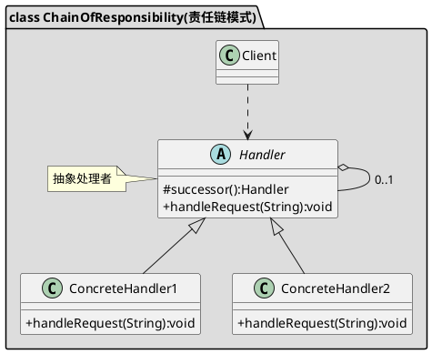

[toc]

## 1. 定义

能处理同一类请求的对象连成一条链,servlet filter

## 2. uml



## 3. Java
### 3.1. client
```java
public class Client
{
    public static void main(String[] args)
    {
        LeaveRequest request = new LeaveRequest(2);

        Leader boss = new Boss(null);
        Leader manager = new Manager(boss);

        manager.handlerRequest(request);
    }
}

```
### 3.2. 处理链
```java
public abstract class Leader
{
    protected Leader nextLeader;

    public Leader(Leader nextLeader)
    {
        this.nextLeader = nextLeader;
    }

    public abstract void handlerRequest(LeaveRequest request);
}
```
```java
public class Boss extends Leader
{
    public Boss(Leader nextLeader)
    {
        super(nextLeader);
    }

    @Override
    public void handlerRequest(LeaveRequest request)
    {
        if (request.getLeaverDays() < 30)
            System.out.println("Boss 同意");
        else
        {
            if (this.nextLeader != null)
                this.nextLeader.handlerRequest(request);
            System.out.println("不同意");
        }
    }
}
```
```java
public class Manager extends Leader
{
    public Manager(Leader nextLeader)
    {
        super(nextLeader);
    }

    @Override
    public void handlerRequest(LeaveRequest request)
    {
        if (request.getLeaverDays() < 3)
            System.out.println("Manager 同意");
        else
        {
            if (this.nextLeader != null)
                this.nextLeader.handlerRequest(request);
        }
    }
}
```
### 3.3. 请求
```java
public class LeaveRequest
{
    private int leaverDays;

    public LeaveRequest(int leaverDays)
    {
        this.leaverDays = leaverDays;
    }

    public int getLeaverDays()
    {
        return leaverDays;
    }

    public void setLeaverDays(int leaverDays)
    {
        this.leaverDays = leaverDays;
    }
}
```

## 4. Golang

### 4.1. client

```go
func main() {
	boss := 责任链.NewBoss()
	deptLeader := 责任链.NewDeptLeader()
	teamLeader := 责任链.NewTeamLeader()
	teamLeader.SetSuccessor(deptLeader)
	deptLeader.SetSuccessor(boss)

	request := 责任链.NewVacationRequest(5)
	teamLeader.HandleVocationRequest(request)
}

```

### 4.2. 处理链

```go
/*管理者接口*/
type IManager interface {
	SetSuccessor(IManager)
	HandleVocationRequest(*VacationRequest) bool
}

/*管理者基础实现类*/
type BaseManager struct {
	Successor IManager
}

func (m *BaseManager) SetSuccessor(manager IManager) {
	m.Successor = manager
}

func (m *BaseManager) HandleVocationRequest(request *VacationRequest) bool {
	return false
}

type TeamLeader struct {
	BaseManager
}

func NewTeamLeader() *TeamLeader {
	return &TeamLeader{}
}


func (t *TeamLeader) HandleVocationRequest(request *VacationRequest) bool {
	if request.Day < 3 {
		fmt.Printf("TeamLeader批准假条[%d]\n", request.Day)
		return true
	} else if t.Successor != nil {
		fmt.Printf("TeamLeader没有权限批准假条[%d]，交给[%s]\n", request.Day, "下一个人")
		t.Successor.HandleVocationRequest(request)
	}

	return false
}

type DeptLeader struct {
	BaseManager
}

func NewDeptLeader() *DeptLeader {
	return &DeptLeader{}
}

func (t *DeptLeader) HandleVocationRequest(request *VacationRequest) bool {
	if request.Day < 10 {
		fmt.Printf("DeptLeader批准假条[%d]\n", request.Day)
		return true
	} else if t.Successor != nil {
		fmt.Printf("DeptLeader没有权限批准假条[%d]，交给[%s]\n", request.Day, "下一个人")
		t.Successor.HandleVocationRequest(request)
	}

	return false
}

type Boss struct {
	BaseManager
}

func NewBoss() *Boss {
	return &Boss{}
}

func (t *Boss) HandleVocationRequest(request *VacationRequest) bool {
	fmt.Printf("Boss批准假条[%d]\n", request.Day)
	return true
}
```
### 4.3. 请求

```go
/*休假请求*/
type VacationRequest struct {
	Day uint32
}

func NewVacationRequest(day uint32) *VacationRequest {
	return &VacationRequest{Day: day}
}
```

## 5. 实例
### 5.1. 过滤器链

```go
type Config struct {
	key   string
	value string
}

// 过滤器函数
type filterFunc func(config *Config) bool

//过滤器链
type FilterChain struct {
	filterChains []filterFunc
}

// 添加一个过滤器
func (f *FilterChain) addFilter(filter filterFunc) {
	f.filterChains = append(f.filterChains, filter)
}

// 执行过滤器
func (f *FilterChain) filter(config *Config) bool {
	for _, filter := range f.filterChains {
		if filter(config) {
			return true
		}
	}

	return false
}

// key过滤器
func keyFilter(config *Config) bool {
	if config.key == "name" {
		return true
	}
	return false
}

// value过滤器
func valueFilter(config *Config) bool {
	if config.value == "zsk" {
		return true
	}
	return false
}

var defaultFilterChain = &FilterChain{}

func init() {
	defaultFilterChain.addFilter(keyFilter)
	defaultFilterChain.addFilter(valueFilter)
}

func main() {
	fmt.Println(defaultFilterChain.filter(&Config{}) == false)
	fmt.Println(defaultFilterChain.filter(&Config{key: "key"}) == false)
	fmt.Println(defaultFilterChain.filter(&Config{key: "name"}) == true)
	fmt.Println(defaultFilterChain.filter(&Config{value: "zsk"}) == true)
	fmt.Println(defaultFilterChain.filter(&Config{value: "wsy"}) == false)
}

```


## 6. 参考
- [niedbalski/filterchain: A simple Golang filter chain pattern implementation](https://github.com/niedbalski/filterchain)
- [Go Revel \- Filters（过滤器链） \- 黑暗伯爵 \- 博客园](https://www.cnblogs.com/hangxin1940/p/3269270.html)
- [Go设计模式16\-职责链模式\(Gin的中间件实现\) \- Mohuishou](https://lailin.xyz/post/chain.html)