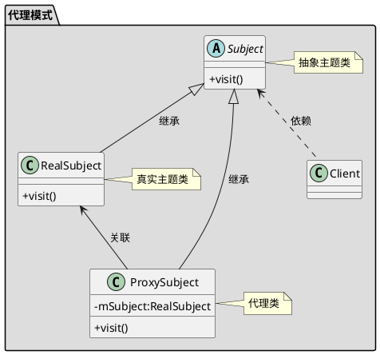

# 代理模式
 

适用于抽象出公共的逻辑或者不改变原有代码的基础上为类和函数增加新的功能

## uml


## 使用
### 静态代理
代理类在编译时生成，需要程序员自己手写
#### client
```java
public class Client
{
    public static void main(String[] args)
    {
        Proxy proxy = new Proxy(new RealImpl());
        proxy.run();
    }
}
```
#### 代理
```java
public class Proxy implements Real
{
    private Real real;

    public Proxy(Real real)
    {
        this.real = real;
    }

    public void run()
    {
        System.out.println("运行之前");
        this.real.run();
        System.out.println("运行之后");
    }

}
```
#### 被代理
```java
public interface Real
{
    void run();
}
```
```java
public class RealImpl implements Real
{
    @Override
    public void run()
    {
        System.out.println("Real run");
    }
}
```


### 动态代理

代理类在运行时生成， 利用的java的反射机制

#### jdk 动态代理
使用接口实现动态代理，需要目标类有个接口

##### client
```java
public class Client
{
    public static void main(String[] args)
    {
        Proxy proxy = new Proxy(new RealImpl());

        Real obj = (Real)  proxy.getProxyInstance(ClassLoader.getSystemClassLoader(), new Class[]{Real.class}, proxy);
        obj.run();
    }
}
```
##### 代理
```java
//代理类不需要实现被代理类的接口
public class Proxy implements InvocationHandler
{
    private Real real;

    public Proxy(Real real)
    {
        this.real = real;
    }

    //为目标对象生成代理对象
    public Object getProxyInstance(ClassLoader loader, Class<?>[] interfaces, InvocationHandler h) {
        return java.lang.reflect.Proxy.newProxyInstance(loader, interfaces, h);
    }

    @Override
    public Object invoke(Object proxy, Method method, Object[] args) throws Throwable
    {
        System.out.println("*************************");
        method.invoke(real, args);
        System.out.println("*************************");
        return null;
    }
}
```
##### 被代理
```java
public interface Real
{
    void run();
}

```
```java
public class RealImpl implements Real
{
    @Override
    public void run()
    {
        System.out.println("Real run");
    }
}
```


#### cglib
通过继承目标类来实现，不能对final修饰的类进行代理
##### client

```java
public class Client
{
    public static void main(String[] args)
    {
        Proxy proxy = new Proxy(new Real());

        Real obj = (Real) proxy.getProxyInstance();
        obj.run();
    }
}
```

##### 代理
```java
public class Proxy implements MethodInterceptor
{
    private Real real;

    public Proxy(Real real)
    {
        this.real = real;
    }

    //为目标对象生成代理对象
    public Object getProxyInstance() {
        //工具类
        Enhancer en = new Enhancer();
        //设置父类
        en.setSuperclass(real.getClass());
        //设置回调函数
        en.setCallback(this);
        //创建子类对象代理
        return en.create();
    }

    @Override
    public Object intercept(Object o, Method method, Object[] objects, MethodProxy methodProxy) throws Throwable
    {
        System.out.println("run之前");
        // 执行目标对象的方法
        Object returnValue = method.invoke(real, objects);
        System.out.println("run之后");
        return null;
    }
}
```
##### 被代理
```java
public class Real
{
    public void run()
    {
        System.out.println("Real run");
    }
}
```


## Spring  Aop

- 如果目标类实现了接口
那么默认情况使用JDK动态代理
也可以强制使用CGLIB
- 如果目标类没有实现接口
那么使用CGLIB


## 参考链接

- [JDK动态代理和cglib动态代理 \- 简书](https://www.jianshu.com/p/1712ef4f2717)
- [java \- What is the difference between JDK dynamic proxy and CGLib? \- Stack Overflow](https://stackoverflow.com/questions/10664182/what-is-the-difference-between-jdk-dynamic-proxy-and-cglib)

