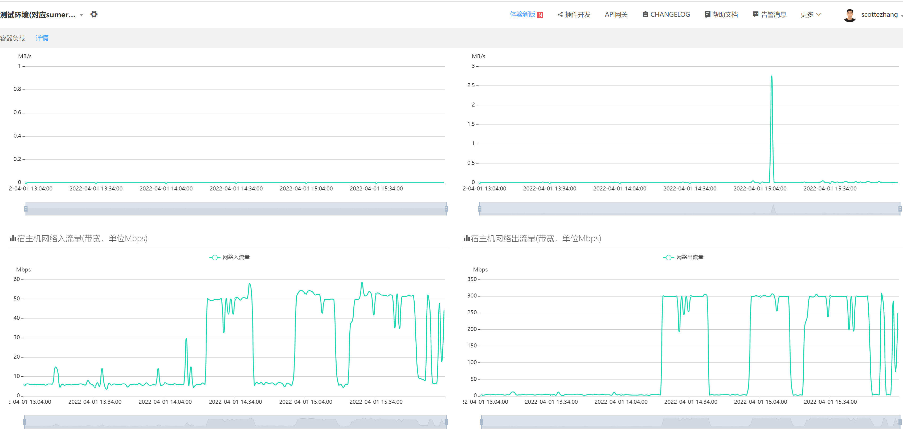

[toc]

## 1. 需求是什么

[【流金】通用频控服务重构\-平台业务商业化\-TAPD 平台](http://tapd.oa.com/pcg_platform_business_commercialization/prong/stories/view/1020454436872960855)

## 2. 为什么要做这个需求

流金系统历经多次业务融合与发展，在架构、扩展性、复用性和维护性等方面存在一些问题，亟需对一些服务进行重构，此次需求是对频控逻辑重构，抽取成通用能力

## 3. 方案设计

### 3.1. 存储设计

存储选用 Redis，
数据结构为 string 类型：`appid_key 次数`
[Redis RateLimiter.md](../../Redis/使用/Redis%20RateLimiter.md)

### 3.2. 接口设计

[ads_flow_ctrl\.proto](http://trpc.rick.oa.com/rick/pb/view_protobuf?id=40385)

```proto
// 错误码
enum ErrCode {
  ERR_CODE_OK = 0;// 成功
  // 10000以上为业务错误码
  ERR_CODE_TIMEOUT = 10001; // 超时
  ERR_CODE_KEY_NOT_FOUND = 10002; // key不存在
}

// 频控时间单位
enum TimeUnit {
    TIME_UNIT_SEC = 0;//秒
    TIME_UNIT_DAY = 1;//自然天
    // TIME_UNIT_WEEK = 2;//自然周
    // TIME_UNIT_MONTH = 3;//自然月
}


message AddFreqReq {
    uint32 appid = 1[(validate.rules).uint32.gt = 0];//由频控服务分配，标示业务
    string key = 2[(validate.rules).string = {min_len: 1, max_len: 30}];//频控key
    uint32 time_span = 3[(validate.rules).uint32.gt = 0];//频控时间长度
    TimeUnit time_unit = 4[(validate.rules).enum.defined_only = true];//频控时间单位。参考TimeUnit
}

message AddFreqRsp  {
    int32 code = 1;//参考ErrCode
    string msg = 2;
    uint32 appid = 3;//同AddFreqReq.appid
    string key = 4;//同AddFreqReq.key
    uint32 freq = 5;//当前频控周期内的访问次数
    uint32 ttl = 6;//当前频控周期内的剩余时间，单位s
}

message BatchAddFreqReq {
    repeated AddFreqReq add_freq_reqs = 1[(validate.rules).repeated = {min_items: 1, max_items: 30}];
}

message BatchAddFreqRsp {
    repeated AddFreqRsp add_freq_rsps = 1;
}

message GetFreqReq {
    uint32 appid = 1[(validate.rules).uint32.gt = 0];//由频控服务分配，标示业务
    string key = 2[(validate.rules).string = {min_len: 1, max_len: 50}];//频控key
}

message GetFreqRsp {
    int32 code = 1;//参考ErrCode
    string msg = 2;
    uint32 appid = 3;//同GetFreqReq.appid
    string key = 4;//同GetFreqReq.key
    uint32 freq = 5;//当前频控周期内的访问次数
    uint32 ttl = 6;//当前频控周期内的剩余时间，单位s
}

message BatchGetFreqReq {
    repeated GetFreqReq get_freq_reqs = 1[(validate.rules).repeated = {min_items: 1, max_items: 30}];
}

message BatchGetFreqRsp {
    repeated GetFreqRsp get_freq_rsps = 1;
}

service AdsFlowCtrl {
    // 增加访问次数
    rpc AddFreq (AddFreqReq) returns (AddFreqRsp);
    // 增加访问次数-批量接口
    rpc BatchAddFreq (BatchAddFreqReq) returns (BatchAddFreqRsp);
    // 获取访问次数
    rpc GetFreq (GetFreqReq) returns (GetFreqRsp);
    // 获取访问次数-批量接口
    rpc BatchGetFreq (BatchGetFreqReq) returns (BatchGetFreqRsp);
}
```

### 3.3. 架构设计

#### 3.3.1. 架构图


#### 3.3.2. 时序图


#### 3.3.3. 批量接口的设计

[封装复杂度之批量接口\_明明如月学长的博客\-CSDN 博客\_批量接口怎么设计](https://blog.csdn.net/w605283073/article/details/120575996)

1. 请求长度限制
2. 参数校验：对所有请求都检验参数，只要有一个失败则返回整体失败，不做部分处理
3. 部分失败：**忽略掉失败的部分**、整体失败、提供回滚

一方面直接嵌套了单个接口的 req 和 rsp，减少理解负担；另一方面批量接口的 rsp 加了 code 和 msg，即两层 code、msg 设计
如果批量请求中有写请求参数校验失败，那么整体返回失败，对外层的 code、msg 赋值。之所以这么设计是因为传参这种理应在开发调试阶段 fix 掉，同时也是为了简化代码处理
如果某些请求失败某些请求成功那么对里面的 code、msg 赋值

#### 3.3.4. 自定义 code、msg 不使用 error

需要处理部分失败的情况

#### 3.3.5. 自己调用 validate

无法校验整体参数

#### 3.3.6. 内部错误码+外部错误码

#### 3.3.7. 幂等性设计

可以加个 orderNo, 由业务方生成保证写操作重试时幂等. 但是没有必要,原因在于业务方一般都不会重试, 且频控要求其实并不是特别严格

#### 3.3.8. 降级设计

写操作不降级, 业务方自行降级
读操作网络错误降级使用本地缓存

#### 3.3.9. 为什么需要封装 Lua

[Redis RateLimiter.md](../../Redis/使用/Redis%20RateLimiter.md)

#### 3.3.10. Redis hot key

- 如何发现 hot key
  - 腾讯云 Redis 监控可以每 5s 统计一次访问 TopN 的 key。我们这边分布式定时任务每 1s 轮询一次他的 API 查询热 key
  - [云数据库 Redis 5 秒监控更新说明\-操作指南\-文档中心\-腾讯云\-腾讯云](https://cloud.tencent.com/document/product/239/48573)
  - [云数据库 Redis 查询实例热 Key\-API 文档\-文档中心\-腾讯云\-腾讯云](https://cloud.tencent.com/document/product/239/38920)
- 如何处理热 key
  - 对于 TopN 的热 key，看访问次数是否达到阈值，是则使用 Redis Pub/Sub 通知所有节点，将热 key 缓存到本地内存，1s 过期

## 4. 压测

预估：IO 密集型应用，那么取决于 CPU 核数和每个核能维护的线程数。假设 CPU 为 1C，每个核心能维护 300 个线程，接口响应为 50ms，50ms 中 10ms 用于 CPU 计算，40ms 用于 IO，`QPS=1C*300T/10ms=1C*300T/0.01s=3000`
实际：1 核 1G 的机器，100 并发下，p99 时延为 50ms 的情况下，QPS 可以达到 3000，同时 CPU 没有跑满

为什么 CPU 没有跑满，也就是瓶颈不是 CPU，那加了核数理论上 QPS 不会变化？
并发数上来了，减少了 CPU 切换的时间，会让延迟更低，根据 QPS=并发数/响应时间可以得出 QPS 会更高

第一次压测：打开 debug 日志
第二次压测：关闭 debug 日志，效果提升明显
第三次压测：使用 EvalSha 代替 Eval，效果提升不明显
接口目标定为 p99 为 50ms 左右，配置为机器为 1 核 1G，Redis 为 1 核 1G
根据并发度/响应时间=QPS，提高 QPS 有两条路，降低响应时间--对应火焰图纵向尽量短？测试接口不就完事了；提高并发度--对应火焰图横向的时间尽量用于 logic.AddFreq
对应于火焰图尽量时间都用于 logic.AddFreq
解释 tnet 相对于 net 为什么没有提升
解释 redigo 相对于 goredis 为什么有提升
解释引入了 gc 插件为什么会有提升
引入 gc 插件的效果和引入 tnet 的效果一样

解释为什么 BatchAdd CPU 利用率不高？火焰图中只采样到了 64 多 s，而 Add 则有 100s

### 4.1. AddFreq

性能目标定为 p99 为 50ms 左右，服务机器配置为 4 核 4G，Redis 机器配置为 1 核 1G

1. 第一次压测：并发 500 的情况 QPS 大概 2.1W
   分析：用 top 查看了进程内存占用小但是 CPU 跑满了，查看火焰图可以看出有两块比较明显的时间分布，一个是 GC 扫描占用了挺大一块时间；另一个是 trpc 集成社区 goredis 库，引入 concurrentgo 适配，然而 concurrentgo 耗时挺高的

2. 针对 GC 问题，典型的高 CPU 内存场景，通过引入[tpstelemetry](https://git.woa.com/tpstelemetry/trpc-gc-tuning-plugin)提高 GC 阈值降低 GC 频率。
   第二次压测：并发 500 的情况 QPS 大概 2.8W
   分析火焰图：可以看出 GC 标记的耗时已经减少了很多

3. 针对 trpc 集成的 goredis 库耗时问题，尝试更换成 redisgo 库。
   第三次压测：并发 500 的情况 QPS 大概 3.6W
   分析火焰图：可以看出已经没有了 concurrent 库的耗时

4. 引入[tnet](https://git.woa.com/trpc-go/tnet/blob/master/README_cn.md)后第四次压测：并发 500 的情况 QPS 也大概 3.6W，性能没有提升。查看文档也是减少 GC 来提升并发度，由于之前已经引入了[tpstelemetry](https://git.woa.com/tpstelemetry/trpc-gc-tuning-plugin)减少了 GC 时间，所以引入 tnet 之后性能没有提升也正常
   火焰图：

5. 关闭天机阁和 007 后 QPS 大概 6W
6. 使用`redis-benchmark`压测了一把，Redis 的 QPS 大概在 7W

结论：性能目标定为 p99 为 50ms 左右，服务机器配置为 4 核 8G，Redis 机器配置为 1 核 1G 的情况下 QPS 大概 6W，瓶颈在 Redis 的 CPU。此时服务器的 CPU 跑了 400%

### 4.2. BatchAddFreq

1. 第一次压测：引入 GC 插件，使用 goredis 库，并发 500 的情况下 QPS 大概 1.3W

2. 第二次压测：goredis 改成 redigo，并发 500 的情况下大概 1.3W
   两者差别并不大，top 查看了下，CPU 利用率才打到 200 多点，内存都没有跑满，磁盘也基本没有压力，怀疑是网络瓶颈。

首先用 golang 的 trace 工具分析了下，，发现确实网络等待比较久，应该就是网络瓶颈。

- 网络瓶颈一般是延迟和带宽
  - 延迟方面：业务服务器部署在广州，Redis 服务器在深圳，属于同地区，不是优化重点；
  - 带宽方面：
    - 一方面是最大带宽限制：
      - 查看业务服务器的监控出入流量总和接近 400Mbps，查阅了下 123oa 的容器使用的是万兆网卡，没打满；
      - 再查看 Redis 的配置，默认是 128Mbps，已经打满了，修改成千兆以上；
      - 中间链路的带宽可以用`iperf3`测试，但是由于平台限制测试不了，但大概率不是瓶颈；
    - 另一方面是传输的数据包大小，使用 tcpdump 和 wireshark 分析了下业务服务器和 Redis 服务器的包，，服务器传给 Redis 的包有点大需要分成 3 个 tcp 包，于是把 pipeline 传输 Lua 脚本的代码修改成 pipeline 传输 Lua hash 以减少网络传输量

3. 第三次压测：并发 500 的情况下 QPS 大概 1.8W。分析过程如下：

业务服务器还是没达到 100%的 CPU，内存、磁盘都没满，那还是网络瓶颈，难不成真的是中间链路的带宽瓶颈？
既然 iperf3 没法用，那么换个思路，
第一个思路，在业务服务器的本地部署了一个 Redis，这样就能排除带宽因素。部署后重新压测了一把，发现 QPS 还是没有变化，用 top 查看了下，发现 redis-server 的 CPU 已经 100%了，同样的 QPS 下云上的 Redis 也就 50%多，这性能差距没那么大吧，到这里我已经怀疑是 Redis CPU 监控的问题了
第二个思路，redis-benchmark 压测云上 redis-server 的瓶颈好了，redis-benchmark 带宽占用会小很多（当然中途又踩了包括 benchmark 是单线程、命令不正确抓包分析等坑），这里测出的 QPS 和用代码是一样的，说明带宽确实没问题。

想来想去只能是 Redis CPU 监控有问题，然后找运维人员问了下，Redis 的架构是 proxy+server，server 层是主从复制并且开启了读写分离，默认监控显示的是主从节点的平均 CPU 利用率，所以其实是 100 多了，一平均就成了 50%多，最后去其他监控页面查看了下各个节点的 CPU，发现果然主节点的 CPU 已经 100 了
结论：性能目标定为 p99 为 50ms 左右，服务机器配置为 4 核 8G，Redis 机器配置为 1 核 1G 的情况下 QPS 大概 1.7W，瓶颈在 Redis 的 CPU，此时服务器的 CPU 只跑了 200%多

### 4.3. GetFreq

同 AddFreq

### 4.4. BatchGetFreq

同 BatchAddFreq

## 5. 部署

对于广告业务下限流的场景我觉得可以用全球复制。
一般使用限流服务的代码是这样的：1. 读频控，2. 处理业务逻辑，3. 写频控
步骤 3 可以异步执行，关键是优化读频控延时
云 Redis 全球复制是对官方的 Redis-Replication 特性的增强。有两种方案，一种是 Leader-Leader，另一种是 Leader-Follower
前者部署如下：

服务读/写存储都在一个城市中，读写延迟都会降低；问题是同时写多个实例的时候会发生冲突，看官方的描述对并发冲突的问题没有解决，再加上我们关键是要优化读延迟，所以这个方案放弃；
后者的话部署如下：

服务读存储在一个城市中，写的话还是跨城市，因此只有读延迟降低。这是很明显的读写分离适合读多写少且允许数据同步延迟的场景
而我们限流场景在频控超过后只会走 1. 读频控的逻辑，所以是读多写少；而数据同步延迟，询问了下腾讯云的同学暂没统计过延迟，不过对于我们这边限流的场景，好像不存在 1. 在深圳地区写了 Redis 主实例的 key，然后 2. 在北京地区读同一个了 Redis 从实例的 key 的情况。
[云 Redis.md](../../Redis/云Redis.md)

## 6. 参考

- [一文搞懂 pprof\_程序员麻辣烫的博客\-CSDN 博客\_pprof](https://blog.csdn.net/shida219/article/details/116709430)
- [降本增效: 一种可节约 30%CPU 资源的 tRPC\-Go 插件 \- KM 平台](https://km.woa.com/articles/show/540132?kmref=search&from_page=1&no=2)
- [tRPC\-Go: 性能优化之路 \- KM 平台](https://km.woa.com/articles/show/428762?kmref=search&from_page=1&no=1)
- [腾讯云 redis 压测数据比不上友商？不！ \- 云\+社区 \- 腾讯云](https://cloud.tencent.com/developer/article/1986717)
- [云数据库 Redis 产品性能\-产品简介\-文档中心\-腾讯云\-腾讯云](https://cloud.tencent.com/document/product/239/17952#.E6.B5.8B.E8.AF.95.E6.96.B9.E6.B3.95)
