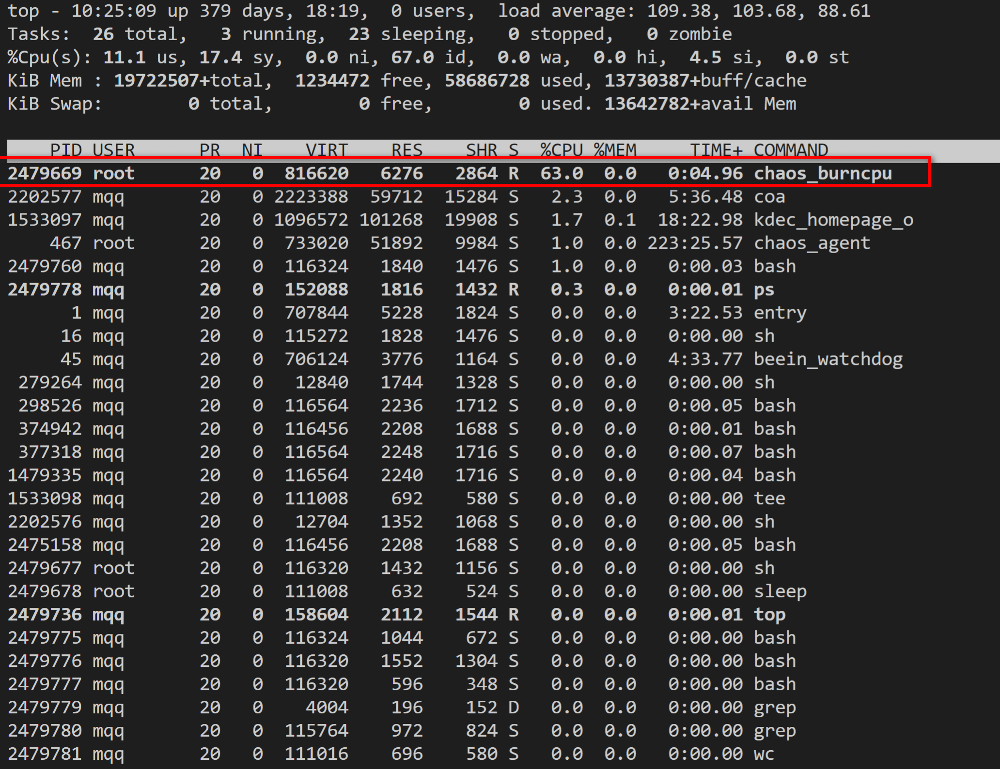
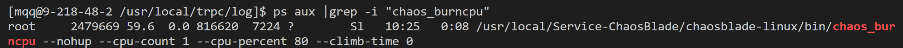
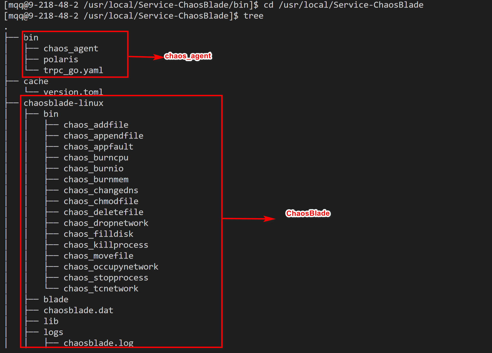
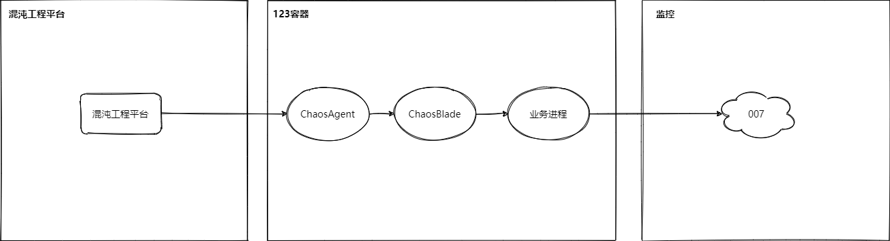

## 1. 混沌工程起源


- 2008 年 Netflix 数据库宕机，导致业务中断，之后 Netflix 工程师着手寻找替代架构
- 2010 年 Netflix 开始基于微服务的分布式架构，需要把物理机基础设施迁移到 AWS，为保证 EC2 实例故障不会对业务造成影响，开发出了杀 EC2 实例的工具 Chaos Monkey
- 2011 年 Simian Army 诞生，在 Chaos Monkey 的基础上增加了故障注入模式，可以测试更多的故障场景
- 2012 年 Netflix 在 GitHub 上开源了 Simian Army，其中包含了 Chaos Monkey V1 版本
- 2014 年 Netflix 团队创建了一种新的角色，叫作混沌工程师
- ...

## 2. 什么是混沌工程

> 混沌工程是在**分布式系统上**进行**实验**的学科，旨在提升系统**容错性**，建立系统抵御**生产环境中**发生**不可预知问题**的信心

- 关键词：分布式系统、实验、容错性、生产环境、不可预知问题。就是说混沌工程是保证分布式系统高可用的措施，并且是在生产环境基于实验的思想找出不可预知的问题
- 对比下混沌工程和传统测试加深理解

### 2.1. 混沌工程 vs 传统测试

- 传统测试：对能预先想到的问题点进行测试，给定特定的输入->特定的输出，通过断言判定测试是否通过
- 混沌工程：基于实验的思想，注入故障并观察会发生什么问题
- 相同点：分布式系统下的高可用措施之一
- 不同点:

  |      | 混沌工程               | 传统测试               |
  | ---- | ---------------------- | ---------------------- |
  | 问题 | 问题是未知的，寻找问题 | 问题是已知的，穷举问题 |
  | 环境 | 生产环境               | 测试环境               |

## 3. 为什么需要混沌工程

- 通过“有意识地搞破坏”可以识别出未知的问题进而修复，增强了我们应对故障的能力，从而提升用户体验

## 4. 怎么实施混沌工程

### 4.1. 指导思想

混沌工程有五大原则，可以当作是指导思想

#### 4.1.1. 建立一个围绕稳定状态行为的假说

通过监控观察实验

#### 4.1.2. 多样化真实世界的事件

尽可能的模拟现实世界的故障并注入，比如： 

#### 4.1.3. 在生产环境中运行实验

字面意思，最终是要在生产环境进行实验

#### 4.1.4. 持续自动化运行实验

最开始可以手动执行实验，但这种方式是劳动密集型不可持续，所以之后改成自动执行实验甚至自动创建实验

#### 4.1.5. 最小化爆炸半径

因为是在生产环境进行实验，会对业务有负面影响。作为混沌工程师，我们要做的就是要控制负面影响的范围，实在不放心可以现在开发/测试/预发布环境进行实验，然后在生产环境进行

### 4.2. 前提

- 已经解决已知的 bug
- 有稳定的监控系统

### 4.3. 步骤

1. 创建实验，准备注入故障
2. 执行实验，注入故障
3. 通过监控观察实验
4. 修复发现的问题
5. 自动化持续进行验证

## 5. 混沌工程工具

### 5.1. ChaosBlade

ChaosBlade 是阿里巴巴开源的一款遵循混沌工程原理和混沌实验模型的实验注入工具，帮助企业提升分布式系统的容错能力，并且在企业上云或往云原生系统迁移过程中业务连续性保障。
[chaosblade/README_CN\.md at master · chaosblade\-io/chaosblade · GitHub](https://github.com/chaosblade-io/chaosblade/blob/master/README_CN.md)

### 5.2. 混沌工程实验平台

#### 5.2.1. 智能编排

智能编排只需勾选实验目标，实验计划随机生成
接入步骤：[接入混沌工程定时任务 \- 腾讯 iWiki](https://iwiki.woa.com/pages/viewpage.action?pageId=952760794)

#### 5.2.2. 自定义编排

可以自定义实验计划
实验类型：[常用原子实验参数简介 \- 腾讯 iWiki](https://iwiki.woa.com/pages/viewpage.action?pageId=126770714)
接入步骤：[场景编排及其随机编排的用法 \- 腾讯 iWiki](https://iwiki.woa.com/pages/viewpage.action?pageId=134800014)

## 6. 混沌工程原理

以 CPU 负载为例，执行实验的时候在服务器上用`top`命令查看 CPU 负载高的进程，如下图

- 
  可以看出`chaos_burncpu`进程占用的 CPU 最高，然后用`ps`命令查看这个进程，如下图
- 
  可以看出执行的路径是在`/usr/local/Service-ChaosBlade`，进入该目录下使用`tree`命令查看，如下图：
  
  可以看出主要有两大块组成，一个是 tRPC-go 编写的`chaos_agent`，另一个是阿里开源的`ChaosBlade`，`chaos_agent`的代码没有公开，不过从名字`agent`可以看出他就是个代理，真正执行逻辑的是`ChaosBlade`，因此能够推测出混沌工程大概的架构如下图：
  
  核心就是`ChaosBlade`，我们只需研究之即可

### 6.1. CPU 负载

源码位于 ChaosBlade 项目的`chaosblade-exec-os`子项目下的[burncpu](https://github.com/chaosblade-io/chaosblade-exec-os/blob/master/exec/bin/burncpu/forlinux/burncpu.go)，大致流程如下

1. 新开一个子进程运行一段 go 程序，这段 go 程序如下

   ```go
   func burnCpu() {
   	runtime.GOMAXPROCS(cpuCount)

   	for i := 0; i < cpuCount; i++ {
   		go func() {
   			for {
   				for i := 0; i < 2147483647; i++ {
   				}
   				runtime.Gosched()
   			}
   		}()
   	}
   	select {} // wait forever
   }
   ```

2. 通过 Linux [cgroup](https://github.com/containerd/cgroups)限制每个子进程的 CPU 使用率，代码如下：

   ```go
   const cfsPeriodUs = uint64(200000)
   const cfsQuotaUs = int64(2000)

   func cgroupNew(cores int, percent int) cgroups.Cgroup {
   	period := cfsPeriodUs
   	quota := cfsQuotaUs * int64(cores) * int64(percent)
   	control, err := cgroups.New(cgroups.V1, cgroups.StaticPath(burnCpuCgroup), &specs.LinuxResources{
   		CPU: &specs.LinuxCPU{
   			Period: &period,
   			Quota:  &quota,
   		},
   	})
   	//...
   }
   ```

3. 结束的时候通过`kill -9`命令杀掉所有进程并清除 cgroup 的限制

### 6.2. 磁盘填充

源码位于 ChaosBlade 项目的`chaosblade-exec-os`子项目下的[filldisk](https://github.com/chaosblade-io/chaosblade-exec-os/blob/master/exec/bin/filldisk/filldisk.go)，大致流程如下

1. 通过设置的百分比计算需要填充的文件大小，这里使用的是[syscall package](https://pkg.go.dev/syscall)获取磁盘空间大小
   - 
1. 如果当前 Linux 系统下存在`fallocate`命令，那么调用`fallocate -l xxxM 文件位置`，fallcate 的作用如下图： - 
   可以快速预分配一段文件并且不占用 IO
1. 否则调用`dd if=/dev/zero of=文件位置 bs=1M count=文件大小 iflag=fullblock >/dev/null 2>&1 &`，dd 的作用如下图：
   - 
1. 结束的时候通过`kill -9`杀掉进程并且删除生成的文件

### 6.3. 磁盘 IO 负载

源码位于 ChaosBlade 项目的`chaosblade-exec-os`子项目下的[burnio](https://github.com/chaosblade-io/chaosblade-exec-os/blob/master/exec/bin/burnio/burnio.go)，大致流程如下

1. 如果指定了提高 write 负载，那么新开一个 goroutine，在这个 goroutine 里死循环调用`dd if=/dev/zero of=文件位置 bs=块大小M count=100 oflag=dsync`往文件里塞数据
2. 如果指定了提高 read 负载，那么新开一个 goroutine，在这个 goroutine 里先通过`dd if=/dev/zero of=文件位置 bs=6M count=100 oflag=dsync`创建一个大文件，
   然后死循环执行`dd if=文件位置 of=/dev/null bs=块大小M count=100 iflag=dsync,direct,fullblock`从之前创建的文件中读取数据
3. 结束的时候通过`kill -9`杀掉进程并且删除生成的文件

### 6.4. 内存占用

源码位于 ChaosBlade 项目的`chaosblade-exec-os`子项目下的[burnmem](https://github.com/chaosblade-io/chaosblade-exec-os/blob/master/exec/bin/burnmem/burnmem.go)，大致流程如下

1.  通过使用率计算需要填充的内存大小，这里使用的是 Linux [cgroup](https://github.com/containerd/cgroups)获取内存大小
1.  如果指定 ram 模式，那么就是分配相应大小的 slice 占用内存，代码如下：

    ````go
    // 128K
    type Block [32 * 1024]int32

        func burnMemWithRam() {
            //...
            append(buf, make([]Block, fillSize)
            //...
        }
        ```

    ram 模式下结束的时候调用`kill -9`杀掉进程

    ````

1.  如果是 cache 模式，首先通过`mount -t tmpfs tmpfs burnmem_tmpfs -o size=100%`挂载一个目录，这个目录类型为 tmpfs，tmpfs 下创建的文件会占用内存，同时使用 Linux 下的`dd if=/dev/zero of=burnmem_tmpfs bs=1M count=内存大小`写文件，这会占用 cache。
    cache 模式结束的时候调用`kill -9`杀掉进程并且`umount`这个文件。mount 的作用如下：

- 
- 

### 6.5. 杀进程

源码位于 ChaosBlade 项目的`chaosblade-exec-os`子项目下的[killprocess](https://github.com/chaosblade-io/chaosblade-exec-os/blob/master/exec/bin/killprocess/killprocess.go)，大致流程如下

1. 首先获取到当前运行的所有进程信息，这里使用的是[gopsutil](https://github.com/shirou/gopsutil)
2. 一个个遍历找出和需要 kill 的进程名匹配的进程
3. 调用`kill -9`杀掉这个进程

### 6.6. 进程挂起

源码位于 ChaosBlade 项目的`chaosblade-exec-os`子项目下的[stopprocess](https://github.com/chaosblade-io/chaosblade-exec-os/blob/master/exec/bin/stopprocess/stopprocess.go)，大致流程如下

1. 首先获取到当前运行的所有进程信息，这里使用的是[gopsutil](https://github.com/shirou/gopsutil)
2. 一个个遍历找出和需要挂起的进程名匹配的进程
3. 调用`kill -STOP`挂起这个进程
4. 通过`kill -CONT`恢复这个进程

### 6.7. DNS 篡改

源码位于 ChaosBlade 项目的`chaosblade-exec-os`子项目下的[changedns](https://github.com/chaosblade-io/chaosblade-exec-os/blob/master/exec/bin/changedns/changedns.go)，大致流程如下

1. DNS 篡改就是调用的`echo 域名 IP >> /etc/hosts`修改 hosts 文件解析域名
2. 结束的时候`cat hosts| grep -v 域名 IP > tmpHosts && cat tmpHosts > hosts`还原 hosts 文件

### 6.8. 网络包重复、丢失、延迟

源码位于 ChaosBlade 项目的`chaosblade-exec-os`子项目下的[tcnetwork](https://github.com/chaosblade-io/chaosblade-exec-os/blob/master/exec/bin/tcnetwork/tcnetwork.go)，通过 Linux 下的`traffic control`实现


1. 网络包重复调用的是 Linux 下的 `tc qdisc add dev 网络接口名 root netem duplicate 百分比%` 命令
2. 网络包丢失调用的是 `tc qdisc add dev 网络接口名 root netem loss 百分比%` 命令
3. 网络包延迟调用的是 Linux 下的 `tc qdisc add dev 网络接口名 root netem delay %sms %sms` 命令
4. 结束的时候调用的是`tc filter del dev 网络接口名 parent 1: prio 4`，再调用`tc qdisc del dev 网络接口名 root`

### 6.9. 应用内故障注入

应用内故障是通过 tRPC-go 的 filter 实现的，大概逻辑如下：

- 实验参数更新流程：
  1. 配置 ChaosFilter 后启动服务，此时会 go 一个协程监听 unixsocket
  2. 混沌实验开始后会把实验参数会通过 unixsocket 发送数据
  3. 该协程收到数据后会更新 ChaosFilter 的参数
- 请求处理：业务逻辑处理之前和之后都会经过 ChaosFilter

#### 6.9.1. 请求延时

```go
// Inject 注入动作
func (d *delayFaultAtom) Inject(
	ctx context.Context,
	req, rsp interface{},
	handler filter.HandleFunc) error {
	//...
    time.Sleep(time.Duration(d.delayTime) * time.Millisecond)
	return handler(ctx, req, rsp)
}
```

#### 6.9.2. 请求超时

```go
// Inject 超时故障注入
func (t *timeoutAtom) Inject(
	ctx context.Context,
	req, rsp interface{},
	handler filter.HandleFunc) error {
    //...
    timeout := trpc.Message(ctx).RequestTimeout()
    time.Sleep(timeout)
	return nil
}
```

#### 6.9.3. 模拟异常

```go
// Inject 执行mock error的故障注入动作
func (m *mockErrorAtom) Inject(
	ctx context.Context,
	req, rsp interface{},
	handler filter.HandleFunc) error {
	//...
    err := m.newError()
    return err
}


// newError 根据错误类型生成对应的错误对象
func (m *mockErrorAtom) newError() error {
	switch m.errType {
	case errs.ErrorTypeFramework:
		return m.newFrameworkError()
	case errs.ErrorTypeCalleeFramework:
		return &errs.Error{
			Type: errs.ErrorTypeCalleeFramework,
			Code: int32(m.errCode),
			Msg:  m.errMsg,
			Desc: "CalleeFrameworkErr",
		}
	case errs.ErrorTypeBusiness:
		return errs.New(m.errCode, m.errMsg)
	default:
		//默认返回business 的error
		return errs.New(m.errCode, m.errMsg)
	}
}
```

#### 6.9.4. 模拟请求

```go
// Inject 开始mock request 的故障注入动作
func (m *mockRequestAtom) Inject(
	ctx context.Context,
	req, rsp interface{},
	handler filter.HandleFunc) error {
	// ...
    // 利用反射生成新的请求对象
    mockReq := reflect.New(reflect.ValueOf(req).Elem().Type()).Interface()

    //将mock的request内容写入新请求对象
    json.Unmarshal([]byte(m.mockRequest), &mockReq)
    //...

    // 请求替换
    req = mockReq
    return handler(ctx, req, rsp)
}
```

#### 6.9.5. 模拟返回

```go
// Inject 开始mock response 的注入动作
func (m *mockResponseAtom) Inject(
	ctx context.Context,
	req, rsp interface{}, handler filter.HandleFunc) error {
	//...

    mockRsp := reflect.New(reflect.ValueOf(rsp).Elem().Type()).Interface()
    json.Unmarshal([]byte(m.mockResponse), &mockRsp)
    //...

    // 利用反射来设定返回值
    rspValue := reflect.ValueOf(rsp).Elem()
    mockRspValue := reflect.ValueOf(mockRsp).Elem()
    //...

    // 将拦截的服务返回值篡改为我们的设定值
    rspValue.Set(mockRspValue)
    return nil
}
```

## 7. 参考

- [Chaos Engineering 的历史、原则以及实践\-InfoQ](https://www.infoq.cn/article/chaos-engineering-the-history-principles-and-practice)
- [混沌工程\(Chaos Engineering\) 到底是什么? \- 云\+社区 \- 腾讯云](https://cloud.tencent.com/developer/article/1622874)
- [StabilityGuide/混沌工程介绍与实践\.md at master · StabilityMan/StabilityGuide · GitHub](https://github.com/StabilityMan/StabilityGuide/blob/master/docs/prevention/resilience/%E6%B7%B7%E6%B2%8C%E5%B7%A5%E7%A8%8B%E4%BB%8B%E7%BB%8D%E4%B8%8E%E5%AE%9E%E8%B7%B5.md)
- [混沌工程及故障演练组件的应用与实践\-InfoQ](https://www.infoq.cn/article/r1iyfd1r5pykcyaelinw)
- [混沌工程原则 \- Principles of chaos engineering](https://principlesofchaos.org/zh/)
- [混沌工程\_哔哩哔哩\_bilibili](https://www.bilibili.com/video/BV1p44y1r7S2/)
- [【互娱 AMS】混沌工程\-稳定性治理设计及实践原则 \- 互娱增值服务部 \- 技术&服务藏经阁 \- KM 平台](https://km.woa.com/group/34294/articles/show/382620?kmref=search&from_page=1&no=1#_Toc3223)
- [什么是混沌工程？ \- 知乎](https://www.zhihu.com/question/308294657)
