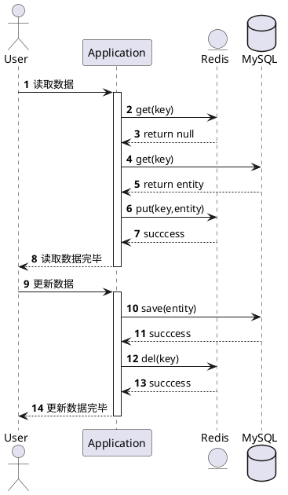
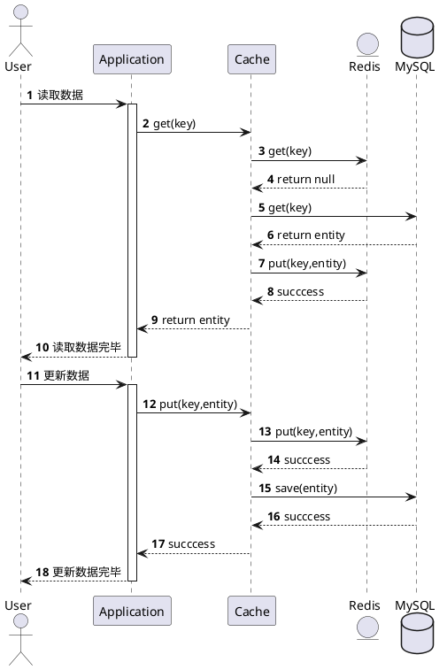
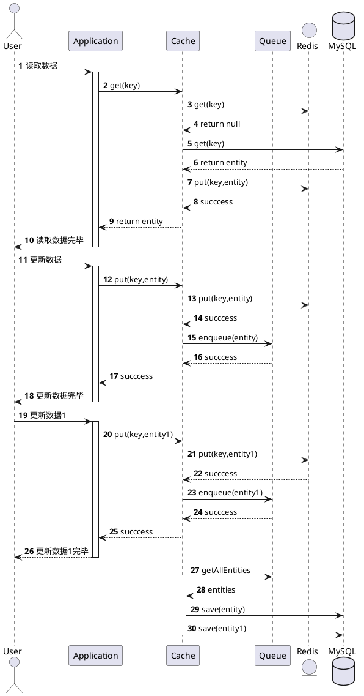

## 1. 什么是缓存
CPU和磁盘的速度差异巨大，一般会根据局部性原理把常用的数据加载到内存中，以提高访问速度

## 2. 为什么需要缓存
- 提高性能
- 降低下游负载
## 3. 缓存的缺点
### 3.1. 缓存一致性
- CAP原则下延迟导致的一致性是没办法解决的，只能保证最终一致性
- 如果是read-through那么通过超时保证最终一致性，如果是全量缓存那么只读缓存
- 监控告警+手动补偿，重试
- [\#133 缓存与数据库一致的解决方案【Go 夜读】\_哔哩哔哩\_bilibili](https://www.bilibili.com/video/BV1Mg41197MM?spm_id_from=333.851.b_7265636f6d6d656e64.2&vd_source=79c9f80f56384444d88bfb3e4cf579df)
### 3.2. 额外的存储空间
典型的空间换时间
## 4. 缓存层次

### 4.1. 客户端缓存
- [HTTP缓存.md](../../Computer_Network/应用层/HTTP/HTTP缓存.md)

### 4.2. CDN缓存
- [CDN.md](../../Computer_Network/应用层/CDN/CDN.md)
### 4.3. Web服务器缓存
- [Nginx.md](../../Nginx/Nginx.md)
### 4.4. 业务服务器缓存
- 本地内存

### 4.5. 缓存中间件缓存
- [Redis.md](../../Redis/Redis.md) 

### 4.6. 数据库缓存
- MySQL内置的缓存

## 5. 缓存的使用
### 5.1. 缓存大小
缓存的大小可以设置为平均活跃用户数，这样就不会被淘汰出缓存
### 5.2. 缓存时长
缓存的时长可以设置为平均活跃时间，这样就不会被淘汰出缓存
### 5.3. 缓存命中率
缓存的好坏要看命中率。缓存的命中率高说明缓存有效，一般来说命中率到 80% 以上就算很高了
对于非热点数据，可以用一致性Hash把请求路由到同一个节点，缓存命中率就会相当高，但是依然会有数据热点问题，原因在于如果请求量上来了，即使扩容了，那么一致性Hash的特定会导致原有的请求打到原来的节点，扩容根本没用。虽然可以用虚拟节点，可是虚拟节点需要迁移数据，导致缓存不命中，不过还好

### 5.4. 缓存预热
统计访问次数多的数据，启动服务器的时候把数据加载到缓存中
### 5.5. 缓存淘汰策略
[缓存替换策略.md](../../Algorithm/算法/缓存替换策略.md)
### 5.6. 缓存架构模式

#### 5.6.1. cache-as-sor
- 业务代码和缓存分开。一般配合read-through+write-back或者read-through+write-through或者refresh-ahead
- 优点：耦合度低
- 缺点：灵活度低
#### 5.6.2. cache-aside
- 业务代码和缓存放在一起。一般配合read-through+write-invalid
- 优点：灵活度高
- 缺点：耦合度高

### 5.7. 缓存更新

#### 5.7.1. read-through+write-invalid
- 读的时候， 缓存中有，直接返回；没有则取数据库取，然后放入缓存，再返回
- 写的时候，先**更新数据库，再删除缓存**

##### 5.7.1.1. 为什么写的时候是删除缓存而不是更新缓存
这是lazy计算的思想，即用到的时候再做计算。 更新缓存涉及一系列复杂操作比较耗时，且有可能之后不会用到
本质上就是重写轻读还是重读轻写
##### 5.7.1.2. 缓存一致性问题

###### 5.7.1.2.1. 并发读写问题
无论先更新数据库还是先删除缓存都会出现缓存不一致的问题

1. 先删除缓存再更新数据库，在**并发读写一个key**的时候会出现缓存一致性问题
    - 用户1写操作：删除Redis缓存
    - 用户2读操作：从MySQL读取数据
    - 用户2读操作：把数据写入Redis
    - 用户1写操作：写入数据库

2. 先更新数据库再删除缓存，**并发读写一个key**的时候会出现缓存一致性问题。
    - 用户1读操作：从MySQL读取数据
    - 用户2写操作：更新MySQL数据
    - 用户2写操作：删除Redis缓存
    - 用户1读操作：把数据写入Redis
这种是读操作开始在写操作提交之前，并且放入缓存又晚于写操作之后的删除缓存。相比于上面的删除缓存再更新数据库，这种脏数据的概率低得多

3. 如何解决
    - 最终一致性：加上缓存过期时间
    - 强一致性：加锁

###### 5.7.1.2.2. 网络错误问题
1. 更新数据库成功但是删除缓存失败，针对网络错误只能重试
    - 更新数据库后，把删除缓存的操作丢入消息队列，重试直至成功
    - 或者更新完数据库后，使用canal订阅bin-log，把删除缓存的操作丢入消息队列，重试直至成功

#### 5.7.2. read-through+write-through
- 读的时候， 缓存中有，直接返回；没有则取数据库取，然后放入缓存，再返回
- 写的时候，**先更新缓存，然后更新数据库**。即双写

##### 5.7.2.1. 缓存一致性问题
无论先更新数据库还是先更新缓存都会出现缓存不一致的问题
###### 5.7.2.1.1. 并发写问题
1. 先更新数据库再更新缓存， **并发写**的时候会出现缓存一致性问题
    - 用户1写操作：更新数据库
    - 用户2写操作：更新数据库
    - 用户2写操作：更新缓存
    - 用户1写操作：更新缓存，此时缓存中的是旧的数据
但实际上并发写的情况比较少，并且写同一条记录数据库有锁，所以概率很低。

2. 先更新缓存再更新数据库，**并发写**的时候会出现缓存一致性问题
    - 用户1写操作：更新缓存
    - 用户2写操作：更新缓存
    - 用户2写操作：更新数据库
    - 用户1写操作：更新数据库，此时数据库中的是旧的数据

3. 如何解决
    - 最终一致性：加上缓存过期时间
    - 强一致性：加锁
###### 5.7.2.1.2. 网络错误问题
1. 更新数据库成功但是更新缓存失败，针对网络错误只能重试
    - 更新数据库后，把更新缓存的操作丢入消息队列，重试直至成功
    - 或者更新完数据库后，使用canal订阅bin-log，把更新缓存的操作丢入消息队列，重试直至成功

#### 5.7.3. read-through+write-back
- 读的时候， 缓存中有，直接返回；没有则取数据库取，然后放入缓存，再返回
- 写的时候，**只更新缓存，不更新数据库。缓存会异步地批量更新数据库**

##### 5.7.3.1. 为什么不直接更新数据库
- 只操作内存，IO效率很高
- 还可以合并对同一个数据的多次操作

##### 5.7.3.2. 缓存一致性问题

###### 5.7.3.2.1. 宕机
- 数据在缓存中没刷入数据库前，如果宕机那么数据就丢失了

#### 5.7.4. refresh-ahead
- 读的时候，只从缓存中读
- 写的时候，只写数据库。
- 定时任务，拉取数据库中的全量数据，更新缓存
#### 5.7.5. CDC
- 变更数据捕获系统
- 比如Linkedin的databus、阿里巴巴的[canal](../../Database/MySQL/canal/canal.md)
#### 5.7.6. 方案对比
- refresh-ahead：
    - 优点：读取数据的时候只走缓存，效率特别高
    - 缺点：
        - 需要定时全量拉取所有数据丢入缓存
        - 如果定时间隔太短并且数据量太大会超时，定时间隔太长则缓存和数据库不一致的时间也越长（相当于复制，复制延迟是定时拉取时间）
    - 适合小数据量的场景
- read-through+write-back：
    - 优点：相对于refresh-ahead不用定时全量拉取；而且先写缓存后续批量写数据库相当快
    - 缺点：
        - 数据在缓存中没刷入数据库前，如果宕机那么数据就丢失了；
        - 数据不管用不用得到都刷入缓存命中率低
    - 适合数据量较大、可以丢失、写入性能要求特别高的场景
- read-through+write-through：
    - 优点：相对于write-back数据不会丢失
    - 缺点：
        - 数据不管用不用得到都刷入缓存命中率低
        - ~~有读写并发问题~~
    - 适合数据量较大、不能丢失、写入性能要求没那么高的场景
- read-through+write-invalid：
    - 优点：相对于write-through缓存命中率高，占用内存小
    - 缺点：
        - 相对于write-through需要get请求数据的时候才把数据丢入缓存，效率偏低
        - ~~有读写并发问题~~
    - 适合数据量特别大、不能丢失、写入性能要求没那么高的场景

### 5.8. 缓存回源
- 如果在缓存中没读到数据，那么去数据库中读取叫做回源
- 如果缓存需要回源，那么会有以下问题

#### 5.8.1. 缓存穿透

##### 5.8.1.1. 是什么
- 查询的**key不存在**，那么数据库和缓存中都不会有，查询请求就会落到数据库中，如果这个请求量太大（比如黑客攻击），那么数据库就会被打挂
##### 5.8.1.2. 如何解决
###### 5.8.1.2.1. 缓存空值
- 对返回为空的 Key 值依然进行缓存，如果插入了数据那么需要清除这个空缓存
- 缺点
    - 第一次查询的仍然得从数据库中查
    - 缓存中大量的空数据
###### 5.8.1.2.2. BloomFilter
- 把数据库中存在的key都记录在BloomFilter中，这样子请求过来如果key在BloomFilter中存在那么直接从缓存中读取；如果在BloomFilter中不存在那么直接返回空
- 缺点:
    - 有一定的误差率。由于hash冲突的原因BloomFilter可能会把不存在的key当作存在的，这样子就会去数据库中查一次发现没有，不过量不大所以可以接受

###### 5.8.1.2.3. BloomFilter vs Cache Null

|     | BloomFilter |  Cache Null   |
| --- | ----------- | ------------- |
| 优点 | 占用空间少   | 不需要定时重建 |
| 缺点 | 需要定时重建 | 占用空间大     |
#### 5.8.2. 缓存击穿
##### 5.8.2.1. 是什么
- 缓存中**热点key失效**，那么查询请求就会落到数据库中，如果这个请求量太大（比如大促场景），那么数据库就会被打挂
##### 5.8.2.2. 如何解决

###### 5.8.2.2.1. 不自动过期
- 设置逻辑过期时间，超过了那么手动更新缓存
- 定期更新缓存
###### 5.8.2.2.2. 加上互斥锁排队处理
- 只允许一个线程重建缓存，其他线程等待重建缓存的线程执行完再去缓存中取
- 比如Golang的[sync.singleflight.md](../../Golang/sync.singleflight.md)

###### 5.8.2.2.3. 不自动过期 vs 互斥锁
|     |     不自动过期      |      互斥锁       |
| --- | ------------------ | ----------------- |
| 优点 | 不存在死锁、阻塞风险 | 保证一致性        |
| 缺点 | 数据不一致          | 存在死锁、阻塞风险 |
#### 5.8.3. 缓存雪崩
##### 5.8.3.1. 是什么
- 缓存中**大规模的key失效**（区别于缓存击穿的热点key失效），比如缓存宕机、重启或者key同时超时，那么查询请求就会落到数据库中，如果这个请求量太大（比如大促场景），那么数据库就会被打挂
##### 5.8.3.2. 如何解决

###### 5.8.3.2.1. 设置不同的失效时间
- 在基础的时间上加减一个值
- 缺点：
    - 无法解决单个key是热点的问题
    - 解决：加上互斥锁排队处理
###### 5.8.3.2.2. 提高缓存系统可用性
- 比如Redis开启集群模式，开启持久化模式
###### 5.8.3.2.3. 启用透明多级缓存
- 比如本地缓存

## 6. 如何设计缓存中间件
- [如何设计一个缓存中间件.md](如何设计一个缓存中间件.md)
## 7. 参考
- [缓存 · 系统设计入门](https://wizardforcel.gitbooks.io/system-design-primer/content/21.html)
- [缓存系统设计精要](https://juejin.cn/post/6844904136207499277#heading-25)
- [分布式的环境下， MySQL和Redis如何保持数据的一致性？ \- 知乎](https://www.zhihu.com/question/36413559)
- [Design Patterns: Cache\-Aside Pattern](https://blog.cdemi.io/design-patterns-cache-aside-pattern/)
- [Cache Usage Patterns](https://www.ehcache.org/documentation/3.8/caching-patterns.html)
- [Understanding write\-through, write\-around and write\-back caching \(with Python\)](https://shahriar.svbtle.com/Understanding-writethrough-writearound-and-writeback-caching-with-python)
- [Caching Strategies and How to Choose the Right One \| CodeAhoy](https://codeahoy.com/2017/08/11/caching-strategies-and-how-to-choose-the-right-one/)
- [缓存更新的套路 \| \| 酷 壳 \- CoolShell](https://coolshell.cn/articles/17416.html)
- [A beginner's guide to Cache synchronization strategies \- Vlad Mihalcea](https://vladmihalcea.com/a-beginners-guide-to-cache-synchronization-strategies/)
- [Cache\-Aside pattern \- Cloud Design Patterns \| Microsoft Docs](https://docs.microsoft.com/en-us/azure/architecture/patterns/cache-aside)
- [如何获得高并发的经验？ \- 知乎](https://www.zhihu.com/question/40609661/answer/1874410227?utm_source=com.ideashower.readitlater.pro&utm_medium=social&utm_oi=1010072966851362816)
- [All things caching\- use cases, benefits, strategies, choosing a caching technology, exploring some popular products \| by Kousik Nath \| DataDrivenInvestor](https://medium.datadriveninvestor.com/all-things-caching-use-cases-benefits-strategies-choosing-a-caching-technology-exploring-fa6c1f2e93aa)
- [Cache Consistency with Database](https://danielw.cn/cache-consistency-with-database#when-not-read-or-write)
- [先更新缓存还是先更新数据库 \- 知乎](https://zhuanlan.zhihu.com/p/150864858)
- [高并发场景下，到底先更新缓存还是先更新数据库？ \- 云\+社区 \- 腾讯云](https://cloud.tencent.com/developer/article/1774867#:~:text=Write%20through,%E7%BC%93%E5%AD%98%E5%B1%82%20%E5%88%B0%E8%BE%BE%E6%95%B0%E6%8D%AE%E6%BA%90%E3%80%82)
- [缓存模式（Cache Aside、Read Through、Write Through、Write Behind）\_靖哥哥的博客\-CSDN博客](https://blog.csdn.net/HalfImmortal/article/details/106962943)
- [28种缓存替换策略的分类整理｜《Cache Replacement Policies》Chapter 2 \- 知乎](https://zhuanlan.zhihu.com/p/387985644)
- [linkedin/databus: Source\-agnostic distributed change data capture system](https://github.com/linkedin/databus)
- [DataBus概述 \- 叶枫啦啦的个人空间 \- OSCHINA \- 中文开源技术交流社区](https://my.oschina.net/liyurong/blog/1842359)
