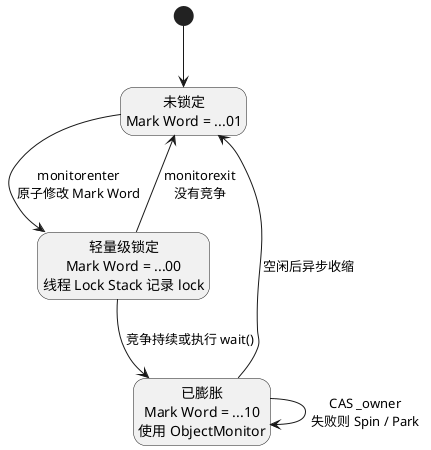

## 目录

- [0. 从上一篇继续](#0-从上一篇继续)
- [1. 互斥锁到底保证了什么？](#1-互斥锁到底保证了什么)
  - [1.1 Atomicity：临界区不能交错](#11-atomicity临界区不能交错)
  - [1.2 Visibility：前一个临界区的写入需要被后一个看到](#12-visibility前一个临界区的写入需要被后一个看到)
  - [1.3 Ordering：锁还是一个内存顺序边界](#13-ordering锁还是一个内存顺序边界)
  - [1.4 一把锁解决了三个问题](#14-一把锁解决了三个问题)
- [2. Java：synchronized](#2-javasynchronized)
  - [2.1 Atomicity](#21-atomicity)
  - [2.2 Visibility](#22-visibility)
  - [2.3 Ordering](#23-ordering)
  - [2.4 synchronized 如何使用 Monitor？](#24-synchronized-如何使用-monitor)
  - [2.5 实现层：HotSpot x86-64](#25-实现层hotspot-x86-64)
    - [2.5.1 Atomicity：谁能成功获得锁？](#251-atomicity谁能成功获得锁)
    - [2.5.2 Visibility：前一个线程的写入如何被看到？](#252-visibility前一个线程的写入如何被看到)
    - [2.5.3 Ordering：同步边界如何约束重排序？](#253-ordering同步边界如何约束重排序)
- [3. Go：sync.Mutex](#3-gosyncmutex)
  - [3.1 Atomicity](#31-atomicity)
  - [3.2 Visibility](#32-visibility)
  - [3.3 Ordering](#33-ordering)
  - [3.4 从 sync.Mutex 到 Go Runtime](#34-从-syncmutex-到-go-runtime)
  - [3.5 实现层：Go / amd64](#35-实现层go--amd64)
    - [3.5.1 Atomicity：谁能成功获得锁？](#351-atomicity谁能成功获得锁)
    - [3.5.2 Visibility：前一个 Goroutine 的写入如何被看到？](#352-visibility前一个-goroutine-的写入如何被看到)
    - [3.5.3 Ordering：同步边界如何约束重排序？](#353-ordering同步边界如何约束重排序)
- [4. CPython：threading.Lock](#4-cpythonthreadinglock)
  - [4.1 Atomicity](#41-atomicity)
  - [4.2 Visibility](#42-visibility)
  - [4.3 Ordering](#43-ordering)
  - [4.4 从 threading.Lock 到 PyMutex](#44-从-threadinglock-到-pymutex)
  - [4.5 实现层：CPython / Linux x86-64](#45-实现层cpython--linux-x86-64)
    - [4.5.1 Atomicity：谁能成功获得锁？](#451-atomicity谁能成功获得锁)
    - [4.5.2 Visibility：前一个线程的写入如何被看到？](#452-visibility前一个线程的写入如何被看到)
    - [4.5.3 Ordering：同步边界如何约束重排序？](#453-ordering同步边界如何约束重排序)
- [5. 三种语言放在一起看](#5-三种语言放在一起看)
  - [5.1 三种语言的区别](#51-三种语言的区别)
- [6. 下一篇](#6-下一篇)

---

## 0. 从上一篇继续

上一篇介绍了 Java、Go 和 CPython 为并发程序提供的语言规则。这一篇开始进入第一个具体的同步工具：

```text
Mutex
```

我们继续使用贯穿这个系列的例子：

```text
counter++
```

看看一把互斥锁如何同时处理：

```text
Atomicity
Visibility
Ordering
```

如果只关心锁提供什么保证，可以读到各语言的 `2.3 / 3.3 / 4.3`；后面的实现小节再从 Runtime 下钻到 CPU。

---

# 1. 互斥锁到底保证了什么？

`counter++` 看起来只有一行，执行到 CPU 时却可以简化理解为：

```text
LOAD  counter
ADD   1
STORE counter
```

假设 `counter = 0`，两个线程同时执行：

```text
Thread A                    Thread B

LOAD counter -> 0
                            LOAD counter -> 0
ADD 1 -> 1
                            ADD 1 -> 1
STORE counter = 1
                            STORE counter = 1
```

最后得到的是 `counter = 1`，而不是 `counter = 2`。原因是两个线程的 `LOAD / ADD / STORE` 发生了交错。

在 `counter++` 外使用同一把锁：

```text
Thread A                    Thread B

lock
LOAD counter -> 0
ADD 1
STORE counter = 1
unlock

                            lock
                            LOAD counter -> 1
                            ADD 1
                            STORE counter = 2
                            unlock
```

这时结果就是 `counter = 2`。`lock` 和 `unlock` 之间的区域称为临界区：

```text
Critical Section
```

## 1.1 Atomicity：临界区不能交错

加锁以后，另一个使用同一把锁的线程不能插入当前临界区：

```text
Thread A                    Thread B

lock
LOAD counter
ADD 1
STORE counter
unlock

                            lock
                            LOAD counter
                            ADD 1
                            STORE counter
                            unlock
```

这里的“原子性”并不是把 `LOAD / ADD / STORE` 合并成一条 CPU 指令，而是让整个临界区相对于其他受同一把锁保护的临界区不可交错。

因此需要区分：

```text
CPU Atomic Instruction
    操作本身不可分割

Mutex
    通过互斥，让一段普通指令组成的临界区不可交错
```

Mutex 使用更底层的小范围原子操作，构造出可以覆盖任意代码范围的临界区原子性。

## 1.2 Visibility：前一个临界区的写入需要被后一个看到

只有“不同时执行”还不够。仍然使用 `counter++`：

```text
Thread A                    Thread B

lock
counter++
unlock

                            lock
                            print(counter)
                            unlock
```

如果 A 先释放锁，B 随后获得同一把锁，那么 B 应该看到 A 已经完成的写入：

```text
A 读取 counter = 0
A 写入 counter = 1
A unlock

        ↓

B lock
B 读取 counter = 1
```

否则即使两个临界区没有交错，这把锁仍然无法可靠保护共享状态。因此 Mutex 还必须提供内存同步，让前一个临界区的内存效果能够被后一个临界区可靠观察。

## 1.3 Ordering：锁还是一个内存顺序边界

只使用一个变量时，很难直接观察到重排序。因此这里沿用上一篇的做法：保留 `counter++`，再增加一个表示更新完成的 `ready`。

初始状态：

```text
counter = 0
ready = false
```

```text
Thread A                    Thread B

lock
counter++
ready = true
unlock

                            lock
                            if ready {
                                print(counter)
                            }
                            unlock
```

程序员要求：如果 B 读到 `ready = true`，那么它随后读到的 `counter` 必须是 `1`，不能是旧值 `0`。

```text
A 写入 counter = 1
        ↓
A 写入 ready = true
        ↓
A unlock
        ↓
B lock
        ↓
B 读取 ready = true
        ↓
B 读取 counter = 1
```

编译器和 CPU 可以进行不改变程序语义的优化，但最终不能让 B 观察到 `ready = true`、`counter = 0` 这种违反锁语义的结果。

所以 `unlock / lock` 不仅控制临界区的进入与退出，也构成了内存同步与顺序边界。

## 1.4 一把锁解决了三个问题

```text
                    Mutex

                      │
      ┌───────────────┼───────────────┐
      │               │               │
      ▼               ▼               ▼

  Atomicity       Visibility       Ordering

      │               │               │
      ▼               ▼               ▼

临界区不能交错     前一个临界区      同步边界两侧的
                  的写入可被        操作不能被重排
                  后一个观察        到错误的位置
```

接下来分别看 Java、Go 和 CPython 如何提供这些保证。

---

# 2. Java：synchronized

Java 的互斥示例使用 `synchronized`：

```java
synchronized (lock) {
    counter++;
}
```

## 2.1 Atomicity

先看 Java 规范对 Monitor 最基本的规定。

[JLS §17.1 Synchronization](https://docs.oracle.com/javase/specs/jls/se25/html/jls-17.html#jls-17.1) 对 Monitor 有两句非常直接的定义：

> **“Each object in Java is associated with a monitor.”**
>
> **“Only one thread at a time may hold a lock on a monitor.”**

也就是说：每个 Java 对象都关联一个 Monitor，而同一个 Monitor 在同一时刻只能被一个线程持有。`synchronized` 语句会先尝试锁定目标对象关联的 Monitor，成功后才执行代码块，退出代码块时再释放它。

对于：

```java
synchronized (lock) {
    counter++;
}
```

`synchronized` 竞争的是 `lock` 对象关联的 Monitor。线程必须先成功获得这个 Monitor，才能进入代码块；同一时刻只有一个线程能够持有它，其他竞争同一个 Monitor 的线程只能等待。

```text
Thread A                    Thread B

尝试获得 lock 的 Monitor    尝试获得 lock 的 Monitor
        │                           │
        ▼                           ▼
      成功                         失败并等待
        │                           │
        ▼                           │
    counter++                       │
        │                           │
        ▼                           │
   释放 Monitor                     │
                                    ▼
                              获得 Monitor
                                    │
                                    ▼
                                counter++
```

`counter++` 本身仍然可能是 `LOAD / ADD / STORE`。这里的 Atomicity 来自 Monitor 的互斥：使用同一个 Monitor 的临界区不能交错，而不是 `counter++` 突然变成了一条 CPU 原子指令。

## 2.2 Visibility

JMM 对 Monitor 的 happens-before 关系有明确规定。

[JLS §17.4.5 Happens-before Order](https://docs.oracle.com/javase/specs/jls/se25/html/jls-17.html#jls-17.4.5) 原文：

> **“An unlock on a monitor happens-before every subsequent lock on that monitor.”**

放回 `counter++`：

```text
Thread A                    Thread B

counter++
unlock(m)

        happens-before

                            lock(m)
                            print(counter)
```

如果 A 把 `counter` 从 `0` 更新为 `1` 后释放 Monitor，B 随后获得同一个 Monitor，那么 A 对 `counter` 的写入必须能够被 B 可靠观察。

因此，这里的可见性并不是要求程序员判断 `counter` 什么时候写回 DRAM、什么时候让另一颗 CPU 的 Cache 失效，而是 JMM 直接给程序员一条可以依赖的规则：

```text
unlock(m)
        ↓
happens-before
        ↓
subsequent lock(m)
```

至于 JVM 最终如何在不同 CPU 上实现这条保证，是实现层的问题。

## 2.3 Ordering

Visibility 和 Ordering 不是两套独立规则。[JLS §17.4.4 Synchronization Order](https://docs.oracle.com/javase/specs/jls/se25/html/jls-17.html#jls-17.4.4) 先规定：

> **“An unlock action on monitor m synchronizes-with all subsequent lock actions on m.”**

[JLS §17.4.5 Happens-before Order](https://docs.oracle.com/javase/specs/jls/se25/html/jls-17.html#jls-17.4.5) 再说明 happens-before 的含义：

> **“If one action happens-before another, then the first is visible to and ordered before the second.”**

合起来就是：

```text
unlock(m)
    │
    │ synchronizes-with
    ▼
subsequent lock(m)

    ↓

happens-before
```

继续使用前面的 `counter + ready`：

```text
Thread A                    Thread B

counter++
ready = true
unlock(m)

        happens-before

                            lock(m)
                            if ready {
                                print(counter)
                            }
```

初始状态：

```text
counter = 0
ready = false
```

如果 B 获得同一个 Monitor 后读到 `ready = true`，那么它就必须同时观察到前面已经完成的 `counter++`：

```text
counter++          // counter = 1
ready = true
unlock(m)

        ↓ happens-before

lock(m)
read ready         // true
read counter       // 1
```

JMM 不禁止所有重排序，只限制程序能够观察到的结果。这个例子已经用同一个 Monitor 正确同步，B 获锁后就不能观察到：

```text
ready = true
counter = 0
```

`unlock / lock` 因而构成同步边界；JVM 再针对具体硬件实现所需的 Load / Store 约束。

## 2.4 synchronized 如何使用 Monitor？

前面讨论的是 `synchronized` 向程序员提供的保证。现在只看它如何落到 Monitor。

[JVMS §6.5 monitorenter](https://docs.oracle.com/javase/specs/jvms/se25/html/jvms-6.html#jvms-6.5.monitorenter) 在 Notes 中明确说明，`monitorenter` 可以和一个或多个 `monitorexit` 一起：

> **“to implement a `synchronized` statement in the Java programming language”**

因此，对于同步代码块，Java 编译器使用下面两条字节码指令表示进入和退出：

```text
monitorenter
monitorexit
```

对应关系是：

```text
Java Source
synchronized (lock) { counter++; }

        ↓

JVM Bytecode
monitorenter / monitorexit

        ↓

获得 / 释放 lock 对象关联的 Monitor
```

到这里，`synchronized → Monitor` 的关系就结束了：`synchronized` 是 Java 语法，Monitor 是 JVM 提供的同步机制。

具体语义可以参考 [JVMS §6.5 monitorenter / monitorexit](https://docs.oracle.com/javase/specs/jvms/se25/html/jvms-6.html#jvms-6.5.monitorenter)。

## 2.5 实现层：HotSpot x86-64

`monitorenter` 和 `monitorexit` 仍然是 JVM 字节码，不是 CPU 指令。解释器或 JIT 必须继续把它们实现到具体硬件上。

下面以截至 2026-09-08 核对的 OpenJDK HotSpot x86-64 实现为例。具体路径可能随 JDK 版本变化，但都必须满足前面介绍的 JMM 规则。

```text
monitorenter / monitorexit
        ↓
HotSpot 解释器 / JIT
        ↓
轻量级锁 / ObjectMonitor
        ↓
CPU 原子指令、内存顺序与缓存一致性
```

### 2.5.1 Atomicity：谁能成功获得锁？

HotSpot 不会一开始就为每次 `synchronized` 使用 `ObjectMonitor`。无竞争时可以走 Lightweight Locking；竞争持续或需要更完整的 Monitor 能力时，再进入 `ObjectMonitor`。先看这几个状态之间的关系：



没有竞争时，HotSpot 在当前线程的 Lock Stack 中记录 `lock`，并原子地把对象头 `Mark Word` 的锁标记从 `01` 改为 `00`。

发生竞争后，锁可以膨胀为 `ObjectMonitor`：

```text
ObjectMonitor

_owner       当前持有者，0 表示 NO_OWNER
_entry_list  等待获得锁的线程
```

`ObjectMonitor::try_lock()` 最终调用：

```cpp
AtomicAccess::cmpxchg(&_owner, NO_OWNER, owner_id)
```

以 x86-64 为例，它可以简化理解成下面的机器指令。这里使用的是等价简化形式，不是某一次 JIT 编译的完整反汇编：

```asm
; RAX 必须保存期望值 NO_OWNER = 0
mov  rax, 0
mov  rbx, owner_id
lock cmpxchg qword ptr [monitor._owner], rbx
jne  contended
```

`lock cmpxchg` 会原子地完成“读取 `_owner` → 比较 → 必要时写入”这一组操作。两个核心同时竞争时，只能有一个成功把 `_owner` 从 `NO_OWNER` 改成自己的 `owner_id`，因此只有一个线程能够成为 Monitor 的持有者。

失败的线程进入 `contended`：先短暂 Spin，仍然失败则加入 `_entry_list` 并 Park。持有者退出后清空 `_owner`，再 Unpark 一个等待者重新竞争。

放回 `counter++`：

```text
Thread A                         Thread B

lock cmpxchg _owner -> 成功      lock cmpxchg _owner -> 失败
LOAD counter                     Spin / Park
ADD  1
STORE counter
STORE _owner = 0                 被唤醒，重新执行 lock cmpxchg
```

### 2.5.2 Visibility：前一个线程的写入如何被看到？

继续使用已经膨胀的 `ObjectMonitor`。HotSpot 释放锁的源码是：

```cpp
AtomicAccess::release_store(&_owner, NO_OWNER)
```

这里函数名中的 `release` 表示：释放锁时，前面临界区中已经完成的内存操作不能因为实现层的重排序而跑到解锁之后。具体需要什么机器指令，由 HotSpot 根据 CPU 架构决定。

在 x86-64 上，这条释放操作可以落成普通的写指令：

```asm
; Thread A
mov  eax, dword ptr [counter]
add  eax, 1
mov  dword ptr [counter], eax       ; counter = 1
mov  qword ptr [monitor._owner], 0  ; 释放锁
```

这里先不引入额外的 Fence 分类，只需要理解一个结果：在 x86-64 上，前面对 `counter = 1` 的写入不会在对其他核心的可观察结果上跑到随后释放 `_owner` 的写入之后。

B 随后重新竞争同一个 Monitor：

```asm
; Thread B
mov  rax, 0
mov  rbx, owner_id
lock cmpxchg qword ptr [monitor._owner], rbx
jne  contended
mov  ecx, dword ptr [counter]       ; 读取 counter
```

当 B 成功获得 Monitor 后，它才能继续读取 `counter`。A 的 release store、B 获锁时的原子 RMW 和 x86-64 的缓存一致性共同实现了 JMM 要求的可见性。

### 2.5.3 Ordering：同步边界如何约束重排序？

仍然使用 `counter++` 和 `ready`：

```text
Thread A                    Thread B

monitorenter(lock)          monitorenter(lock)
counter++       // 1        if ready {
ready = true                    print(counter)
monitorexit(lock)           }
                            monitorexit(lock)
```

如果 B 获得锁后读到 `ready = true`，它就必须同时读到 `counter = 1`，不能得到：

```text
ready = true
counter = 0
```

HotSpot 把 `monitorenter`、`monitorexit` 当作同步边界，JIT 不能把 `counter` 或 `ready` 的访问移到会破坏 happens-before 的位置；x86-64 再用前面看到的原子操作和内存顺序实现这条边界。

可以把这条路径简化成：

```text
Thread A

counter = 1
ready = true
释放 Monitor

        ↓ JMM happens-before

Thread B

获得 Monitor
read ready      // true
read counter    // 1
```

对应实现可以查看 OpenJDK 的 [`markWord.hpp`](https://github.com/openjdk/jdk/blob/master/src/hotspot/share/oops/markWord.hpp)、[`objectMonitor.inline.hpp`](https://github.com/openjdk/jdk/blob/master/src/hotspot/share/runtime/objectMonitor.inline.hpp)、[`objectMonitor.cpp`](https://github.com/openjdk/jdk/blob/master/src/hotspot/share/runtime/objectMonitor.cpp) 和 [`orderAccess_linux_x86.hpp`](https://github.com/openjdk/jdk/blob/master/src/hotspot/os_cpu/linux_x86/orderAccess_linux_x86.hpp)。

---

# 3. Go：sync.Mutex

Go 的互斥示例使用 `sync.Mutex`：

```go
var mu sync.Mutex

mu.Lock()
counter++
mu.Unlock()
```

## 3.1 Atomicity

先看 Go 标准库对 `Mutex.Lock()` 的定义。

[`sync.Mutex.Lock`](https://pkg.go.dev/sync#Mutex.Lock) 原文：

> **“Lock locks m. If the lock is already in use, the calling goroutine blocks until the mutex is available.”**

同一个 Mutex 已经处于 locked 状态时，其他 Goroutine 调用 `Lock()` 只能等待。

同一个官方文档在 `Unlock()` 中还特别说明：

> **“A locked Mutex is not associated with a particular goroutine.”**

因此 Go 的 `Mutex` 不应理解成“记录了某个 Goroutine 作为 owner”，这里只需要依赖它的 locked / unlocked 状态。

```text
Goroutine A                 Goroutine B

Lock
LOAD counter
ADD 1
STORE counter
Unlock

                            Lock
                            LOAD counter
                            ADD 1
                            STORE counter
                            Unlock
```

`counter++` 本身仍然可能是 `LOAD / ADD / STORE`。它的临界区之所以具有 Atomicity，是因为同一个 Mutex 只允许一个 Goroutine 进入，而不是 `counter++` 变成了 CPU 原子指令。

## 3.2 Visibility

Go Memory Model 对 Mutex 的同步关系有明确规定。

[The Go Memory Model - Locks](https://go.dev/ref/mem#Locks) 原文：

> **“For any sync.Mutex or sync.RWMutex variable l and n < m, call n of l.Unlock() is synchronized before call m of l.Lock() returns.”**

放回 `counter++`：

```text
Goroutine A                 Goroutine B

counter++
mu.Unlock()

        synchronized-before

                            mu.Lock()
                            print(counter)
```

如果 A 把 `counter` 从 `0` 更新为 `1` 后释放 Mutex，B 随后成功获得同一个 Mutex，那么 A 对 `counter` 的写入可以被 B 可靠观察。

Go 程序员可以直接依赖这条同步关系：

```text
Unlock
        ↓
synchronized-before
        ↓
后续 Lock 返回
```

具体的 Cache 和机器指令由 Go Compiler 与 Runtime 处理。

## 3.3 Ordering

前面的 `synchronized-before` 还会继续参与构造 happens-before。

[The Go Memory Model](https://go.dev/ref/mem) 原文：

> **“The happens before relation is defined as the transitive closure of the union of the sequenced before and synchronized before relations.”**

继续使用前面的 `counter + ready`：

```text
Goroutine A                 Goroutine B

counter++
ready = true
mu.Unlock()

        synchronized-before

                            mu.Lock()
                            if ready {
                                print(counter)
                            }
```

初始状态：

```text
counter = 0
ready = false
```

A 中的：

```text
counter++
ready = true
```

在 Goroutine 内部先于 `Unlock()`；A 的 `Unlock()` 又 synchronized-before B 的 `Lock()` 返回；B 成功获得锁以后才继续读取 `ready` 和 `counter`。

因此这些关系最终形成 happens-before：

```text
counter++          // counter = 1
ready = true
mu.Unlock()

        ↓ happens-before

mu.Lock()
read ready         // true
read counter       // 1
```

Go Compiler 和 Runtime 可以优化代码，但不能让这个已正确同步的程序在 B 获锁后观察到：

```text
ready = true
counter = 0
```

因此 `Unlock / Lock` 构成同步边界，底层 Load / Store 约束由具体实现负责。

## 3.4 从 sync.Mutex 到 Go Runtime

前面讨论的是 Go Memory Model 和 `sync.Mutex` API 向程序员提供的保证。现在先看 `sync.Mutex` 如何落到 Go 的实现层。

当前 Go 源码中，公开的 `sync.Mutex` 内部持有一个 `internal/sync.Mutex`：

```go
type Mutex struct {
    _  noCopy
    mu isync.Mutex
}

func (m *Mutex) Lock() {
    m.mu.Lock()
}

func (m *Mutex) Unlock() {
    m.mu.Unlock()
}
```

而内部 Mutex 的核心状态可以简化理解为：

```text
state
sema
```

所以这一层的关系是：

```text
sync.Mutex
        ↓
internal/sync.Mutex
        ↓
锁状态 state
+ Runtime Semaphore
        ↓
Go Runtime
```

到这里讨论的仍然是实现层的锁结构，还没有直接落到某一条 CPU 指令。

当前实现可以参考 Go 源码 [`sync/mutex.go`](https://go.dev/src/sync/mutex.go) 和 [`internal/sync/mutex.go`](https://go.dev/src/internal/sync/mutex.go)。

## 3.5 实现层：Go / amd64

`internal/sync.Mutex` 再往下，会依赖 `sync/atomic`、Go Runtime 的等待 / 唤醒机制，以及具体 CPU 架构提供的原子指令。

这里和 Java 一样，固定看一个具体实现。以下源码细节按 2026-09-08 的 Go 官方源码核对：

```text
Go / amd64
```

当前 `sync.Mutex` 的 Fast Path 是：

```go
if atomic.CompareAndSwapInt32(&m.state, 0, mutexLocked) {
    return
}
```

而 `Unlock()` 的 Fast Path 是：

```go
new := atomic.AddInt32(&m.state, -mutexLocked)
```

`sync/atomic` 再往下会连接到 `internal/runtime/atomic`。在 amd64 上，Go 源码中对应的核心指令分别是：

```asm
LOCK
CMPXCHGL CX, 0(BX)
```

以及：

```asm
LOCK
XADDL AX, 0(BX)
```

因此这一层可以直接连接成：

```text
sync.Mutex
        ↓
atomic.CompareAndSwapInt32 / atomic.AddInt32
        ↓
internal/runtime/atomic
        ↓
LOCK CMPXCHG / LOCK XADD
        ↓
amd64 CPU
```

这里讨论的是当前 Go 在 amd64 上的一种具体实现，不是 Go Memory Model 规定必须使用这些机器指令。

### 3.5.1 Atomicity：谁能成功获得锁？

先看获取锁。

当前 Go 的 `Lock()` Fast Path：

```go
atomic.CompareAndSwapInt32(&m.state, 0, mutexLocked)
```

在 amd64 上最终对应原子的 `CMPXCHG`。

等价地简化成 x86-64 指令，可以理解为：

```asm
; EAX = 0，表示期望 Mutex 当前未加锁
xor  eax, eax

; ECX = mutexLocked = 1
mov  ecx, 1

lock cmpxchg dword ptr [m.state], ecx
jne  contended
```

`lock cmpxchg` 把：

```text
读取 state
    ↓
比较 state 是否等于 0
    ↓
如果相等则写入 mutexLocked
```

作为一个原子的 Read-Modify-Write 完成。

两个 CPU Core 同时竞争：

```text
CPU A                           CPU B

LOCK CMPXCHG state             LOCK CMPXCHG state

        │                              │
        ▼                              ▼

      SUCCESS                        FAILED
```

只有一个 Core 能成功把：

```text
state = 0
```

改成：

```text
state = mutexLocked
```

因此：

```text
LOCK CMPXCHG
        ↓
只有一个 Goroutine 成功修改 Mutex state
        ↓
只有一个 Goroutine 获得锁
        ↓
临界区无法交错
```

这就是 Go Mutex 最终落到 amd64 后，临界区 Atomicity 的底层支点。

如果 CAS 失败，Go 不会让 Goroutine 永远执行 `LOCK CMPXCHG`。当前 Slow Path 会先根据情况 Spin，随后通过：

```text
runtime_SemacquireMutex
```

把 Goroutine 放入等待路径；`Unlock()` 再通过：

```text
runtime_Semrelease
```

唤醒等待者。

这里要注意：被等待的是 **Goroutine**。Go Runtime 会把它 Park，让对应的 OS Thread 可以继续运行其他 Goroutine，而不是要求这个 Mutex 直接把整个 OS Thread 一直阻塞在那里。

当前实现可以参考：

- [`internal/sync/mutex.go`](https://go.dev/src/internal/sync/mutex.go)
- [`runtime/sema.go`](https://go.dev/src/runtime/sema.go)
- [`sync/atomic/asm.s`](https://go.dev/src/sync/atomic/asm.s)
- [`internal/runtime/atomic/atomic_amd64.s`](https://go.dev/src/internal/runtime/atomic/atomic_amd64.s)

### 3.5.2 Visibility：前一个 Goroutine 的写入如何被看到？

规范层已经规定：

```text
Unlock
    synchronized-before
后续 Lock 返回
```

现在看这个保证在当前 amd64 实现上如何落地。

Go 对 `sync/atomic` 的定义还明确规定：

[The Go Memory Model - Atomic Values](https://go.dev/ref/mem#atomic) 原文：

> **“All the atomic operations executed in a program behave as though executed in some sequentially consistent order.”**

Mutex 内部使用的这些原子操作因此具有强内存顺序语义。

继续使用 `counter`：

```text
Goroutine A

counter++
mu.Unlock()

        ↓ synchronized-before

mu.Lock()
read counter

Goroutine B
```

当前 amd64 Fast Path 中：

- `Unlock()` 使用 `atomic.AddInt32()`，最终落到 `LOCK XADD`；
- `Lock()` 使用 `atomic.CompareAndSwapInt32()`，最终落到 `LOCK CMPXCHG`。

把这条路径简化成等价的 x86-64 指令序列，可以理解成：

```asm
; Goroutine A
; ... 执行 counter++ ...

mov  eax, -1
lock xadd dword ptr [m.state], eax   ; Unlock

; Goroutine B
xor  eax, eax
mov  ecx, 1
lock cmpxchg dword ptr [m.state], ecx
jne  contended                       ; Lock 失败进入 Slow Path

; ... Lock 成功后读取 counter ...
```

关键是两层约束：

```text
Compiler
不能把临界区中的内存操作移动到
会破坏 Go Memory Model 同步语义的位置

        +

amd64
LOCK XADD / LOCK CMPXCHG
提供原子的、带强内存顺序约束的 RMW
```

A 在 `Unlock()` 前完成的写入通过 Cache Coherence 传播；B 只有成功获得同一个 Mutex 后才读取 `counter`，从而满足 Go Memory Model 的可见性要求。

### 3.5.3 Ordering：同步边界如何约束重排序？

还是使用 `counter + ready`：

```text
Goroutine A                 Goroutine B

counter++
ready = true
mu.Unlock()

        ↓ happens-before

                            mu.Lock()
                            if ready {
                                print(counter)
                            }
```

如果 B 成功获得同一个 Mutex 并读到：

```text
ready = true
```

就不能再观察到：

```text
counter = 0
```

上一节已经列出了 amd64 Fast Path 的 `LOCK XADD` 和 `LOCK CMPXCHG`。同一组指令还承担同步边界的实现，因此最终不能出现：

```text
B 已成功 Lock 同一个 Mutex
ready = true
counter = 0
```

这违反 Go Memory Model。具体寄存器分配和指令布局可以变化，但观察结果不能越过规范边界。

---

# 4. CPython：threading.Lock

CPython 的互斥示例使用 `threading.Lock`：

```python
lock = threading.Lock()

with lock:
    counter += 1
```

上一篇已经区分过 GIL 模式和 Free-threaded 模式。前者仍可能在线程之间切换，后者允许线程在多个 CPU Core 上并行执行；两种模式下，共享可变状态需要互斥时都应显式使用 `threading.Lock`。Free-threaded 模式的差异可参考 Python 官方的 [Free-threading 文档](https://docs.python.org/3/howto/free-threading-python.html)。

## 4.1 Atomicity

先看 Python 官方文档对 Primitive Lock 的定义。

[`threading.Lock`](https://docs.python.org/3/library/threading.html#lock-objects) 原文：

> **“All methods are executed atomically.”**

文档同时规定：

> **“When the state is locked, acquire() blocks until a call to release() in another thread changes it to unlocked.”**

一个线程成功 `acquire()` 以后，其他线程不能同时获得同一把 Lock。`with lock:` 在进入代码块时获取锁，退出时释放。

```text
Thread A                    Thread B

acquire
counter += 1
release

                            acquire
                            counter += 1
                            release
```

因此两个临界区不会交错。`counter += 1` 本身仍然可能对应多个底层操作，它的临界区 Atomicity 来自 Lock 的互斥。

## 4.2 Visibility

Python 官方文档把 Primitive Lock 定义为：

> **“A primitive lock is a synchronization primitive...”**

但 Python 当前官方规范没有一套像 JMM、Go Memory Model 那样，正式使用 `happens-before` 或 `synchronized-before` 统一描述线程间内存可见性的语言内存模型。曾经提出过 [PEP 583 - A Concurrency Memory Model for Python](https://peps.python.org/pep-0583/)，但该 PEP 的状态已经是 **Withdrawn**，而且属于非规范性的 Informational PEP。

因此不能写成：

```text
Python release
        ↓
happens-before
        ↓
Python acquire
```

这不是 Python 官方定义的一条规则。

在 CPython 中，仍然通过同一把 `threading.Lock` 同步共享状态：

```text
Thread A                    Thread B

with lock:
    counter += 1

                            with lock:
                                print(counter)
```

应当依赖 `Lock` 的同步行为，而不是某条 Python 字节码是否恰好不可中断。三种语言在规范层的差别是：

```text
Java / Go
        ↓
有正式 Memory Model
直接定义跨线程同步关系

CPython
        ↓
依赖 threading.Lock 的 API 语义
以及解释器对这个同步原语的实现
```

所以这里依赖同一把 Lock，但不虚构一条 Python 官方的 happens-before 规则。

## 4.3 Ordering

Ordering 沿用同一边界。继续看 `counter + ready`：

```text
Thread A                    Thread B

with lock:
    counter += 1
    ready = True

                            with lock:
                                if ready:
                                    print(counter)
```

Python 没有像 JLS 或 Go Memory Model 那样给出可直接引用的 Ordering / happens-before 规则。因此，对 `counter` 和 `ready` 的共享访问都放在同一把 Lock 下，不脱离 Lock 推导可见性或重排序：

```text
Python 层
依赖 threading.Lock 的同步行为

        ↓

CPython 实现层
负责使用底层原子操作和线程等待 / 唤醒
实现这个同步原语
```

## 4.4 从 threading.Lock 到 PyMutex

下面看 `threading.Lock` 如何落到 CPython 实现层。

Python 官方文档对 Primitive Lock 的描述中明确写到：

> **“implemented directly by the `_thread` extension module.”**

继续往下，当前 CPython 的线程锁接口最终会落到 `PyMutex`。例如 `Python/thread.c` 中：

```text
PyThread_allocate_lock()
        ↓
PyMutex

PyThread_acquire_lock()
        ↓
_PyMutex_LockTimed()

PyThread_release_lock()
        ↓
PyMutex_Unlock()
```

调用链是：

```text
threading.Lock
        ↓
_thread
        ↓
PyThread lock API
        ↓
PyMutex
        ↓
CPython Runtime
```

当前实现可以参考 CPython 源码 [`Python/thread.c`](https://github.com/python/cpython/blob/main/Python/thread.c) 和 [`Python/lock.c`](https://github.com/python/cpython/blob/main/Python/lock.c)。

## 4.5 实现层：CPython / Linux x86-64

`PyMutex` 再往下，会依赖 CPython 自己的原子操作封装以及 Parking Lot。

以下源码细节按 2026-09-08 的 CPython 主线源码核对，环境固定为：

```text
CPython main
Linux x86-64
GCC / Clang
```

当前 `_PyMutex_LockTimed()` 的 Fast Path 会先读取 `_bits`，然后尝试：

```c
_Py_atomic_compare_exchange_uint8(&m->_bits, &v, v | _Py_LOCKED)
```

而 CPython 在 GCC / Clang 下的 `_Py_atomic_compare_exchange_uint8()` 最终使用：

```c
__atomic_compare_exchange_n(
    obj,
    expected,
    desired,
    0,
    __ATOMIC_SEQ_CST,
    __ATOMIC_SEQ_CST
)
```

调用继续向下：

```text
threading.Lock
        ↓
PyMutex
        ↓
CPython Atomic API
        ↓
GCC / Clang __atomic builtins
        ↓
x86-64 Atomic Instruction
```

在 x86-64 上，这种 8-bit Compare-And-Swap 可以被编译成 `LOCK CMPXCHG`。下面仍然使用等价简化形式，不代表某一个具体 CPython 二进制的完整反汇编。

### 4.5.1 Atomicity：谁能成功获得锁？

当前 Fast Path：

```c
uint8_t v = _Py_atomic_load_uint8_relaxed(&m->_bits);

if ((v & _Py_LOCKED) == 0) {
    if (_Py_atomic_compare_exchange_uint8(
            &m->_bits,
            &v,
            v | _Py_LOCKED)) {
        return PY_LOCK_ACQUIRED;
    }
}
```

它的核心仍然是：

```text
读取锁状态
        ↓
原子 Compare-And-Swap
        ↓
只有一个线程能够设置 _Py_LOCKED
```

在 Linux x86-64 + GCC / Clang 上，可以把关键机器指令简化理解为：

```asm
; AL 保存期望的旧值
; DL 保存准备写入的新值：old | _Py_LOCKED

lock cmpxchg byte ptr [m._bits], dl
jne  contended
```

两个 OS Thread 同时执行：

```text
Thread A                        Thread B

LOCK CMPXCHG m._bits           LOCK CMPXCHG m._bits

        │                              │
        ▼                              ▼

      SUCCESS                        FAILED
```

只有一个线程能原子地把 `_Py_LOCKED` bit 设置成功。

因此：

```text
LOCK CMPXCHG
        ↓
只有一个线程成功修改 PyMutex 状态
        ↓
只有一个线程获得 threading.Lock
        ↓
临界区无法交错
```

如果 Fast Path 失败，后续路径会因 CPython 的构建模式有所不同。

当前源码中：

```c
#if Py_GIL_DISABLED
static const int MAX_SPIN_COUNT = 40;
#else
static const int MAX_SPIN_COUNT = 0;
#endif
```

也就是说，Free-threaded build 会先进行短暂 Spin；如果仍然无法获得锁，再设置 `_Py_HAS_PARKED` 并调用：

```text
_PyParkingLot_Park
```

GIL-enabled build 中 `MAX_SPIN_COUNT = 0`，不会经过这段 Spin，而是直接进入后续等待路径。

等待者被放入 Parking Lot 的等待队列，随后通过 `_PySemaphore_Wait()` 睡眠。

在 Linux 上，如果构建环境支持 POSIX Semaphore，这一层最终使用：

```text
sem_wait / sem_timedwait
```

唤醒则使用：

```text
sem_post
```

如果目标平台或构建配置不使用 POSIX Semaphore，CPython 还有 `pthread_mutex + pthread_cond` 的回退实现。

当前实现可以参考：

- [`Python/lock.c`](https://github.com/python/cpython/blob/main/Python/lock.c)
- [`Python/parking_lot.c`](https://github.com/python/cpython/blob/main/Python/parking_lot.c)
- [`Include/cpython/pyatomic_gcc.h`](https://github.com/python/cpython/blob/main/Include/cpython/pyatomic_gcc.h)

### 4.5.2 Visibility：前一个线程的写入如何被看到？

Python 规范层没有 JMM / Go Memory Model 那样的 happens-before 原文，因此这里讨论的是 **当前 CPython 实现**，不是给 Python 补一条不存在的语言规则。

当前 CPython 的普通 Mutex Fast Path，在没有等待者时，解锁同样通过：

```c
_Py_atomic_compare_exchange_uint8(
    &m->_bits,
    &v,
    _Py_UNLOCKED
)
```

而 `_Py_atomic_compare_exchange_uint8()` 使用的是：

```text
__ATOMIC_SEQ_CST
```

GCC 对 `__ATOMIC_SEQ_CST` 的定义要求这些原子操作处于一个顺序一致的全序中，并允许编译器把这种语义映射到目标 CPU 的同步指令。

因此在 Linux x86-64 上，获取和释放锁的核心都可以简化理解为：

```asm
; Thread A
; ... CPython 在临界区中执行 counter += 1 ...

; 原子地把 PyMutex 从 locked 改成 unlocked
lock cmpxchg byte ptr [m._bits], dl

; Thread B
; 原子地把 PyMutex 从 unlocked 改成 locked
lock cmpxchg byte ptr [m._bits], dl
jne  contended

; ... 成功后才继续执行临界区 ...
```

Go 与 CPython 在这一层的来源不同：

```text
Go
原子语义由 Go Memory Model / sync/atomic 明确定义

CPython
内部直接使用 GCC / Clang 的 C 原子 Builtin
```

到了 x86-64，二者都要落实为原子状态转换和相应的内存顺序约束。B 成功获得 Lock 后，才能继续观察 A 在前一个临界区完成的写入。

如果存在等待者，解锁会进入 `_PyParkingLot_Unpark()`；`mutex_unpark()` 最终用 `_Py_atomic_store_uint8()` 更新 Mutex 状态。这个 Store 同样使用 `__ATOMIC_SEQ_CST`；具体生成哪条 x86-64 原子指令，由编译器版本、目标架构和优化策略决定，这里不再固定成某一条机器指令。

### 4.5.3 Ordering：同步边界如何约束重排序？

继续使用：

```text
Thread A                    Thread B

with lock:
    counter += 1
    ready = True

                            with lock:
                                if ready:
                                    print(counter)
```

这里不能把它写成：

```text
Python 官方 happens-before
```

因为 Python 没有定义这条规则。不过，上一节已经看到当前 CPython 用 `__ATOMIC_SEQ_CST` 操作锁状态；GCC / Clang 不能围绕这些操作生成破坏顺序语义的代码，x86-64 上的 `LOCK CMPXCHG` 与 Cache Coherence 再落实硬件约束。

Python 没有把这个实现结果正式命名为：

```text
release → acquire happens-before
```

当前 CPython 的实现路径是：

```text
threading.Lock
        ↓
PyMutex
        ↓
__ATOMIC_SEQ_CST
        ↓
x86-64 Atomic Instruction
        ↓
x86-64 CPU
```

三者在硬件层使用的是同类能力，差别主要在规范层如何描述保证。

---

# 5. 三种语言放在一起看

### 5.1 三种语言的区别

先看它们提供给程序员的抽象：

| | Java | Go | CPython |
|---|---|---|---|
| 互斥工具 | `synchronized` | `sync.Mutex` | `threading.Lock` |
| 形式 | 语言语法，对象关联 Monitor | 可嵌入数据结构的库类型 | 标准库中的 Lock 对象 |
| 进入和退出 | `synchronized` 自动管理 | 显式 `Lock / Unlock` | `acquire / release` 或 `with lock:` |
| 所有者 | Monitor 由获得它的线程持有，并且可重入 | 不记录 Goroutine owner | Primitive Lock 不绑定 owner |
| 规范来源 | JLS / JMM | Go Memory Model | Python Lock API；内存顺序需结合具体实现讨论 |

再看一把锁提供的三项保证：

| | Java | Go | CPython |
|---|---|---|---|
| Atomicity | 同一 Monitor 的临界区不能交错 | 同一 Mutex 的临界区不能交错 | 同一 Lock 的临界区不能交错 |
| Visibility | `unlock` 前的写入对随后获得同一 Monitor 的线程可见 | `Unlock` 前的写入对随后 `Lock` 返回的 Goroutine 可见 | 依赖 `threading.Lock` 的同步语义与 CPython 实现 |
| Ordering | `unlock → subsequent lock` 建立 happens-before | `Unlock → Lock` synchronized-before，并参与形成 happens-before | 没有正式的 Python happens-before 规则；CPython 通过 PyMutex 的原子顺序实现同步边界 |

Atomicity 的结果基本相同，差别主要出现在 Visibility 和 Ordering 的规范来源：Java、Go 可以直接引用 Memory Model；Python 只能先依赖 Lock API，继续下钻时再限定具体解释器。

最后看本文选择的三个具体实现：

| | Java / HotSpot | Go / Runtime | CPython |
|---|---|---|---|
| 锁状态 | 对象头；膨胀后使用 `ObjectMonitor._owner` | `internal/sync.Mutex.state` | `PyMutex._bits` |
| Fast Path | 轻量级锁；膨胀后 CAS `_owner` | CAS 修改 `state` | CAS 设置 `_Py_LOCKED` |
| x86-64 示例 | `LOCK CMPXCHG`；释放路径可使用 release store | `LOCK CMPXCHG` / `LOCK XADD` | `LOCK CMPXCHG`；原子操作使用 `__ATOMIC_SEQ_CST` |
| 竞争失败 | 进入 Monitor 队列，由 HotSpot 管理等待 | Park Goroutine，OS Thread 可以继续运行其他 Goroutine | 通过 Parking Lot 等待对应的 OS Thread |
| 唤醒 | `ObjectMonitor` 唤醒等待者 | Runtime Semaphore 唤醒 Goroutine | Parking Lot / Semaphore 唤醒线程 |

到了 CPU 层，三者都依赖原子 RMW、内存顺序和 Cache Coherence。真正不同的是 Runtime 如何保存锁状态，以及竞争失败后调度和唤醒哪一种执行单元。

---

# 6. 下一篇

Mutex 使用底层的小范围原子操作，构造出可以保护任意代码范围的临界区。但如果我们只想完成 `counter++` 这样的简单操作，还可以直接使用语言提供的 Atomic 工具：

```text
Java   -> AtomicInteger
Go     -> sync/atomic
Python -> 标准库没有与前两者完全对称的通用 AtomicInteger API
```

下一篇讨论 Atomic，并回答：

> 什么时候应该直接使用 Atomic，什么时候应该使用 Mutex？
