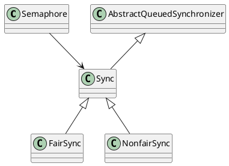

## 1. 是什么

限流工具类，同一时间只允许n个线程访问某资源

## 2. 原理分析

### 2.1. uml

可以看出Semaphore也有公平的和非公平之分，参考

- [非公平信号量.md](/notes/java-juc/Semaphore/%E9%9D%9E%E5%85%AC%E5%B9%B3%E4%BF%A1%E5%8F%B7%E9%87%8F/)
- [公平信号量.md](/notes/java-juc/Semaphore/%E5%85%AC%E5%B9%B3%E4%BF%A1%E5%8F%B7%E9%87%8F/)
