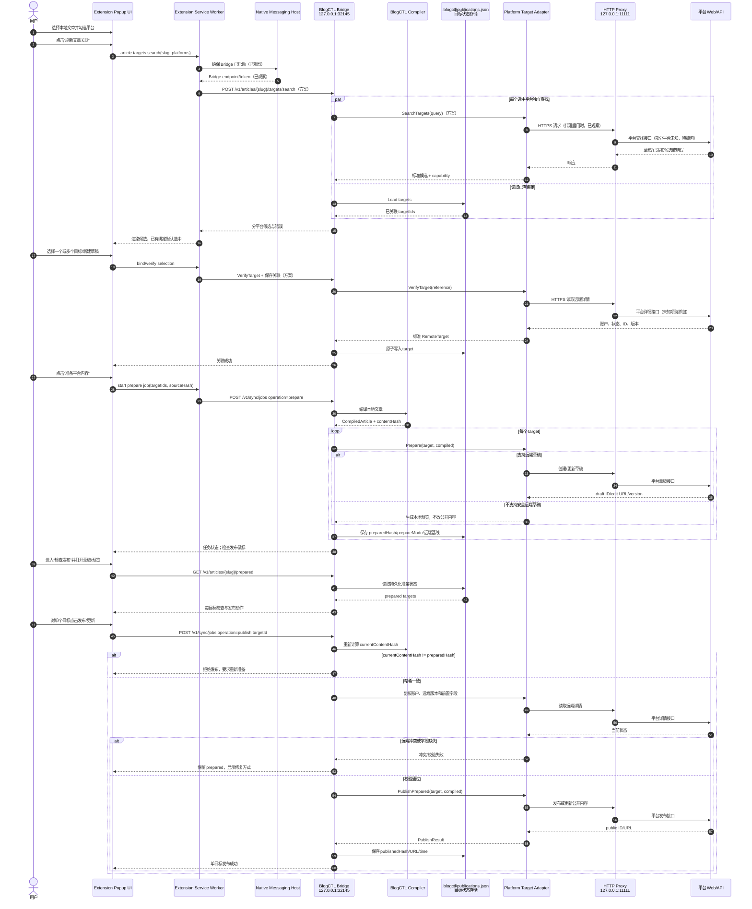

# BlogCTL 多平台文章关联、内容准备与检查发布方案

状态：设计完成，待实现

日期：2026-09-21

基线分支：`fix/juejin-native-contract-20260921`

基线提交：`7521e97`

## 1. 目标与结论

BlogCTL 的发布交互拆成两个业务阶段：

1. **内容准备**：选择本地文章，在选中的平台查找远端候选，建立一个或多个关联，并把内容准备到远端草稿或本地预览。此阶段不得修改公开内容。
2. **检查发布**：读取已持久化的准备结果，打开草稿或预览；用户检查后，对单个目标显式执行发布或更新公开文章。

“任务”只展示异步执行状态、错误和重试，不承载发布决策。

平台接口不通过猜测或一次性通用模板补齐。浏览器中能够完成的动作，以 PFlow/HAR 抓包作为契约证据，再实现对应平台能力、脱敏 fixture 和回归测试。

### 1.1 核心产品规则

- 一篇本地文章可以关联多个远端目标，包括同一平台的多个目标。
- 查找只针对用户勾选的平台并行执行。
- 已有关联在候选列表中默认选中。
- 平台没有关联且没有候选时，默认生成一个“新建草稿”目标。
- 平台返回候选但没有既有关联时，不自动新建草稿。用户必须选择候选或显式选择“新建草稿”，避免重复文章。
- 解除关联只删除本地关联，不删除远端文章或草稿。
- 第一阶段的主按钮统一为 **准备平台内容（N 个目标）**。
- 主按钮下固定显示：**只创建或更新草稿；无法安全保存远端草稿的平台只生成本地预览。不会修改公开内容。**
- 第二阶段按目标逐个发布，首版不提供批量发布。
- 只要本地内容哈希与准备哈希不一致，就禁止发布并要求重新准备。
- 扩展关闭、切换网页或 Bridge 重启后，文章关联和准备状态必须能恢复。

## 2. 本次代码审查范围

本方案依据当前仓库实现，不对未抓包的平台接口作外部推测。

已审查的主要路径：

- `tools/blogctl/publisher/types.go`
- `tools/blogctl/publisher/service.go`
- `tools/blogctl/publisher/manifest.go`
- `tools/blogctl/publisher/bindings.go`
- `tools/blogctl/publisher/registry.go`
- `tools/blogctl/publisher/{cnblogs,juejin,csdn,segmentfault,zhihu,cto51,oschina,toutiao,devto}.go`
- `tools/blogctl/bridge/{server,control,medium,cnblogs_bindings,devto_lookup,juejin_search}.go`
- `tools/blogctl/extension/background.js`
- `tools/blogctl/extension/popup/{popup,sync,sync-model,sync-state,tasks}.js`

## 3. 当前实现事实与缺口

### 3.1 已有能力

- Go 原生发布适配器覆盖博客园、掘金、CSDN、思否、知乎、51CTO、开源中国、今日头条和 DEV.to。
- Medium 由 Bridge 中的独立浏览器会话客户端创建草稿。
- Extension 将浏览器会话交给本地 Bridge，Bridge 通过 `127.0.0.1:32145` 执行平台请求。
- Bridge 外部流量可通过 `127.0.0.1:11111` 代理。
- 发布前已有 `draftHash == contentHash` 检查。
- 博客园已有可持久化的 `.blogctl/publications.json`，能表达一条草稿关联和一条已发布关联。
- 博客园、DEV.to、掘金已有远端候选查找，其中掘金当前只查找已发布文章。

### 3.2 结构性缺口

1. `.distribution/manifest.json` 每个 `slug + platform` 只有一组 `remoteDraftId/draftUrl/publishedUrl`，无法表达同一平台多个目标。
2. `syncRequest` 只传平台列表；`syncJob.Results` 以平台 ID 为键，同一平台多个目标会互相覆盖。
3. 博客园关联是平台专用结构和专用路由，其他平台无法复用。
4. Extension 的候选结果主要缓存在 `localStorage`，它不是准备状态的权威来源。
5. 当前任务页能从已完成草稿任务发起发布，混合了“执行记录”和“业务决策”。
6. `Adapter` 强制所有平台暴露同一组方法，但方法存在不代表语义相同。
7. 当前“更新已发布文章”是博客园专用旁路，且会直接改变公开内容，不应出现在内容准备页。

## 4. 当前平台能力矩阵

表中“代码存在”只说明当前实现有调用路径；“已验证”必须有实际抓包、成功响应和回归 fixture。远端 Agent 不得把“代码存在”当成“契约已验证”。

| 平台 | 认证来源 | 创建草稿 | 更新草稿 | 从准备结果发布 | 远端查找 | 绑定已有文章 | 更新已发布文章的安全准备 | 当前判断 |
| --- | --- | --- | --- | --- | --- | --- | --- | --- |
| 博客园 | 浏览器 Cookie | 代码存在，已联调 | 代码存在，已联调 | 代码存在 | 草稿和已发布候选已有实现 | 已有专用绑定 | 当前为直接更新公开文章；是否能先形成编辑草稿待抓包确认 | 优先迁移到通用目标模型 |
| 掘金 | 浏览器 Cookie | 代码存在，已抓包联调 | 代码存在，已抓包联调 | 代码存在，发布前读取分类、标签、专栏等原值 | 当前只查已发布文章 | 尚未通用化 | 已发布文章可通过其编辑草稿准备并再次发布，已由抓包链路验证 | 第一批完整迁移 |
| CSDN | 浏览器 Cookie | 代码存在 | 代码存在 | 复用 save 并切换发布参数 | 未实现 | 未实现 | 未知 | 需抓包验证查找和编辑已发布文章链路 |
| 思否 | 浏览器 Cookie | 代码存在 | 代码存在 | 使用 `draftId` 发布 | 未实现 | 未实现 | 未知 | 需抓包验证 |
| 知乎 | 浏览器 Cookie | 代码存在 | 代码存在 | 对同一 article ID 调用 publish | 未实现 | 未实现 | 未知 | 需抓包验证草稿、已发布文章和 ID 关系 |
| 51CTO | 浏览器 Cookie | 代码存在 | 代码存在 | 发布请求携带 `did` | 未实现 | 未实现 | 未知 | 需抓包验证 |
| 开源中国 | 浏览器 Cookie | 代码存在 | 代码存在 | 当前发布路径未使用传入 draft ref，而是调用新增公开文章接口 | 未实现 | 未实现 | 未知 | 存在重复创建风险，未验证前禁止标记为“发布准备草稿” |
| 今日头条 | 浏览器 Cookie | 代码存在 | 代码存在 | 同一 `pgc_id` 走发布变更 | 未实现 | 未实现 | 未知 | 需抓包验证 |
| DEV.to | API Key | API 创建，`published` 由编译输入决定 | API 更新 | `PublishDraft` 明确未实现 | 已实现远端查找 | 当前只查找，未支持手动绑定 | API 是否可将既有公开文章安全保存为草稿需单独确认 | 需要把发布状态从编译输入中移出，服从两阶段流程 |
| Medium | 浏览器 Cookie | Bridge 可创建新草稿 | 未实现已有草稿更新 | 未实现 | 未实现 | 未实现 | 未知 | 当前只能作为“每次新建草稿”能力使用 |

## 5. 目标交互

### 5.1 Tab 结构

建议改为五个 Tab：

1. **内容准备**
2. **检查发布**
3. **任务**
4. **发布配置**
5. **工具与配置**

### 5.2 内容准备

#### 选择本地文章

保留一个可搜索输入框：

- 输入标题或 slug 时过滤本地文章。
- 输入为空时列出全部本地文章。
- 选择后显示标题、slug、内容状态和当前内容哈希摘要。

#### 查找远端目标

用户勾选平台后点击 **刷新文章关联**：

- 只请求选中的平台。
- 每个平台卡片独立显示加载、成功、失败和不支持。
- 返回草稿和已发布文章，不能只返回一种状态。
- 候选项显示标题、远端状态、更新时间、ID、URL、匹配原因和是否已关联。
- 同一平台允许勾选多个候选。
- 支持“新建草稿”虚拟候选。
- 手动 ID/URL 放在候选列表的折叠区中；必须先由 Bridge 核验账户、对象状态和规范化 ID，核验成功后才能关联。

候选搜索建议返回：

```json
{
  "platform": "juejin",
  "query": {
    "slug": "concurrency-series-04-mutex-implementation",
    "title": "并发编程（四）：互斥锁实现"
  },
  "capabilities": {
    "searchDrafts": true,
    "searchPublished": true,
    "manualReference": true
  },
  "candidates": [
    {
      "remoteArticleId": "...",
      "remoteDraftId": "...",
      "title": "...",
      "remoteState": "published",
      "editUrl": "...",
      "publicUrl": "...",
      "updatedAt": "...",
      "matchReasons": ["exact-title"],
      "boundTargetId": "tgt_..."
    }
  ]
}
```

#### 准备动作

主按钮：**准备平台内容（N 个目标）**。

每个目标按 capability 选择准备方式：

- 新目标：创建远端草稿。
- 已有草稿：更新该草稿。
- 已发布文章且平台支持编辑草稿：读取并保留远端元数据，更新它对应的编辑草稿。
- 已发布文章且平台不支持安全编辑草稿：只生成本地平台预览，保存待发布 payload 摘要，不调用修改公开内容的接口。

准备成功后不自动切换 Tab。内容准备页显示 **已准备**，同时“检查发布”Tab 显示数量徽标，并提供 **前往检查发布** 链接。

### 5.3 检查发布

页面按本地文章和远端目标展示准备结果。每个目标显示：

- 平台、远端标题和状态。
- 准备时间、准备哈希、当前内容哈希。
- 草稿或预览入口。
- 准备方式：远端草稿或本地预览。
- 平台需要补充的分类、标签、专栏等校验结果。
- 发布影响说明。

每个目标只提供与其状态匹配的动作：

| 目标类型 | 检查动作 | 公开变更动作 |
| --- | --- | --- |
| 新建草稿 | 打开草稿 | 发布新文章 |
| 已有草稿 | 打开草稿 | 发布草稿 |
| 已发布文章，平台支持编辑草稿 | 打开编辑草稿 | 发布更新 |
| 已发布文章，平台无独立编辑草稿 | 打开本地预览 | 更新公开文章 |

点击公开变更动作前，Bridge 必须再次验证：

1. 登录账户与目标所属账户一致。
2. `currentContentHash == preparedHash`。
3. 目标仍存在。
4. 若平台支持远端版本或更新时间，当前值与准备基线一致。
5. 平台发布前置字段已经齐全。

首版逐目标执行。一次确认只影响一个远端目标。

### 5.4 任务

任务页只负责：

- 显示 queued/running/completed/failed。
- 显示每个 target 的结果、耗时、错误和 URL。
- 重试失败目标。
- 打开任务日志。

任务页不提供“发布”“更新公开文章”等业务动作。任务成功后的可操作状态由“检查发布”页从持久化目标状态读取。

## 6. 统一持久模型

### 6.1 权威文件

将内容仓库中的 `.blogctl/publications.json` 升级为平台无关的 version 2，并作为远端文章身份、关联和准备状态的权威来源。

`.distribution/manifest.json` 继续保存编译输出和兼容字段，但不再作为远端身份的唯一来源。

建议结构：

```json
{
  "version": 2,
  "articles": {
    "concurrency-series-04-mutex-implementation": {
      "platforms": {
        "juejin": {
          "targets": [
            {
              "targetId": "tgt_01J...",
              "accountKey": "juejin:183...",
              "remoteArticleId": "...",
              "remoteDraftId": "...",
              "remoteState": "published",
              "source": "search",
              "title": "...",
              "editUrl": "...",
              "publicUrl": "...",
              "remoteVersion": "...",
              "remoteUpdatedAt": "...",
              "verifiedAt": "...",
              "prepareMode": "remote-draft",
              "preparedHash": "sha256:...",
              "preparedAt": "...",
              "publishedHash": "sha256:...",
              "publishedAt": "...",
              "lastError": ""
            }
          ]
        }
      }
    }
  }
}
```

### 6.2 字段规则

- `targetId` 是 BlogCTL 生成的稳定本地 ID，不从可变化的远端状态拼接。
- `remoteArticleId` 与 `remoteDraftId` 分开保存。平台只提供一个 ID 时允许相同。
- `remoteState` 只描述远端对象：`draft | published | unknown`。
- `prepareMode` 为 `remote-draft | local-preview`。
- UI 工作流状态不要与远端状态混在一起，可按持久字段推导：
  - `unprepared`：没有 `preparedHash`。
  - `prepared`：`preparedHash == currentContentHash`。
  - `stale`：二者不同。
  - `published`：`publishedHash == currentContentHash`。
  - `failed`：最近一次目标操作失败。
- `(platform, accountKey, remoteArticleId)` 和 `(platform, accountKey, remoteDraftId)` 在不同本地文章之间必须唯一。
- 关联文件写入必须使用进程内锁和原子替换，防止并发任务丢数据。

### 6.3 迁移

1. 读取 version 1 的 `cnblogs[]`，每条记录转换为一个通用 target。
2. 从 `.distribution/manifest.json` 导入尚未存在的单目标引用，`source` 标记为 `legacy`。
3. 已存在的 `.blogctl/publications.json` 优先于 generated manifest。
4. 迁移必须幂等；成功写入 version 2 后不重复创建 target。
5. 保留旧 manifest 字段一个兼容周期，旧 CLI 仍可读取最近一次目标。

## 7. 平台能力与适配器契约

不要直接破坏现有 `publisher.Adapter`。先新增目标感知接口和兼容适配层：

```go
type PlatformCapabilities struct {
    SearchDrafts          bool
    SearchPublished       bool
    VerifyReference       bool
    CreateDraft           bool
    UpdateDraft           bool
    PreparePublishedEdit  bool
    PublishPrepared       bool
    DirectPublishedUpdate bool
    MultiTarget           bool
}

type RemoteTarget struct {
    TargetID        string
    Platform        string
    AccountKey      string
    RemoteArticleID string
    RemoteDraftID   string
    RemoteState     string
    EditURL         string
    PublicURL       string
    RemoteVersion   string
    RemoteUpdatedAt string
}

type TargetAdapter interface {
    ID() string
    Capabilities() PlatformCapabilities
    SearchTargets(context.Context, SearchQuery) ([]RemoteCandidate, error)
    VerifyTarget(context.Context, RemoteReference) (RemoteTarget, error)
    Prepare(context.Context, RemoteTarget, DraftInput) (PrepareResult, error)
    PublishPrepared(context.Context, RemoteTarget, DraftInput) (PublishResult, error)
}
```

兼容层把旧 `CreateDraft/UpdateDraft/PublishDraft` 映射到单目标操作。只有抓包和测试确认语义后，capability 才设置为 `true`。

对已发布文章的准备必须先读取远端详情并合并平台维护的字段，例如分类、标签、专栏、封面、原始 URL、发布时间和平台版本。禁止用零值覆盖未由 BlogCTL 管理的元数据。

## 8. Bridge API

用平台无关接口替换新增的平台专用路由；旧博客园路由保留一段兼容期。

```text
POST   /v1/articles/{slug}/targets/search
GET    /v1/articles/{slug}/targets
POST   /v1/articles/{slug}/targets/verify
PUT    /v1/articles/{slug}/targets/{targetId}
DELETE /v1/articles/{slug}/targets/{targetId}
GET    /v1/articles/{slug}/prepared
POST   /v1/sync/jobs
GET    /v1/sync/jobs/{jobId}
```

查找请求：

```json
{
  "platforms": ["cnblogs", "juejin"],
  "query": {
    "title": "...",
    "slug": "...",
    "canonicalUrl": "..."
  }
}
```

任务请求改为按目标执行：

```json
{
  "article": "concurrency-series-04-mutex-implementation",
  "operation": "prepare",
  "targetIds": ["tgt_01J...", "new:juejin:01J..."],
  "sourceHash": "sha256:..."
}
```

`operation` 只接受：

- `prepare`
- `publish`

任务结果由 `map[platform]result` 改为按 `targetId` 表达的数组或 map。事件同时包含 `jobId/requestId/platform/targetId/operation/state/durationMs`。

## 9. 端到端时序

图中“已观察”表示当前代码或抓包已经证明；“方案”表示本设计新增；“未知”必须通过平台抓包补齐。



## 10. 组件依赖表

| 组件 | 依赖 | 接口或协议 | 当前证据/状态 | 失败影响 |
| --- | --- | --- | --- | --- |
| 用户 | Extension UI | 浏览器交互 | 已存在 | 无法选择、检查或确认发布 |
| Extension Popup UI | Service Worker | `chrome.runtime.sendMessage` | 已存在 | 页面无法调用 Bridge；持久状态仍应保留 |
| Service Worker | Native Messaging Host | Chromium Native Messaging | 已存在 | 无法启动或发现 Bridge |
| Native Messaging Host | Bridge | 本机进程与健康检查 | 已存在 | 外部平台操作不可用 |
| Bridge | Extension 会话 | loopback HTTP + 短期会话 | 已存在 | 浏览器认证平台拒绝请求 |
| Bridge | Compiler | Go 内部调用/Node 编译运行时 | 已存在 | 无法生成确定性平台内容与 contentHash |
| Bridge | 目标状态存储 | 本地 JSON、锁、原子替换 | v1 仅博客园，v2 待实现 | 关联或准备状态丢失，可能重复创建或误更新 |
| Bridge | Target Adapter | Go 接口 | 旧 Adapter 已存在，目标接口待实现 | 无法统一查找、核验、准备和发布 |
| Target Adapter | 本地 HTTP Proxy | HTTP CONNECT/HTTP | 当前配置支持 `127.0.0.1:11111` | 平台请求超时或失败；loopback 不受影响 |
| HTTP Proxy | 平台 Web/API | HTTPS；DNS 解析位置由代理实现决定 | 平台端点部分已验证，其他未知 | 单平台查找/准备/发布失败 |
| 检查发布 UI | `.blogctl/publications.json` 经 Bridge | GET prepared targets | 待实现 | Popup 关闭或 Bridge 重启后无法恢复可发布状态 |

## 11. 抓包驱动的平台契约

每个平台缺失能力由用户在浏览器执行真实动作，PFlow/HAR 记录请求。一次完整 capture pack 应覆盖：

1. 登录态探针。
2. 草稿列表或搜索，以及分页。
3. 已发布文章列表或搜索，以及分页。
4. 草稿详情。
5. 已发布文章详情。
6. 新建草稿。
7. 更新已有草稿。
8. 编辑已发布文章时，平台是否创建/复用编辑草稿。
9. 发布新文章。
10. 发布对已有文章的更新。
11. 分类、标签、专栏、封面、摘要、canonical、发布时间等平台字段的读取和保留。
12. 冲突、重复提交、限流和认证失效响应。

### 11.1 安全与 fixture 规则

- 原始抓包只用于本地分析，不直接提交仓库。
- fixture 必须删除 Cookie value、Authorization、API key、CSRF token、用户私密字段和请求签名。
- 保留方法、路径、非敏感字段名、状态码、响应结构和脱敏 ID。
- 每个 capability 都必须有成功 fixture、至少一个失败 fixture和契约测试。
- 日志只记录时间、级别、requestId/jobId、operation、platform、targetId、状态、durationMs、HTTP 状态和错误类型；不得记录凭据或完整正文。

## 12. 并发、幂等与失败处理

- 查找可按平台并行；同一 target 的写操作串行。
- `prepare` 的幂等键建议使用 `platform + targetId + contentHash + operation`。
- `publish` 不因网络超时自动重复。超时后先读取远端状态确认是否已经成功，再决定是否可重试。
- 一个任务内允许部分成功。成功 target 立即进入“检查发布”，失败 target 留在“内容准备”并显示重试。
- 平台失败不能把其他平台状态标成未知。
- 远端版本冲突必须停止覆盖，并要求用户刷新候选或重新核验。
- `new:*` 临时目标在创建成功后原子替换为稳定 `targetId`，防止重试再次创建。

## 13. 实施顺序

### 阶段 0：冻结契约与测试骨架

- 为通用 target、capability、job request/result 定义 JSON schema 或 Go 类型。
- 加入迁移、哈希过期、唯一性和同平台多目标测试。
- 为现有平台标注 capability，未知能力保持 false。

### 阶段 1：持久模型

- 将 `.blogctl/publications.json` 升级为 version 2。
- 实现博客园 v1 和 `.distribution/manifest.json` 的幂等迁移。
- 提供按 slug/platform/targetId 的增删改查。
- 为写入加锁和原子替换。

### 阶段 2：目标适配接口

- 新增 `TargetAdapter` 和 `PlatformCapabilities`。
- 为旧 Adapter 提供兼容 shim。
- 不改变已工作的 cookie/session 传输链路。

### 阶段 3：Bridge 与任务

- 实现平台无关的 search/verify/bind/unbind/prepared API。
- 任务输入改为 targetIds，结果按 targetId 保存。
- 分离 `prepare` 与 `publish`。
- 增加结构化关键节点日志和 requestId。

### 阶段 4：内容准备 UI

- 把当前“同步发布”改成“内容准备”。
- 只刷新选中平台。
- 支持草稿、已发布文章、新建草稿和同平台多选。
- 移除博客园专用“更新已发布文章”按钮。
- 统一主按钮为“准备平台内容（N 个目标）”。

### 阶段 5：检查发布 UI

- 新增持久化准备结果页面。
- 按目标显示打开草稿/预览和单目标发布动作。
- stale 状态禁用发布。
- 准备完成后只提示和加徽标，不自动跳页。

### 阶段 6：先迁移博客园和掘金

- 博客园：迁移现有查找、绑定、核验、冲突保护和显式公开更新。
- 掘金：用已抓包链路实现已发布文章与编辑草稿的关联、元数据保留和再次发布。
- 两个平台跑通后，再删除 UI 中的平台专用分支。

### 阶段 7：按 capture pack 逐个平台启用

推荐顺序：CSDN、思否、知乎、51CTO、今日头条、开源中国、DEV.to、Medium。

每个平台单独提交：capture fixture → adapter capability → 回归测试 → UI capability 展示。不要一次性声称所有平台具有同一种草稿语义。

## 14. 文件改动地图

| 区域 | 建议改动 |
| --- | --- |
| `publisher/types.go` | 新增 capability、RemoteTarget、PrepareResult、TargetAdapter |
| `publisher/bindings.go` | 升级为通用 publications v2；迁移博客园 v1 |
| `publisher/manifest.go` | 保留编译缓存职责和旧字段兼容，不再承担多目标权威身份 |
| `publisher/service.go` | 增加 target-aware prepare/publish；统一哈希、账户、版本校验 |
| 各平台 adapter | 按已验证 capability 实现 search/verify/prepare/publish |
| `bridge/server.go` | 注册通用 target 与 prepared 路由 |
| `bridge/control.go` | job 改为 target-aware；删除任务页发布耦合所需的后端假设 |
| `bridge/*_search.go` | 逐步收敛为适配器能力或薄路由层 |
| `extension/background.js` | 增加通用消息；平台专用消息保留兼容期 |
| `extension/popup/popup.html` | 新增“内容准备”和“检查发布”面板 |
| `extension/popup/sync.js` | 候选多选、关联、新建目标、准备任务 |
| `extension/popup/tasks.js` | 只保留任务状态、日志和重试 |
| 新增 `review.js` | 准备状态恢复、打开预览、单目标发布 |

## 15. 验收标准

### 15.1 通用流程

- 选择一篇本地文章和多个平台后，只查找被勾选平台。
- 每个平台能区分“未查找”“查找失败”“不支持查找”“零候选”和“有候选”。
- 同一平台可关联两个远端对象并分别准备、分别发布。
- 零候选时默认新建草稿；有候选但未选择时不会静默新建。
- 解除关联不会删除或修改远端内容。
- 关闭并重新打开 Extension、切换网页、重启 Bridge 后，关联和 prepared 状态仍存在。

### 15.2 安全发布

- 内容准备阶段不会改变任何公开文章。
- 本地内容改变后，检查发布页立即显示 stale 并禁用公开变更按钮。
- 远端版本改变时拒绝覆盖。
- 发布只作用于用户点击的 target。
- 超时重试前会先核验远端结果，避免重复文章。

### 15.3 平台启用门槛

- capability 与实际 UI 一致；不支持的动作不显示可点击按钮。
- 每个启用的远端动作都有脱敏 fixture 和契约测试。
- 博客园和掘金先通过端到端测试；其他平台按 capture pack 逐个开放。
- 日志能通过 requestId/jobId/targetId 串起 Extension → Bridge → Adapter → 平台调用，且不包含 Cookie、token、API key、Authorization 或正文。

## 16. 明确不做

- 不在内容准备完成后自动公开发布。
- 不在任务页加入发布按钮。
- 不把浏览器 `localStorage` 当作远端身份或准备状态的权威存储。
- 不依据接口命名推断平台支持编辑已发布文章。
- 不提交原始 PFlow/HAR 或其中的认证信息。
- 不在本轮设计提交中修改发布业务代码、创建 release 或执行真实公开发布。
