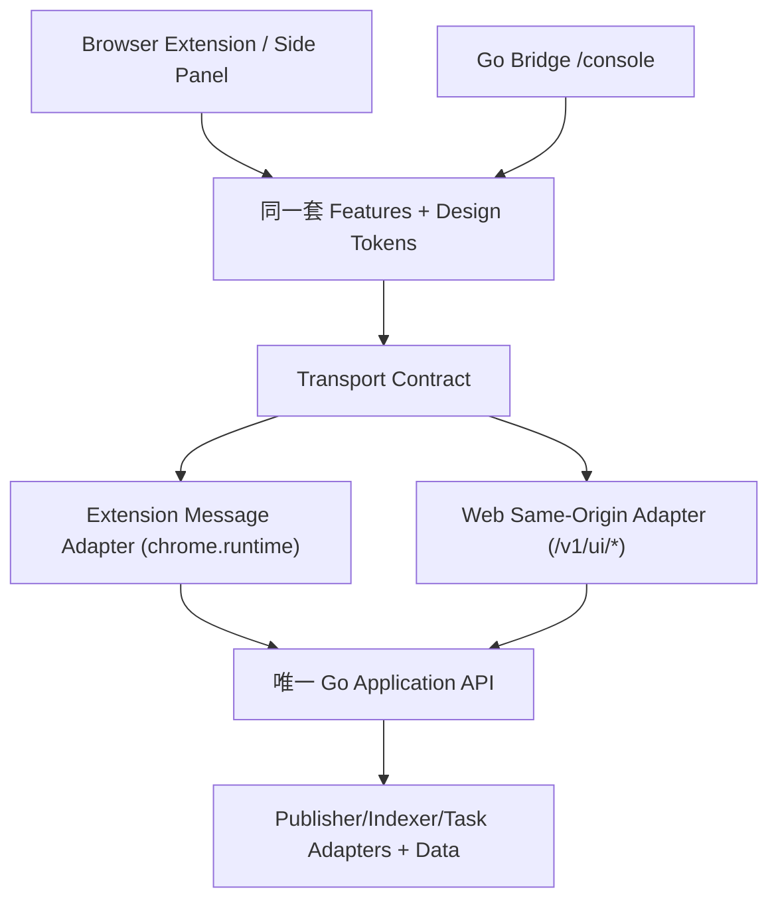

# BlogCTL 统一界面与 Web Console：设计及迁移方案

> 2026-10-10 · 状态：代码落地，待 Windows 真实浏览器验收与发布
> 实际代码审查：DevTool `code verify`（CodeGraph Indexed + Serena Realtime）通过
> 借鉴：`/home/zsk/code/IDFlow/docs/popup-web-console-architecture.md`、`extension/src/settings/{model,renderer,feature,catalog}.ts`，DevTool `docs/index.md` 与 `docs/architecture/principles.md`

## 1. 一句话定义

BlogCTL 是面向本地文章的多平台发布控制台；**Extension 侧边栏与 Bridge 托管的 Web Console 使用同一套 Feature、导航与操作语义，不再开发两种后台。**

## 2. 当前代码审查

| 领域 | 当前实现 | 症结 | 处置 |
|---|---|---|---|
| 入口 | `extension/popup/popup.html` 为七 Tab 全尺寸 Side Panel，`popup.js` 调度 | 窄宽 Tab 换行、设置极长；无独立 Web 入口 | 单一 Feature UI，多宿主布局 |
| 业务 | `inventory.js`、`drafts.js`、`sync.js`、`publications.js` | 检测清单/文章关联/更新与发布二级行为反复跳转 | 三主动作「检测、创建、更新」；发布为页内操作 |
| 配置 | `environment.js` 动态渲染 Tools/Config/Status；`popup.html` 写死容器 | 扁平长页面，缺 IDFlow 分类与逐级钻取 | 借用树形 Registry/Renderer *模式*，由 BlogCTL 配置构造 Domain Catalog |
| 桥接 | `popup/core.js` 通过 `chrome.runtime.sendMessage` 调 `background.js`；Bridge `server.go` 仅授予扩展来源写权限 | 不能直接把 Extension HTML 放到 Web 浏览器里用 | 同一 Feature API；Extension Transport 和同源 Web Transport 分离 |
| Web | Bridge 仅有 /v1/ API，未托管 UI | Web Console 不存在 | 按 IDFlow 同源静态资源 + loopback 限制 + 会话保护实现 |
| 文档 | `README.md`、`RELEASE_NOTES.md`、`docs/toutiao-http.md` | 缺分层文档导航 | 参照 DevTool `docs/index.md`，按 Guide/Architecture/How-to/Reference 分开 |

### 特别注意的现有行为

- 当前远端列表：博客园、CSDN、思否、知乎、51CTO、开源中国、DEV.to 可列举草稿/已发布；掘金当前能枚举已发布，草稿需已知 ID。
- Medium 与今日头条**仅 UI 暂时隐藏**，保留所有适配器及本地历史。
- `PublicationBinding` 是旧的持久关联模型；新版 `create/update` 任务直接携带显式远端目标快照，不读取旧绑定选择目标。
- `jobs.json` / `publications.json` / `blogctl.toml` 均留在 Windows `C:\software\Coding\blogctl\Data\`，保持路径和语义。
- Go Bridge 现有 `allowExtensionWrite` 明确排斥普通 Web 来源；不可通过开放 CORS 或把 Bridge token 拼进静态脚本规避。

## 3. 目标用户体验：两个入口，**一个操作流程**

| 导航 | Extension（窄屏） | Web Console（宽屏） | 复用组件/行为 |
|---|---|---|---|
| 检测 | 平台 + 状态筛选，平台远端清单 | 同上；更宽的内容区 | InventoryFeature |
| 创建 | 选择本地文章 → 平台 → 创建草稿／创建并发布 | 同上 | CreateFeature |
| 更新 | 选择本地文章 → 检测候选 → 多选远端文章 → 更新／更新并发布 | 同上 | UpdateFeature |
| 任务 | 批次与平台结果、重试 | 同上 | TasksFeature |
| 日志 | 实时日志、错误排查 | 同上 | LogsFeature |
| 索引 | 搜索引擎状态、增量/全量任务 | 同上 | IndexFeature |
| 设置 | 分类树、搜索、逐项编辑、必选/可选/健康状态 | 同上 | SettingsFeature |

- **原「发布」一级 Tab 已移除**。创建页按钮「创建草稿 / 创建并发布」，更新页按钮「更新选中 / 更新并发布」；已发布文章的更新不得再触发一次发布。
- 检测仅为账号级远端文章清单；创建不查询旧绑定决定目标。
- 更新只使用当前任务用户选择的远端文章 ID；没有选择时提示「请先选择目标」，**不会隐式新建**。新建使用「创建」页。
- 目标文章多选彼此独立；仅对平台明确支持的操作执行写入；某平台失败不取消其他平台。
- 创建/更新任务必须携带显式目标，并持久记录执行结果。重试以任务快照（含目标 ID）执行，不能读取后来变化的 UI 选择。

## 4. 架构：Host → Shared Feature → Transport → Application

原则：主干极简、宿主与 Feature 解耦、配置驱动、成熟方案优先。**绝不复制** Web 版 `drafts.js`、任务模型或平台能力声明。

### Web Console 安全契约

1. Go Bridge 只绑定 loopback，校验 `Host` 为本地地址（含端口），拒绝远程访问与 Host 伪装。
2. `GET /console` 与其静态资源已由单二进制内嵌。仅允许跨站顶层 Document Navigation 打开页面；禁止跨站 Fetch/API。
3. 当前 Web Console 不暴露同源写 API：页面通过仅注入固定 `/console/*` 来源的 Content Script 把请求转给扩展 background，再复用 Extension Auth 和 Bridge 校验。Web 页面本身永远不持有 Bridge Token/Cookie/平台凭据。
4. 扩展平台 Cookie 只能经既有受限扩展会话同步。本版 Web Console 需要启用 Extension，未启用时不得提供任何写能力。
5. 普通外部网站不能利用本地 Bridge 进行 CSRF；严禁 CORS `*`、禁用来源验证或默认开放全部 `/v1/*`。
6. JS/CSS 同一份 `go:embed` 资源；Feature 统一调用 `BlogCTLTransport.send(type, payload)`。Extension 宿主使用 `chrome.runtime.sendMessage`，Web 宿主经过来源受限的 `window.postMessage` + content script bridge；无第二份 UI。

### Settings Feature（对齐 IDFlow）

- 分类：**概览与健康、内容与路径、分发平台、搜索引擎、素材与渲染、网络与代理、运行依赖**。
- 树节点 Schema：`category/group/status/action/boolean/text/select/secret`。数据来自现有 `blogctl.toml` 与 Tools API。
- 逐级导航 / 搜索 / 面包屑 / 单项「编辑—保存—取消」；只在保存时写入原有配置接口，密钥字段只返回「已配置/未配置」。
- Popup 与 Web Console 只改变可用宽度、导航布局；节点、排序、说明和操作完全一致。
- 尽量把 IDFlow Registry/Renderer 以项目内纯模块复用。为两个仓库建立共享包之前先确保版本契约稳定，**不复制整个 IDFlow 运行时**。

### UI 设计基线

- 统一字体、颜色、间距（4px 基准）、边框、圆角、表单按钮高度、状态样式，消除各 Tab 单独约定。
- 侧边栏窄屏用单列或紧凑顶部导航；Web Console 用左侧导航 + 右内容区。**标签名称、出现顺序、按钮、反馈、步骤相同**，只改空间布局。
- 不把错误显示为「可以更新」；区分「可检测 / 可创建 / 可更新 / 需要登录 / 未配置」。
- 无数据为空状态，失败显示原始可理解错误和重试，不显示“本页没有文章”掩盖接口错误。

## 5. 实施阶段与验收

| 阶段 | 变更 | 验证（本轮不新增普通单测，集中验收） |
|---|---|---|
| P0 审查 & 文档 | DevTool CodeGraph/Serena 审查、架构和迁移清单、文档首页 | 文档链接、DevTool code verify |
| P1 共用 UI/导航 | 提取 UI Tokens、统一 Tab/命名与布局、创建/更新/发布动作归位 | Popup 打开、切 Tab、窄屏及宽屏截图 |
| P2 Settings | IDFlow 树形 Registry/Renderer 与 BlogCTL Catalog 映射 | 搜索/分类钻取、敏感字段不回显、配置读写 |
| P3 Web Console | Bridge 嵌入同源静态资源，双 Transport，安全会话与导航 | `/console`、响应式；禁用扩展情形；恶意 Origin/Host 检查 |
| P4 任务目标重构 | 显式 ID 任务契约，多目标并行，创建/更新/发布状态机，历史绑定退出目标选择 | 真实草稿创建、目标更新、失败/重试/部分成功，杜绝重复创建 |
| P5 文档与迁移 | Quick Start、Guide、How-to、Reference、版本与 Windows 安装 | 路径/命令与产品一致；无遗留入口；Windows Build 与 Extension 一致 |

**发布闸门**：上述阶段可逐步 commit/push，不必每次微变动独立单测；最终须 DevTool Review、全量 Go/JS 回归、实际 Windows Edge 两入口验收，再升版本安装。P1—P5 代码已逐步实现；最终的真实浏览器验收与发版仍作为发布闸门。Web Console 的业务访问依赖 Extension relay，不宣称独立于扩展运行。

## 6. 非目标

- 不改 DevTool Core、不重新实现浏览器抓包、不增 Node 常驻服务。
- 不恢复 Medium、今日头条到 UI。
- 不删除 `publications.json` 或旧历史关联，直至新显式目标流程完成且确认兼容迁移策略。
- 不引入第二套前端业务逻辑；不为 Web Console 绕过原有浏览器来源安全。

## 7. 具体回归场景

1. 一篇本地文章：检测 8 个可见平台，草稿/已发布筛选、编辑/查看地址一致。
2. 创建：只创建草稿或创建后发布，不查旧绑定；同一平台失败不阻塞其余平台。
3. 更新：选择远端 ID A/B，更新 A/B；未选 C 不写 C；重试仍指向 A/B。
4. 已发布文章：只走原文更新能力，不支持则显示明确限制。
5. Settings：路径、平台开关、代理、凭据状态在 Popup/Console 一致；不回显密钥。
6. Web：直接地址打开、不同 Host/Origin/跨站表单无写权限；关闭扩展后能展示允许的控制台能力。
7. Windows：从 `C:\software\Coding\blogctl\Data\` 读取原配置、旧任务和绑定；新版重新加载后无重复 Tab/入口。

## 8. 文档阅读路径

- [文档首页](../index.md)
- [快速开始](../quick-start.md)
- [产品使用指南](../guide/workflows.md)（阶段迁移中）
- [配置与命令参考](../reference/configuration.md)（阶段迁移中）
- [本文：架构决策](unified-ui-and-console-20261010.md)
