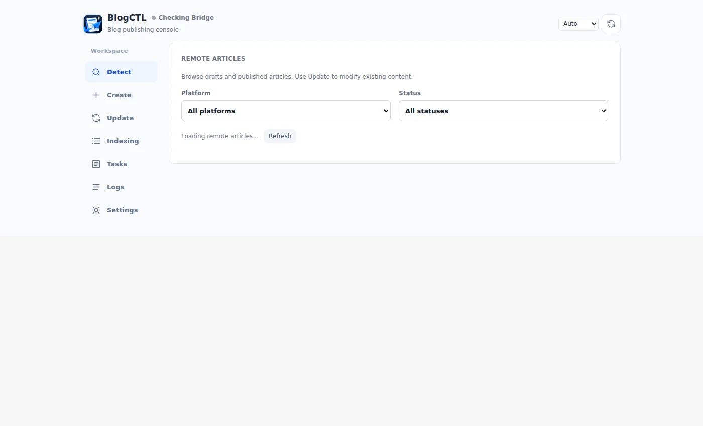
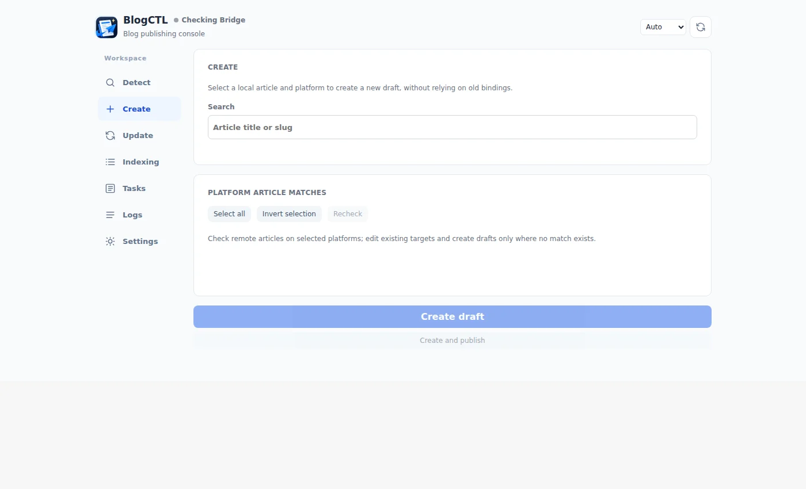
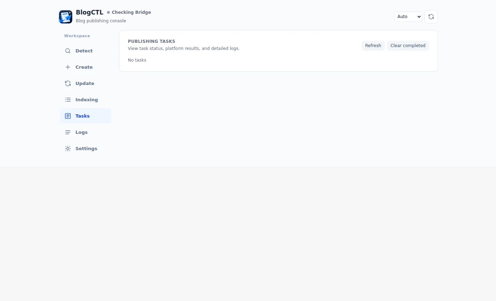

# First run on a new machine

This tutorial starts with a fresh checkout and ends with a working BlogCTL workspace. It first uses bundled sample content; writing to an external publishing platform is optional and must be explicitly authorized.

The screenshots below are **real screenshots of BlogCTL's English Web Console**, served by a Go Bridge using a new, isolated data directory. No browser publishing accounts were connected. They show genuine empty/connection states rather than invented remote articles.

## 1. Check the prerequisites

Install Git, Go 1.27.1+, Node.js 22+ and npm. Verify them:

```bash
git --version
go version
node --version
npm --version
```

Prebuilt BlogCTL Release binaries do not need Go to run. Building the engine still needs Node/npm.

## 2. Clone and inspect BlogCTL

In a new directory:

```bash
git clone https://github.com/ThinkerQAQ/ThinkerQAQ.github.io.git
cd ThinkerQAQ.github.io
go run ./tools/blogctl/cmd help
go run ./tools/blogctl/cmd doctor
```

`doctor` reports the local Node, npm, Git and platform information. Fix missing tools before moving on.

**Version:** use BlogCTL v0.1.148 or later for the bilingual selector. Earlier binaries do not include it. After upgrading, reload the browser Extension.

## 3. Run the example blog without any account

```bash
npm ci
npm run dev:quick
```

Open [http://localhost:4321](http://localhost:4321). The engine assembles `fixtures/` and runs Astro, without production content or cloud credentials. In a second terminal run:

```bash
npm run check
```

Stop the dev server with **Ctrl+C**. Full diagram rendering needs Java/Graphviz/Chromium; it is deliberately excluded from this first run.

## 4. Install the Bridge and browser Extension

**Windows — PowerShell, from the source checkout root:**

```powershell
go build -o blogctl-windows-amd64.exe ./tools/blogctl/cmd
$exe = (Resolve-Path .\blogctl-windows-amd64.exe).Path
& .\tools\blogctl\Install-Windows.ps1 -Executable $exe
```

This installer registers BlogCTL's Native Messaging host for Edge and Chrome. Windows runtime files are stored by default in `Data/` **next to the executable**. Preserve them when upgrading.

For a packaged Release, extract its binary, unpacked Extension and installer together and use the bundled `Install-Windows.ps1`. Source installation is used here because it also permits testing the unreleased English UI.

**Linux / macOS — packaged Release:** run `./Install-Linux.sh` or `./Install-macOS.command` in the extracted package folder. The installer requires the matching `blogctl-linux-<architecture>` or `blogctl-darwin-<architecture>` executable alongside it.

**Browser — Edge or Chrome:**

1. Open `edge://extensions` or `chrome://extensions` and enable **Developer mode**.
2. Select **Load unpacked**. For a source checkout, choose `tools/blogctl/extension/`.
3. Open the **BlogCTL** Extension, which starts its local Bridge on demand.
4. Confirm the Bridge status is **connected**, then choose **Open workspace**. The Console opens at `http://127.0.0.1:32145/console/`.

In Windows PowerShell, verify the HTTP endpoint:

```powershell
Invoke-RestMethod http://127.0.0.1:32145/v1/health
```

On Linux/macOS use `curl http://127.0.0.1:32145/v1/health`. A response containing `"ok": true` confirms the server is running. **It does not prove the browser Extension is connected**, so check the UI indicator as well.

## 5. Set your interface language

Open **Settings → Interface & language** and choose **Follow browser language / Simplified Chinese / English**. Auto follows the browser language. A manual choice persists as `ui_locale` in `blogctl.toml` once the Bridge accepts it. It never changes the language of the article you publish.



*Detect is the first navigation item. No publishing account was signed in for this screenshot.*

## 6. Connect content and inspect remote articles

Open **Settings**. Set **Engine Root** to the `ThinkerQAQ.github.io/` checkout and **Content Root** to a separate `blog-content/` checkout. For practice, use the [public content template](https://github.com/ThinkerQAQ/blog-content-template).

In **Detect**, choose a platform and inspect its **Draft** and **Published** articles. This is read-only. When testing a real account, sign in on that platform in the browser first. A failed detection does not mean the article is absent.

## 7. Create or update an article

In **Create**, select a local article and the target platform. Wait for remote association detection. Create a new draft **only after successful detection finds no matching remote article**.



If the article already exists, use **Update**, select its explicit remote article ID and check the supported action. Update must not silently create a new draft.

For a compile-only preview, from the **content repository** and with the Bridge configured:

```bash
blogctl sync --article YOUR_SLUG --platforms devto --dry-run
```

Replace `YOUR_SLUG` with the slug of a real article. A live Create/Update/Publish requires a signed-in platform session and explicit confirmation. This clean-room tutorial does not perform external writes.

## 8. Inspect the task

Open **Tasks** to view the status, platform result, remote article ID and edit link, once a real task is submitted.



After a timeout, check both Detect and Tasks before retrying a remote write. See [Bridge troubleshooting](../how-to/debug-bridge.md), [operation safety](../concepts/operations.md) and the [full publishing workflow](../guide/workflows.md).

## Fresh-environment verification

Reproduced on 2026-10-10 from a **new shallow Git clone** with Linux/WSL, Go 1.27.1, Node 24.21.0 and npm 11.19.0. An independent `BLOGCTL_DATA_DIR` avoided modifying an existing installation. Verified: CLI help, doctor, Go build, npm ci, fixture assembly, Astro check (**0 errors, 0 warnings**), Bridge `/v1/health` and the actual English Console screenshots. No publishing account was connected and no draft was created.

These images depict the running application, **not a design rendering or simulated publishing data**.
